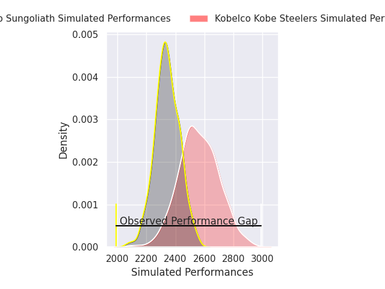
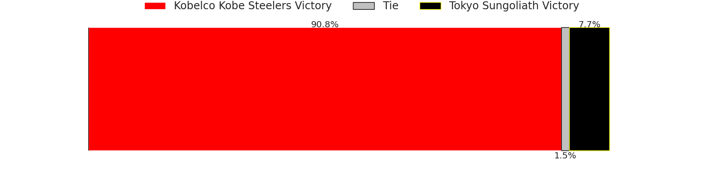
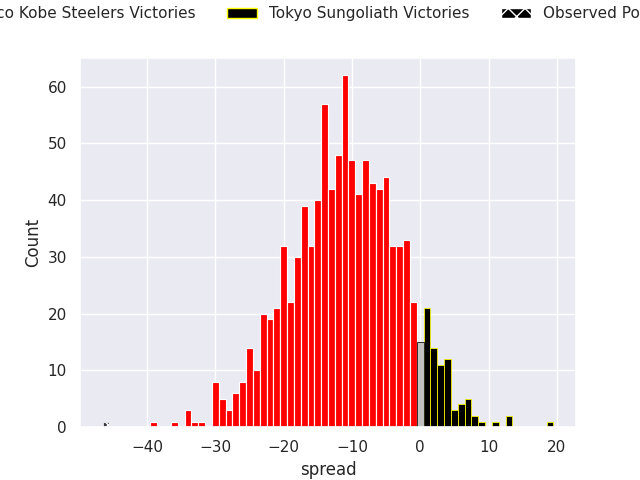

# Team Rankings

# Standings

## Current Standings

| Club                  |   Played |   Wins |   Point Differential |   Losing Bonus Points |   Try Bonus Points |   Competition Points |
|:----------------------|---------:|-------:|---------------------:|----------------------:|-------------------:|---------------------:|
| Saitama Wild Knights  |       18 |     16 |                  328 |                     1 |                  6 |                   71 |
| Kobelco Kobe Steelers |       18 |     16 |                  294 |                     1 |                  4 |                   69 |
| Kubota Spears         |       19 |     15 |                  375 |                     3 |                  5 |                   68 |
| Tokyo Sungoliath      |       18 |     10 |                  111 |                     6 |                  4 |                   50 |
| Black Rams Tokyo      |       19 |      9 |                  -54 |                     2 |                  2 |                   40 |
| Toshiba Brave Lupus   |       19 |      8 |                 -173 |                     3 |                  5 |                   40 |
| Shizuoka Blue Revs    |       18 |      7 |                  -38 |                     4 |                  3 |                   35 |
| Mie Honda Heat        |       18 |      7 |                 -136 |                     4 |                  3 |                   35 |
| Toyota Verblitz       |       18 |      7 |                  -44 |                     2 |                  3 |                   33 |
| Yokohama Canon Eagles |       18 |      6 |                 -143 |                     4 |                  1 |                   29 |
| Urayasu D-Rocks       |       19 |      6 |                 -268 |                     0 |                  2 |                   26 |
| Mitsubishi Dynaboars  |       18 |      4 |                 -208 |                     4 |                  2 |                   22 |
| Shimizu Blue Sharks   |        1 |      0 |                  -22 |                     0 |                    |                    0 |
| Toyota Shuttles Aichi |        1 |      0 |                  -22 |                     0 |                    |                    0 |

## Projected Remaining Table

| Club                  |   To Play |   Projected Wins |   Projected Differential |   Projected Losing Bonus Points | Projected Try Bonus Points   |   Projected Competition Points |
|:----------------------|----------:|-----------------:|-------------------------:|--------------------------------:|:-----------------------------|-------------------------------:|
| Tokyo Sungoliath      |         2 |            1.021 |                    4.682 |                           0.266 |                              |                          4.42  |
| Kobelco Kobe Steelers |         1 |            0.903 |                   11.305 |                           0.069 |                              |                          3.723 |
| Mitsubishi Dynaboars  |         1 |            0.041 |                  -15.987 |                           0.136 |                              |                          0.328 |

## Projected Total Table

| Club                  |   Played |   Wins |   Point Differential |   Losing Bonus Points |   Try Bonus Points |   Competition Points |
|:----------------------|---------:|-------:|---------------------:|----------------------:|-------------------:|---------------------:|
| Kobelco Kobe Steelers |       19 | 16.903 |              305.305 |                 1.069 |                  4 |               72.723 |
| Saitama Wild Knights  |       18 | 16     |              328     |                 1     |                  6 |               71     |
| Kubota Spears         |       19 | 15     |              375     |                 3     |                  5 |               68     |
| Tokyo Sungoliath      |       20 | 11.021 |              115.682 |                 6.266 |                  4 |               54.42  |
| Black Rams Tokyo      |       19 |  9     |              -54     |                 2     |                  2 |               40     |
| Toshiba Brave Lupus   |       19 |  8     |             -173     |                 3     |                  5 |               40     |
| Shizuoka Blue Revs    |       18 |  7     |              -38     |                 4     |                  3 |               35     |
| Mie Honda Heat        |       18 |  7     |             -136     |                 4     |                  3 |               35     |
| Toyota Verblitz       |       18 |  7     |              -44     |                 2     |                  3 |               33     |
| Yokohama Canon Eagles |       18 |  6     |             -143     |                 4     |                  1 |               29     |
| Urayasu D-Rocks       |       19 |  6     |             -268     |                 0     |                  2 |               26     |
| Mitsubishi Dynaboars  |       19 |  4.041 |             -223.987 |                 4.136 |                  2 |               22.328 |
| Shimizu Blue Sharks   |        1 |  0     |              -22     |                 0     |                    |                0     |
| Toyota Shuttles Aichi |        1 |  0     |              -22     |                 0     |                    |                0     |

# Completed Match Review

| Model | Percent Correct Predictions | Spread Error |
| ------ | ------ | ------ |
| Club Level | 70.8% | 14.0 |
| Player Level: Lineup | nan% | nan |
| Player Level: Minutes | nan% | nan |

# Future Predictions

## Week 20

### Tokyo Sungoliath V Mitsubishi Dynaboars on 2026/02/07

Average Margin: Tokyo Sungoliath by 16.0

## Week 21

### Kobelco Kobe Steelers V Tokyo Sungoliath on 2026/05/29

Average Margin: Kobelco Kobe Steelers by 11.3

