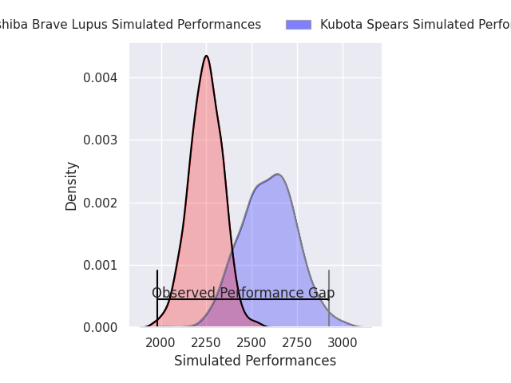
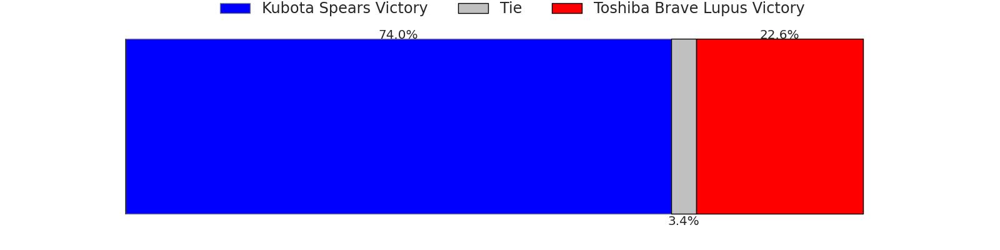
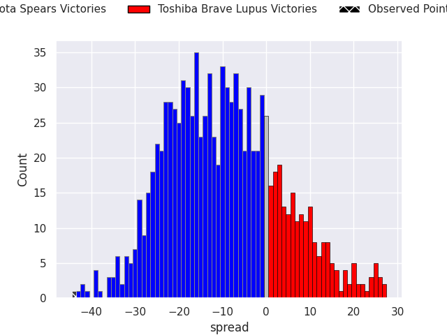
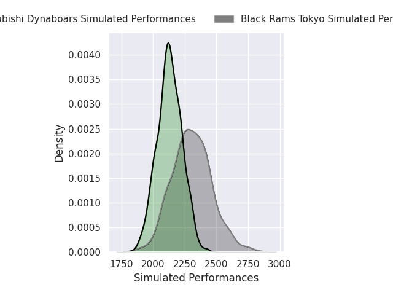
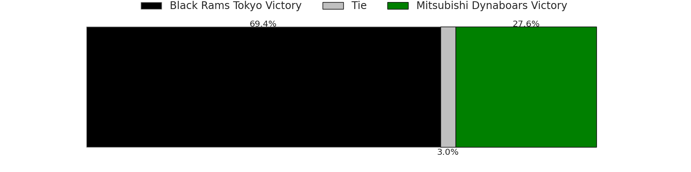
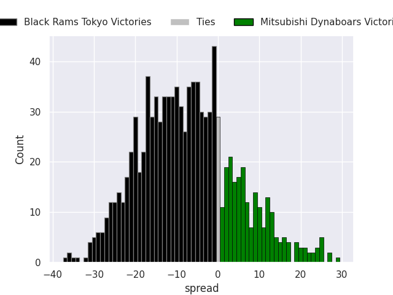

# Team Rankings

# Standings

## Current Standings

| Club                  |   Played |   Wins |   Point Differential |   Losing Bonus Points |   Try Bonus Points |   Competition Points |
|:----------------------|---------:|-------:|---------------------:|----------------------:|-------------------:|---------------------:|
| Saitama Wild Knights  |       12 |     11 |                  209 |                     0 |                  6 |                   50 |
| Kubota Spears         |       12 |     10 |                  248 |                     2 |                  5 |                   47 |
| Kobelco Kobe Steelers |       12 |     10 |                  207 |                     1 |                  4 |                   45 |
| Tokyo Sungoliath      |       11 |      7 |                  108 |                     3 |                  4 |                   35 |
| Black Rams Tokyo      |       12 |      7 |                  -25 |                     1 |                  2 |                   31 |
| Toshiba Brave Lupus   |       12 |      5 |                  -78 |                     3 |                  5 |                   28 |
| Shizuoka Blue Revs    |       12 |      4 |                  -55 |                     3 |                  3 |                   22 |
| Mie Honda Heat        |       12 |      4 |                  -99 |                     3 |                  3 |                   22 |
| Toyota Verblitz       |       12 |      4 |                  -37 |                     2 |                  3 |                   21 |
| Mitsubishi Dynaboars  |       11 |      3 |                 -127 |                     2 |                  2 |                   16 |
| Yokohama Canon Eagles |       12 |      3 |                 -134 |                     3 |                  1 |                   16 |
| Urayasu D-Rocks       |       12 |      3 |                 -217 |                     0 |                  2 |                   14 |

## Projected Remaining Table

| Club                  |   To Play |   Projected Wins |   Projected Differential |   Projected Losing Bonus Points | Projected Try Bonus Points   |   Projected Competition Points |
|:----------------------|----------:|-----------------:|-------------------------:|--------------------------------:|:-----------------------------|-------------------------------:|
| Tokyo Sungoliath      |         7 |            3.94  |                   18.088 |                           1.456 |                              |                         17.85  |
| Saitama Wild Knights  |         6 |            4.102 |                   43.793 |                           0.883 |                              |                         17.757 |
| Kubota Spears         |         6 |            3.917 |                   34.72  |                           0.985 |                              |                         17.139 |
| Kobelco Kobe Steelers |         6 |            3.452 |                   15.954 |                           1.176 |                              |                         15.54  |
| Black Rams Tokyo      |         6 |            2.949 |                    4.213 |                           1.331 |                              |                         13.687 |
| Shizuoka Blue Revs    |         6 |            2.861 |                   -0.47  |                           1.373 |                              |                         13.363 |
| Toshiba Brave Lupus   |         6 |            2.785 |                   -7.008 |                           1.215 |                              |                         12.863 |
| Mitsubishi Dynaboars  |         7 |            2.688 |                  -24.699 |                           1.496 |                              |                         12.798 |
| Yokohama Canon Eagles |         6 |            2.683 |                   -8.618 |                           1.255 |                              |                         12.485 |
| Mie Honda Heat        |         6 |            2.228 |                  -23.511 |                           1.336 |                              |                         10.696 |
| Toyota Verblitz       |         6 |            2.032 |                  -22.184 |                           1.513 |                              |                         10.149 |
| Urayasu D-Rocks       |         6 |            1.802 |                  -30.278 |                           1.472 |                              |                          9.164 |

## Projected Total Table

| Club                  |   Played |   Wins |   Point Differential |   Losing Bonus Points |   Try Bonus Points |   Competition Points |
|:----------------------|---------:|-------:|---------------------:|----------------------:|-------------------:|---------------------:|
| Saitama Wild Knights  |       18 | 15.102 |              252.793 |                 0.883 |                  6 |               67.757 |
| Kubota Spears         |       18 | 13.917 |              282.72  |                 2.985 |                  5 |               64.139 |
| Kobelco Kobe Steelers |       18 | 13.452 |              222.954 |                 2.176 |                  4 |               60.54  |
| Tokyo Sungoliath      |       18 | 10.94  |              126.088 |                 4.456 |                  4 |               52.85  |
| Black Rams Tokyo      |       18 |  9.949 |              -20.787 |                 2.331 |                  2 |               44.687 |
| Toshiba Brave Lupus   |       18 |  7.785 |              -85.008 |                 4.215 |                  5 |               40.863 |
| Shizuoka Blue Revs    |       18 |  6.861 |              -55.47  |                 4.373 |                  3 |               35.363 |
| Mie Honda Heat        |       18 |  6.228 |             -122.511 |                 4.336 |                  3 |               32.696 |
| Toyota Verblitz       |       18 |  6.032 |              -59.184 |                 3.513 |                  3 |               31.149 |
| Mitsubishi Dynaboars  |       18 |  5.688 |             -151.699 |                 3.496 |                  2 |               28.798 |
| Yokohama Canon Eagles |       18 |  5.683 |             -142.618 |                 4.255 |                  1 |               28.485 |
| Urayasu D-Rocks       |       18 |  4.802 |             -247.278 |                 1.472 |                  2 |               23.164 |

# Completed Match Review

| Model | Percent Correct Predictions | Spread Error |
| ------ | ------ | ------ |
| Club Level | 67.6% | 12.1 |
| Player Level: Lineup | nan% | nan |
| Player Level: Minutes | nan% | nan |

# Future Predictions

## Week 13

### Tokyo Sungoliath V Mitsubishi Dynaboars on 2026/02/07

Average Margin: Tokyo Sungoliath by 8.9

## Week 14

### Kubota Spears V Toshiba Brave Lupus on 2026/03/27

Average Margin: Kubota Spears by 9.8

### Shizuoka Blue Revs V Kobelco Kobe Steelers on 2026/03/28

Average Margin: Kobelco Kobe Steelers by 2.3

### Tokyo Sungoliath V Saitama Wild Knights on 2026/03/28

Average Margin: Saitama Wild Knights by 0.3

### Yokohama Canon Eagles V Toyota Verblitz on 2026/03/28

Average Margin: Yokohama Canon Eagles by 2.0

### Urayasu D-Rocks V Mie Honda Heat on 2026/03/29

Average Margin: Mie Honda Heat by 1.0

### Black Rams Tokyo V Mitsubishi Dynaboars on 2026/03/29

Average Margin: Black Rams Tokyo by 7.4

## Week 15

### Saitama Wild Knights V Yokohama Canon Eagles on 2026/04/04

Average Margin: Saitama Wild Knights by 10.6

### Mie Honda Heat V Tokyo Sungoliath on 2026/04/04

Average Margin: Tokyo Sungoliath by 5.0

### Toyota Verblitz V Kubota Spears on 2026/04/04

Average Margin: Kubota Spears by 6.3

### Mitsubishi Dynaboars V Shizuoka Blue Revs on 2026/04/04

Average Margin: Mitsubishi Dynaboars by 0.2

### Toshiba Brave Lupus V Urayasu D-Rocks on 2026/04/05

Average Margin: Toshiba Brave Lupus by 6.7

### Black Rams Tokyo V Kobelco Kobe Steelers on 2026/04/05

Average Margin: Kobelco Kobe Steelers by 1.2

## Week 16

### Mie Honda Heat V Black Rams Tokyo on 2026/04/17

Average Margin: Black Rams Tokyo by 1.6

### Toyota Verblitz V Kobelco Kobe Steelers on 2026/04/18

Average Margin: Kobelco Kobe Steelers by 4.7

### Yokohama Canon Eagles V Urayasu D-Rocks on 2026/04/18

Average Margin: Yokohama Canon Eagles by 5.9

### Shizuoka Blue Revs V Saitama Wild Knights on 2026/04/18

Average Margin: Saitama Wild Knights by 5.1

### Mitsubishi Dynaboars V Toshiba Brave Lupus on 2026/04/18

Average Margin: Mitsubishi Dynaboars by 0.2

### Tokyo Sungoliath V Kubota Spears on 2026/04/18

Average Margin: Kubota Spears by 0.2

## Week 17

### Urayasu D-Rocks V Shizuoka Blue Revs on 2026/04/24

Average Margin: Shizuoka Blue Revs by 3.7

### Kubota Spears V Mie Honda Heat on 2026/04/25

Average Margin: Kubota Spears by 11.3

### Black Rams Tokyo V Toyota Verblitz on 2026/04/25

Average Margin: Black Rams Tokyo by 5.0

### Toshiba Brave Lupus V Yokohama Canon Eagles on 2026/04/25

Average Margin: Toshiba Brave Lupus by 3.9

### Saitama Wild Knights V Mitsubishi Dynaboars on 2026/04/25

Average Margin: Saitama Wild Knights by 11.5

### Kobelco Kobe Steelers V Tokyo Sungoliath on 2026/04/25

Average Margin: Kobelco Kobe Steelers by 2.9

## Week 18

### Urayasu D-Rocks V Saitama Wild Knights on 2026/05/01

Average Margin: Saitama Wild Knights by 8.2

### Black Rams Tokyo V Kubota Spears on 2026/05/02

Average Margin: Kubota Spears by 3.4

### Toshiba Brave Lupus V Shizuoka Blue Revs on 2026/05/02

Average Margin: Toshiba Brave Lupus by 0.6

### Toyota Verblitz V Tokyo Sungoliath on 2026/05/02

Average Margin: Tokyo Sungoliath by 2.3

### Kobelco Kobe Steelers V Mie Honda Heat on 2026/05/02

Average Margin: Kobelco Kobe Steelers by 8.6

### Yokohama Canon Eagles V Mitsubishi Dynaboars on 2026/05/02

Average Margin: Yokohama Canon Eagles by 2.1

## Week 19

### Saitama Wild Knights V Toshiba Brave Lupus on 2026/05/09

Average Margin: Saitama Wild Knights by 8.2

### Mie Honda Heat V Toyota Verblitz on 2026/05/09

Average Margin: Mie Honda Heat by 2.0

### Shizuoka Blue Revs V Yokohama Canon Eagles on 2026/05/09

Average Margin: Shizuoka Blue Revs by 4.0

### Mitsubishi Dynaboars V Urayasu D-Rocks on 2026/05/10

Average Margin: Mitsubishi Dynaboars by 4.9

### Kubota Spears V Kobelco Kobe Steelers on 2026/05/10

Average Margin: Kubota Spears by 3.7

### Tokyo Sungoliath V Black Rams Tokyo on 2026/05/10

Average Margin: Tokyo Sungoliath by 5.2

