# Team Rankings

# Standings

## Current Standings

| Club                  |   Played |   Wins |   Point Differential |   Losing Bonus Points |   Try Bonus Points |   Competition Points |
|:----------------------|---------:|-------:|---------------------:|----------------------:|-------------------:|---------------------:|
| Saitama Wild Knights  |        8 |      8 |                  152 |                     0 |                  6 |                   38 |
| Kubota Spears         |        8 |      7 |                  192 |                     1 |                  5 |                   34 |
| Kobelco Kobe Steelers |        8 |      7 |                   90 |                     1 |                  4 |                   33 |
| Toshiba Brave Lupus   |        8 |      5 |                   13 |                     2 |                  5 |                   27 |
| Tokyo Sungoliath      |        7 |      4 |                    7 |                     2 |                  4 |                   22 |
| Black Rams Tokyo      |        8 |      4 |                  -46 |                     1 |                  2 |                   19 |
| Shizuoka Blue Revs    |        8 |      3 |                  -23 |                     1 |                  3 |                   16 |
| Urayasu D-Rocks       |        8 |      3 |                  -72 |                     0 |                  2 |                   14 |
| Mie Honda Heat        |        8 |      2 |                  -54 |                     2 |                  3 |                   13 |
| Mitsubishi Dynaboars  |        7 |      2 |                  -61 |                     1 |                  2 |                   11 |
| Toyota Verblitz       |        8 |      1 |                 -100 |                     2 |                  3 |                    9 |
| Yokohama Canon Eagles |        8 |      1 |                  -98 |                     3 |                  1 |                    8 |

## Projected Remaining Table

| Club                  |   To Play |   Projected Wins |   Projected Differential |   Projected Losing Bonus Points | Projected Try Bonus Points   |   Projected Competition Points |
|:----------------------|----------:|-----------------:|-------------------------:|--------------------------------:|:-----------------------------|-------------------------------:|
| Kubota Spears         |        10 |            6.84  |                   66.835 |                           1.477 |                              |                         29.587 |
| Saitama Wild Knights  |        10 |            6.259 |                   48.66  |                           1.707 |                              |                         27.525 |
| Kobelco Kobe Steelers |        10 |            6.057 |                   38.195 |                           1.855 |                              |                         26.941 |
| Tokyo Sungoliath      |        11 |            5.863 |                   19.975 |                           2.404 |                              |                         26.872 |
| Toshiba Brave Lupus   |        10 |            5.776 |                   31.225 |                           1.905 |                              |                         25.779 |
| Shizuoka Blue Revs    |        10 |            4.65  |                   -2.832 |                           2.437 |                              |                         22.001 |
| Black Rams Tokyo      |        10 |            4.63  |                   -4.532 |                           2.212 |                              |                         21.574 |
| Mitsubishi Dynaboars  |        11 |            3.988 |                  -45.373 |                           2.419 |                              |                         19.283 |
| Mie Honda Heat        |        10 |            3.85  |                  -35.586 |                           2.169 |                              |                         18.417 |
| Yokohama Canon Eagles |        10 |            3.592 |                  -42.786 |                           2.091 |                              |                         17.299 |
| Toyota Verblitz       |        10 |            3.467 |                  -35.464 |                           2.485 |                              |                         17.245 |
| Urayasu D-Rocks       |        10 |            3.438 |                  -38.317 |                           2.475 |                              |                         17.113 |

## Projected Total Table

| Club                  |   Played |   Wins |   Point Differential |   Losing Bonus Points |   Try Bonus Points |   Competition Points |
|:----------------------|---------:|-------:|---------------------:|----------------------:|-------------------:|---------------------:|
| Saitama Wild Knights  |       18 | 14.259 |              200.66  |                 1.707 |                  6 |               65.525 |
| Kubota Spears         |       18 | 13.84  |              258.835 |                 2.477 |                  5 |               63.587 |
| Kobelco Kobe Steelers |       18 | 13.057 |              128.195 |                 2.855 |                  4 |               59.941 |
| Toshiba Brave Lupus   |       18 | 10.776 |               44.225 |                 3.905 |                  5 |               52.779 |
| Tokyo Sungoliath      |       18 |  9.863 |               26.975 |                 4.404 |                  4 |               48.872 |
| Black Rams Tokyo      |       18 |  8.63  |              -50.532 |                 3.212 |                  2 |               40.574 |
| Shizuoka Blue Revs    |       18 |  7.65  |              -25.832 |                 3.437 |                  3 |               38.001 |
| Mie Honda Heat        |       18 |  5.85  |              -89.586 |                 4.169 |                  3 |               31.417 |
| Urayasu D-Rocks       |       18 |  6.438 |             -110.317 |                 2.475 |                  2 |               31.113 |
| Mitsubishi Dynaboars  |       18 |  5.988 |             -106.373 |                 3.419 |                  2 |               30.283 |
| Toyota Verblitz       |       18 |  4.467 |             -135.464 |                 4.485 |                  3 |               26.245 |
| Yokohama Canon Eagles |       18 |  4.592 |             -140.786 |                 5.091 |                  1 |               25.299 |

# Completed Match Review

| Model | Percent Correct Predictions | Spread Error |
| ------ | ------ | ------ |
| Club Level | 74.1% | 10.1 |
| Player Level: Lineup | nan% | nan |
| Player Level: Minutes | nan% | nan |

# Future Predictions

## Week 9

### Tokyo Sungoliath V Mitsubishi Dynaboars on 2026/02/07

Average Margin: Tokyo Sungoliath by 8.2

## Week 10

### Black Rams Tokyo V Urayasu D-Rocks on 2026/02/20

Average Margin: Black Rams Tokyo by 6.0

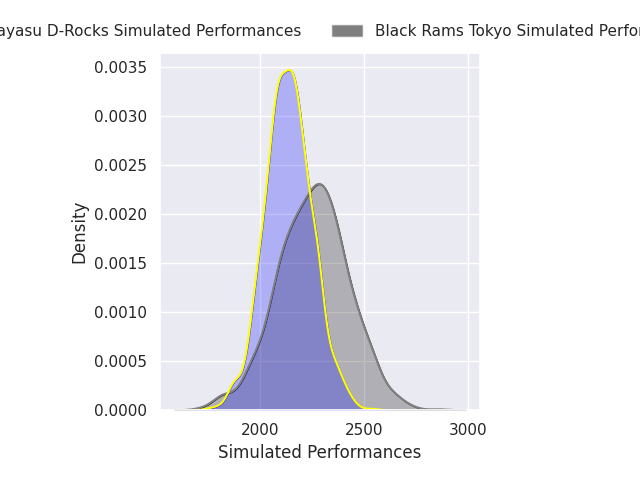

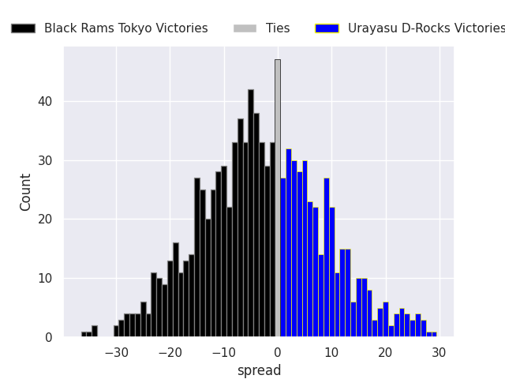

### Toyota Verblitz V Toshiba Brave Lupus on 2026/02/20

Average Margin: Toshiba Brave Lupus by 6.4

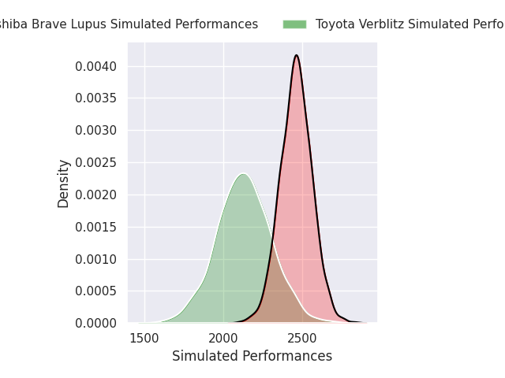
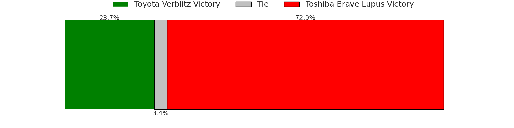
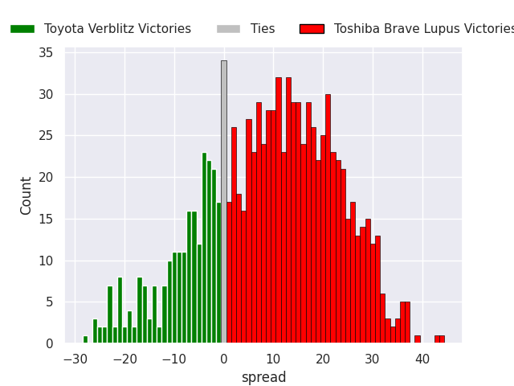

### Kobelco Kobe Steelers V Saitama Wild Knights on 2026/02/20

Average Margin: Kobelco Kobe Steelers by 0.4

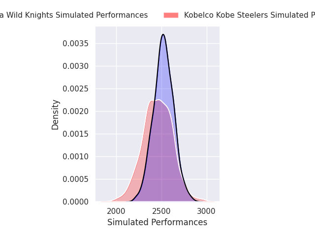
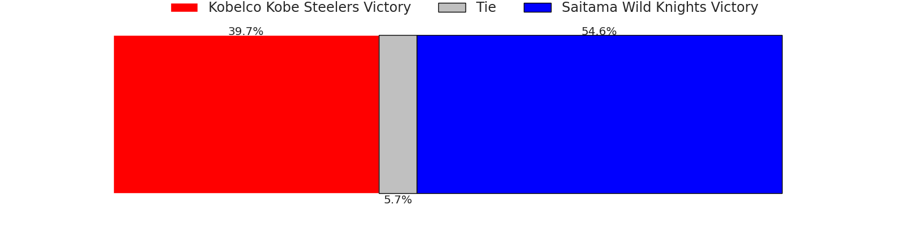
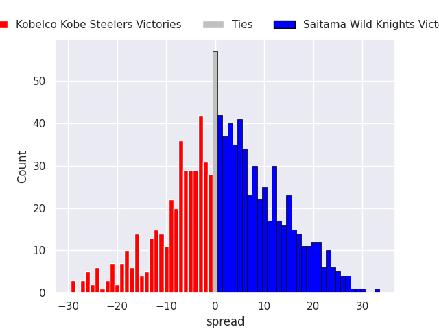

### Kubota Spears V Mitsubishi Dynaboars on 2026/02/20

Average Margin: Kubota Spears by 13.0

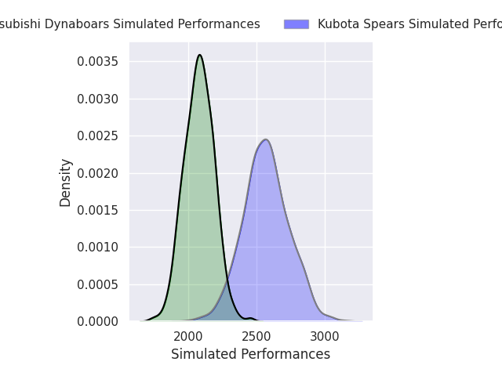

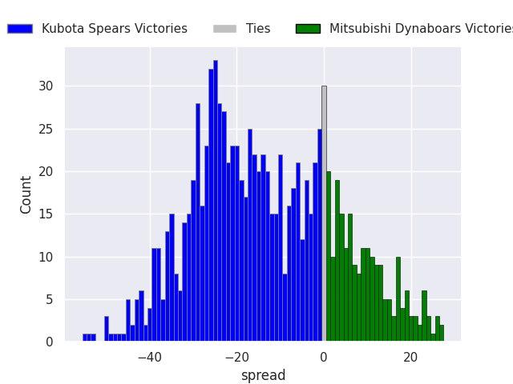

### Tokyo Sungoliath V Yokohama Canon Eagles on 2026/02/21

Average Margin: Tokyo Sungoliath by 7.5

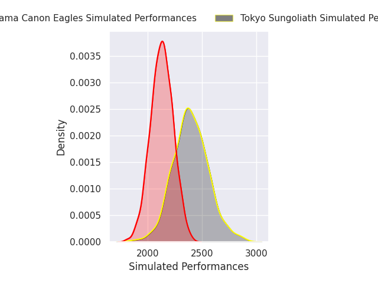
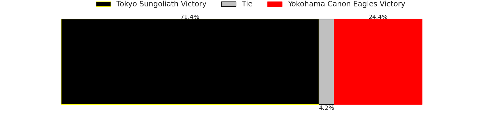
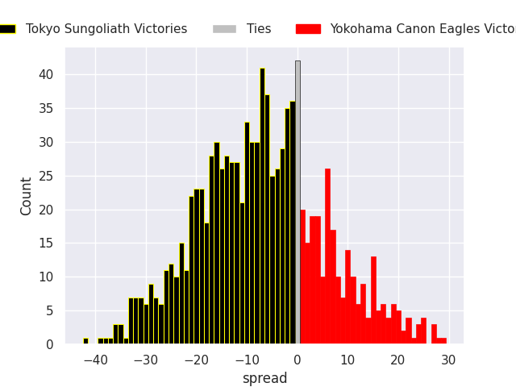

### Mie Honda Heat V Shizuoka Blue Revs on 2026/02/21

Average Margin: Shizuoka Blue Revs by 1.1

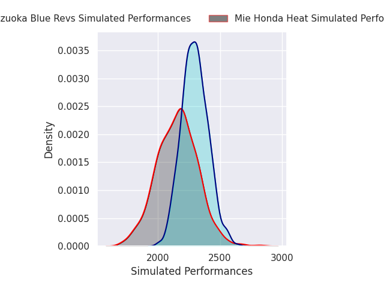
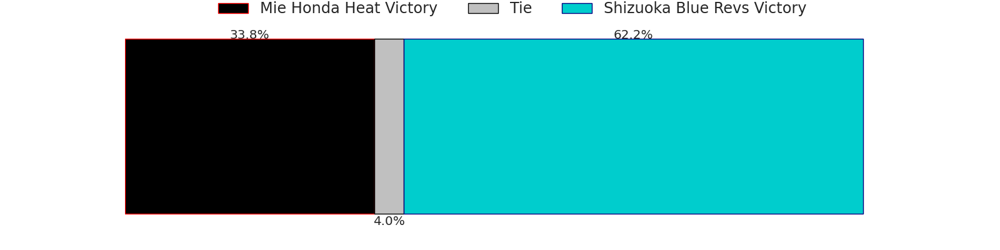
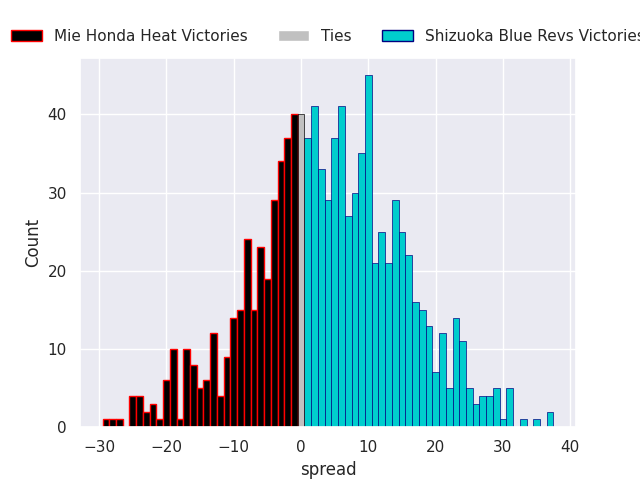

## Week 11

### Saitama Wild Knights V Mie Honda Heat on 2026/02/28

Average Margin: Saitama Wild Knights by 11.3

### Toshiba Brave Lupus V Black Rams Tokyo on 2026/02/28

Average Margin: Toshiba Brave Lupus by 6.0

### Urayasu D-Rocks V Kobelco Kobe Steelers on 2026/02/28

Average Margin: Kobelco Kobe Steelers by 5.6

### Mitsubishi Dynaboars V Toyota Verblitz on 2026/03/01

Average Margin: Mitsubishi Dynaboars by 3.9

### Yokohama Canon Eagles V Kubota Spears on 2026/03/01

Average Margin: Kubota Spears by 8.6

### Shizuoka Blue Revs V Tokyo Sungoliath on 2026/03/01

Average Margin: Shizuoka Blue Revs by 0.5

## Week 12

### Mie Honda Heat V Yokohama Canon Eagles on 2026/03/14

Average Margin: Mie Honda Heat by 3.4

### Black Rams Tokyo V Shizuoka Blue Revs on 2026/03/14

Average Margin: Black Rams Tokyo by 1.5

### Kubota Spears V Saitama Wild Knights on 2026/03/14

Average Margin: Kubota Spears by 3.8

### Kobelco Kobe Steelers V Mitsubishi Dynaboars on 2026/03/14

Average Margin: Kobelco Kobe Steelers by 9.6

### Toyota Verblitz V Urayasu D-Rocks on 2026/03/15

Average Margin: Toyota Verblitz by 1.5

### Tokyo Sungoliath V Toshiba Brave Lupus on 2026/03/15

Average Margin: Tokyo Sungoliath by 0.6

## Week 13

### Kobelco Kobe Steelers V Yokohama Canon Eagles on 2026/03/20

Average Margin: Kobelco Kobe Steelers by 9.5

### Saitama Wild Knights V Black Rams Tokyo on 2026/03/21

Average Margin: Saitama Wild Knights by 7.1

### Mitsubishi Dynaboars V Tokyo Sungoliath on 2026/03/21

Average Margin: Tokyo Sungoliath by 2.5

### Urayasu D-Rocks V Kubota Spears on 2026/03/21

Average Margin: Kubota Spears by 8.7

### Toyota Verblitz V Shizuoka Blue Revs on 2026/03/22

Average Margin: Shizuoka Blue Revs by 2.1

### Toshiba Brave Lupus V Mie Honda Heat on 2026/03/22

Average Margin: Toshiba Brave Lupus by 7.9

## Week 14

### Kubota Spears V Toshiba Brave Lupus on 2026/03/28

Average Margin: Kubota Spears by 6.1

### Tokyo Sungoliath V Saitama Wild Knights on 2026/03/28

Average Margin: Saitama Wild Knights by 2.4

### Shizuoka Blue Revs V Kobelco Kobe Steelers on 2026/03/28

Average Margin: Kobelco Kobe Steelers by 1.7

### Yokohama Canon Eagles V Toyota Verblitz on 2026/03/28

Average Margin: Yokohama Canon Eagles by 2.5

### Black Rams Tokyo V Mitsubishi Dynaboars on 2026/03/29

Average Margin: Black Rams Tokyo by 4.5

### Urayasu D-Rocks V Mie Honda Heat on 2026/03/29

Average Margin: Urayasu D-Rocks by 2.2

## Week 15

### Saitama Wild Knights V Yokohama Canon Eagles on 2026/04/04

Average Margin: Saitama Wild Knights by 9.4

### Mie Honda Heat V Tokyo Sungoliath on 2026/04/04

Average Margin: Tokyo Sungoliath by 2.1

### Toyota Verblitz V Kubota Spears on 2026/04/04

Average Margin: Kubota Spears by 6.8

### Mitsubishi Dynaboars V Shizuoka Blue Revs on 2026/04/04

Average Margin: Mitsubishi Dynaboars by 0.3

### Toshiba Brave Lupus V Urayasu D-Rocks on 2026/04/05

Average Margin: Toshiba Brave Lupus by 7.5

### Black Rams Tokyo V Kobelco Kobe Steelers on 2026/04/05

Average Margin: Kobelco Kobe Steelers by 0.9

## Week 16

### Mie Honda Heat V Black Rams Tokyo on 2026/04/17

Average Margin: Black Rams Tokyo by 0.5

### Shizuoka Blue Revs V Saitama Wild Knights on 2026/04/18

Average Margin: Saitama Wild Knights by 3.8

### Tokyo Sungoliath V Kubota Spears on 2026/04/18

Average Margin: Kubota Spears by 1.6

### Mitsubishi Dynaboars V Toshiba Brave Lupus on 2026/04/18

Average Margin: Toshiba Brave Lupus by 3.0

### Yokohama Canon Eagles V Urayasu D-Rocks on 2026/04/18

Average Margin: Yokohama Canon Eagles by 2.9

### Toyota Verblitz V Kobelco Kobe Steelers on 2026/04/18

Average Margin: Kobelco Kobe Steelers by 4.7

## Week 17

### Urayasu D-Rocks V Shizuoka Blue Revs on 2026/04/24

Average Margin: Shizuoka Blue Revs by 0.3

### Kubota Spears V Mie Honda Heat on 2026/04/25

Average Margin: Kubota Spears by 10.3

### Kobelco Kobe Steelers V Tokyo Sungoliath on 2026/04/25

Average Margin: Kobelco Kobe Steelers by 3.6

### Black Rams Tokyo V Toyota Verblitz on 2026/04/25

Average Margin: Black Rams Tokyo by 4.7

### Saitama Wild Knights V Mitsubishi Dynaboars on 2026/04/25

Average Margin: Saitama Wild Knights by 10.1

### Toshiba Brave Lupus V Yokohama Canon Eagles on 2026/04/25

Average Margin: Toshiba Brave Lupus by 7.4

## Week 18

### Urayasu D-Rocks V Saitama Wild Knights on 2026/05/01

Average Margin: Saitama Wild Knights by 4.6

### Toyota Verblitz V Tokyo Sungoliath on 2026/05/02

Average Margin: Tokyo Sungoliath by 3.0

### Yokohama Canon Eagles V Mitsubishi Dynaboars on 2026/05/02

Average Margin: Yokohama Canon Eagles by 2.0

### Toshiba Brave Lupus V Shizuoka Blue Revs on 2026/05/02

Average Margin: Toshiba Brave Lupus by 3.8

### Black Rams Tokyo V Kubota Spears on 2026/05/02

Average Margin: Kubota Spears by 3.7

### Kobelco Kobe Steelers V Mie Honda Heat on 2026/05/02

Average Margin: Kobelco Kobe Steelers by 6.4

## Week 19

### Shizuoka Blue Revs V Yokohama Canon Eagles on 2026/05/09

Average Margin: Shizuoka Blue Revs by 4.3

### Saitama Wild Knights V Toshiba Brave Lupus on 2026/05/09

Average Margin: Saitama Wild Knights by 4.1

### Mie Honda Heat V Toyota Verblitz on 2026/05/09

Average Margin: Mie Honda Heat by 2.8

### Kubota Spears V Kobelco Kobe Steelers on 2026/05/10

Average Margin: Kubota Spears by 4.1

### Tokyo Sungoliath V Black Rams Tokyo on 2026/05/10

Average Margin: Tokyo Sungoliath by 4.1

### Mitsubishi Dynaboars V Urayasu D-Rocks on 2026/05/10

Average Margin: Mitsubishi Dynaboars by 3.4

