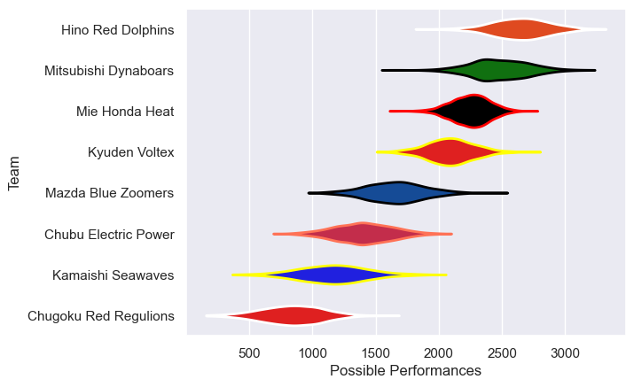

---  
title: "Japan Rugby League One D2 17/18 Status"  
date: 2025-07-28 6:00:00 -0500  
categories: model review projection  
layout: article  
aside:  
    toc: true  
---
# Current Team Rankings

# Standings

## Current Standings

| Club                  |   Played |   Wins |   Point Differential |   Losing Bonus Points | Try Bonus Points   |   Competition Points |
|:----------------------|---------:|-------:|---------------------:|----------------------:|:-------------------|---------------------:|
| Mie Honda Heat        |        7 |      7 |                  435 |                     0 |                    |                   28 |
| Hino Red Dolphins     |        7 |      6 |                  128 |                     0 |                    |                   24 |
| Mitsubishi Dynaboars  |        7 |      5 |                  117 |                     1 |                    |                   21 |
| Kyuden Voltex         |        7 |      4 |                   31 |                     0 |                    |                   16 |
| Kamaishi Seawaves     |        7 |      2 |                  -26 |                     1 |                    |                   11 |
| Mazda Blue Zoomers    |        7 |      2 |                  -41 |                     0 |                    |                   10 |
| Chugoku Red Regulions |        7 |      1 |                 -281 |                     0 |                    |                    4 |
| Chubu Electric Power  |        7 |      0 |                 -363 |                     0 |                    |                    0 |

# Completed Match Review

| Model | Percent Correct Predictions | Spread Error |
| ------ | ------ | ------ |
| Club Level | 42.9% | 45.3 |
| Player Level: Lineup | nan% | nan |
| Player Level: Minutes | nan% | nan |

