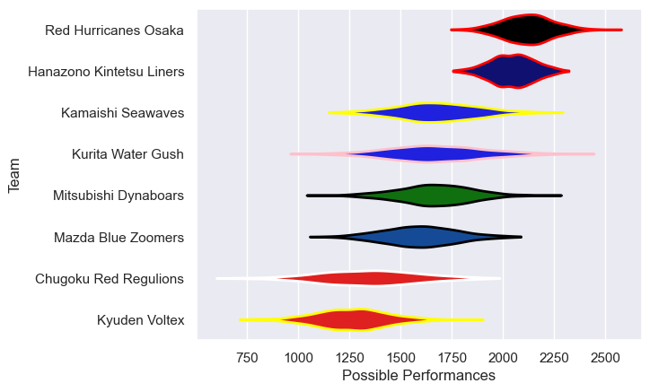

---  
title: "Japan Rugby League One D2 18/19"  
date: 2025-07-29 6:00:00 -0500  
categories: model review projection  
layout: article  
aside:  
    toc: true  
---
# Current Team Rankings

# Standings

## Current Standings

| Club                     |   Played |   Wins |   Point Differential |   Losing Bonus Points | Try Bonus Points   |   Competition Points |
|:-------------------------|---------:|-------:|---------------------:|----------------------:|:-------------------|---------------------:|
| Hanazono Kintetsu Liners |        7 |      7 |                  215 |                     0 |                    |                   28 |
| Red Hurricanes Osaka     |        7 |      6 |                  209 |                     1 |                    |                   25 |
| Mitsubishi Dynaboars     |        7 |      5 |                   93 |                     0 |                    |                   20 |
| Kurita Water Gush        |        7 |      4 |                  -25 |                     0 |                    |                   16 |
| Kamaishi Seawaves        |        7 |      2 |                  -50 |                     1 |                    |                    9 |
| Mazda Blue Zoomers       |        7 |      2 |                 -102 |                     1 |                    |                    9 |
| Chugoku Red Regulions    |        7 |      1 |                 -151 |                     0 |                    |                    4 |
| Kyuden Voltex            |        7 |      1 |                 -189 |                     0 |                    |                    4 |

# Completed Match Review

| Model | Percent Correct Predictions | Spread Error |
| ------ | ------ | ------ |
| Club Level | 60.7% | 26.0 |
| Player Level: Lineup | nan% | nan |
| Player Level: Minutes | nan% | nan |

