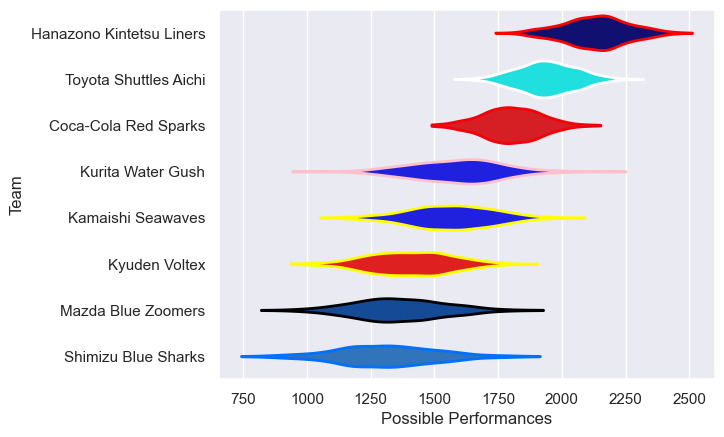

---  
title: "Japan Rugby League One D2 19/20"  
date: 2025-07-29 6:00:00 -0500  
categories: model review projection  
layout: article  
aside:  
    toc: true  
---
# Current Team Rankings

# Standings

## Current Standings

| Club                     |   Played |   Wins |   Point Differential |   Losing Bonus Points | Try Bonus Points   |   Competition Points |
|:-------------------------|---------:|-------:|---------------------:|----------------------:|:-------------------|---------------------:|
| Hanazono Kintetsu Liners |        7 |      7 |                  288 |                     0 |                    |                   28 |
| Coca-Cola Red Sparks     |        7 |      5 |                   81 |                     0 |                    |                   22 |
| Toyota Shuttles Aichi    |        7 |      5 |                  121 |                     0 |                    |                   20 |
| Kamaishi Seawaves        |        7 |      3 |                  -90 |                     1 |                    |                   15 |
| Kurita Water Gush        |        7 |      3 |                  -67 |                     1 |                    |                   13 |
| Mazda Blue Zoomers       |        7 |      2 |                  -96 |                     1 |                    |                    9 |
| Kyuden Voltex            |        7 |      2 |                 -125 |                     0 |                    |                    8 |
| Shimizu Blue Sharks      |        7 |      0 |                 -112 |                     3 |                    |                    3 |

# Completed Match Review

| Model | Percent Correct Predictions | Spread Error |
| ------ | ------ | ------ |
| Club Level | 64.3% | 18.3 |
| Player Level: Lineup | nan% | nan |
| Player Level: Minutes | nan% | nan |

