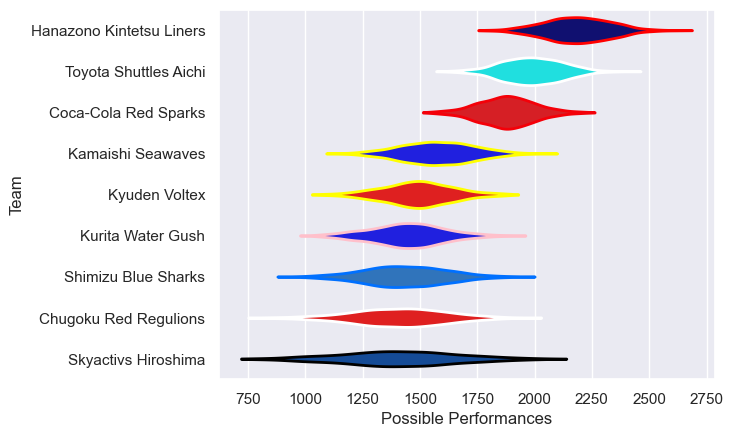

---  
title: "Japan Rugby League One D2 20/21"  
date: 2025-07-29 6:00:00 -0500  
categories: model review projection  
layout: article  
aside:  
    toc: true  
---
# Current Team Rankings

# Standings

## Current Standings

| Club                     |   Played |   Wins |   Point Differential |   Losing Bonus Points |   Try Bonus Points |   Competition Points |
|:-------------------------|---------:|-------:|---------------------:|----------------------:|-------------------:|---------------------:|
| Toyota Shuttles Aichi    |        6 |      6 |                  263 |                     0 |                  1 |                   25 |
| Coca-Cola Red Sparks     |        6 |      4 |                   49 |                     0 |                  1 |                   17 |
| Hanazono Kintetsu Liners |        5 |      4 |                  140 |                     0 |                    |                   16 |
| Kamaishi Seawaves        |        5 |      3 |                    9 |                     1 |                  1 |                   14 |
| Kyuden Voltex            |        6 |      3 |                  -12 |                     1 |                  1 |                   14 |
| Kurita Water Gush        |        5 |      2 |                  -55 |                     1 |                    |                    9 |
| Shimizu Blue Sharks      |        5 |      1 |                 -127 |                     1 |                    |                    5 |
| Skyactivs Hiroshima      |        6 |      1 |                 -134 |                     1 |                    |                    5 |
| Chugoku Red Regulions    |        4 |      0 |                 -133 |                     1 |                    |                    1 |

# Completed Match Review

| Model | Percent Correct Predictions | Spread Error |
| ------ | ------ | ------ |
| Club Level | 70.8% | 20.2 |
| Player Level: Lineup | nan% | nan |
| Player Level: Minutes | nan% | nan |

