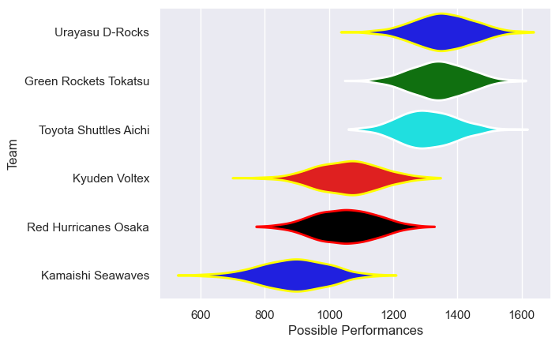
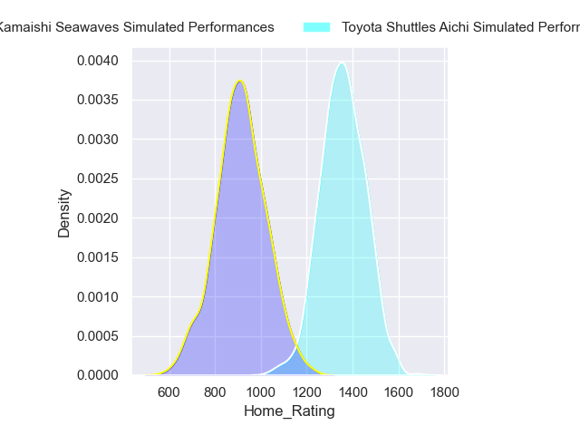
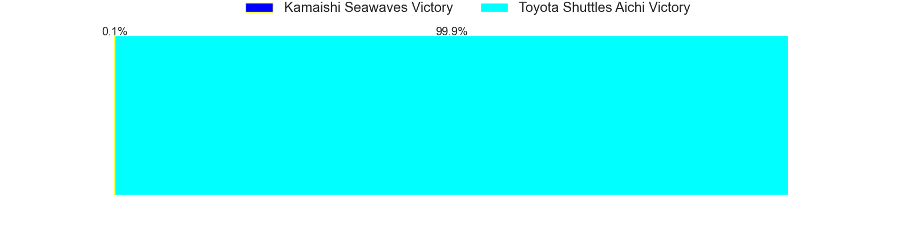
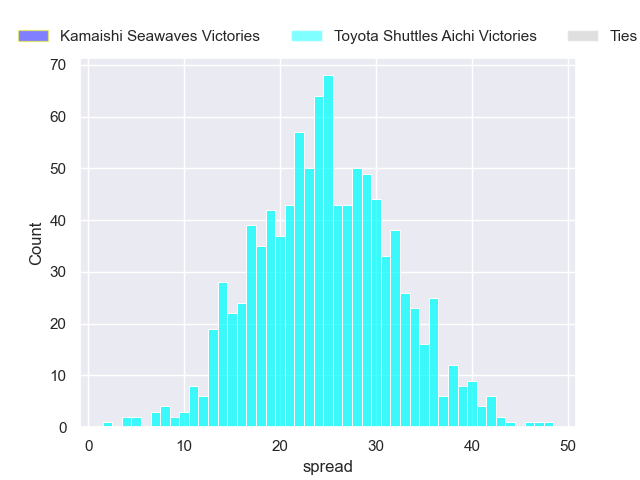
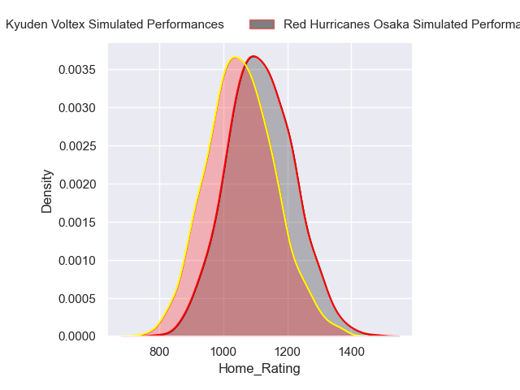
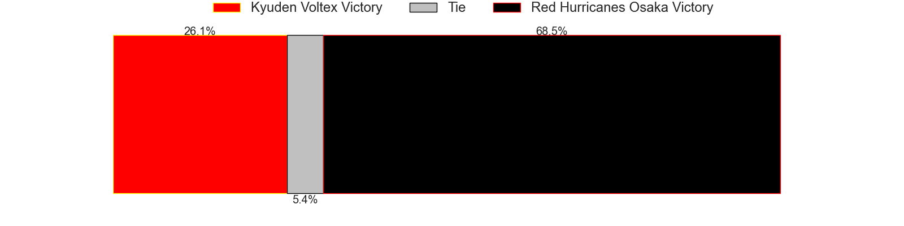
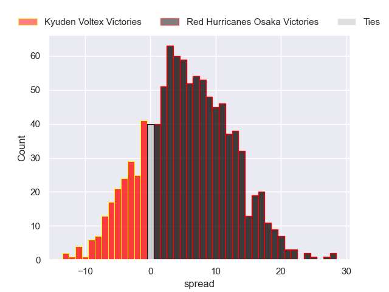

---  
title: "Japan Rugby League One D2 2023 Status"  
date: 2024-03-26 6:00:00 -0500  
categories: model review projection  
layout: article  
aside:  
    toc: true  
---
# Current Team Rankings

# Standings

## Current Standings

| Club                  |   Played |   Wins |   Point Differential |   Losing Bonus Points |   Try Bonus Points |   Competition Points |
|:----------------------|---------:|-------:|---------------------:|----------------------:|-------------------:|---------------------:|
| Urayasu D-Rocks       |        9 |      8 |                  210 |                     1 |                nan |                   39 |
| Green Rockets Tokatsu |        8 |      7 |                  153 |                     0 |                nan |                   33 |
| Toyota Shuttles Aichi |        9 |      6 |                  138 |                     2 |                nan |                   30 |
| Red Hurricanes Osaka  |        9 |      3 |                 -186 |                     0 |                nan |                   13 |
| Kyuden Voltex         |        9 |      1 |                 -117 |                     4 |                nan |                    9 |
| Kamaishi Seawaves     |        8 |      1 |                 -198 |                     2 |                nan |                    8 |

## Projected Remaining Table

| Club                  |   Matches Remaining |   Wins |   Point Differential |   Losing Bonus Points |   Try Bonus Points |   Competition Points |
|:----------------------|--------------------:|-------:|---------------------:|----------------------:|-------------------:|---------------------:|
| Toyota Shuttles Aichi |                   1 |    1   |             19.5541  |                   0   |                0.7 |                  4.7 |
| Urayasu D-Rocks       |                   1 |    0.7 |              3.8514  |                   0.2 |                0.3 |                  3.5 |
| Red Hurricanes Osaka  |                   1 |    0.7 |              3.00213 |                   0.3 |                0.3 |                  3.2 |
| Kyuden Voltex         |                   1 |    0.3 |             -3.00213 |                   0.4 |                0.5 |                  2.2 |
| Green Rockets Tokatsu |                   1 |    0.3 |             -3.8514  |                   0.4 |                0.3 |                  1.7 |
| Kamaishi Seawaves     |                   1 |    0   |            -19.5541  |                   0   |                0.4 |                  0.4 |

## Projected Total Table

| Club                  |   Total Matches |   Wins |   Point Differential |   Losing Bonus Points |   Try Bonus Points |   Competition Points |
|:----------------------|----------------:|-------:|---------------------:|----------------------:|-------------------:|---------------------:|
| Urayasu D-Rocks       |              10 |    8.7 |              213.851 |                   1.2 |                0.3 |                 42.5 |
| Toyota Shuttles Aichi |              10 |    7   |              157.554 |                   2   |                0.7 |                 34.7 |
| Green Rockets Tokatsu |               9 |    7.3 |              149.149 |                   0.4 |                0.3 |                 34.7 |
| Red Hurricanes Osaka  |              10 |    3.7 |             -182.998 |                   0.3 |                0.3 |                 16.2 |
| Kyuden Voltex         |              10 |    1.3 |             -120.002 |                   4.4 |                0.5 |                 11.2 |
| Kamaishi Seawaves     |               9 |    1   |             -217.554 |                   2   |                0.4 |                  8.4 |

# Completed Match Review

| Model | Percent Correct Predictions | Spread Error |
| ------ | ------ | ------ |
| Club Level | 84.6% | 16.0 |
| Player Level: Lineup | 66.7% | 21.8 |
| Player Level: Minutes | 71.4% | 22.0 |

# Future Predictions

## Week 10

### Urayasu D-Rocks V Green Rockets Tokatsu on 2024/03/30

Average Margin: Urayasu D-Rocks by 3.9

Average Scoreline: 30-26

### Toyota Shuttles Aichi V Kamaishi Seawaves on 2024/03/30

Average Margin: Toyota Shuttles Aichi by 19.6

Average Scoreline: 42-22

### Red Hurricanes Osaka V Kyuden Voltex on 2024/03/31

Average Margin: Red Hurricanes Osaka by 3.0

Average Scoreline: 31-28

