---  
title: "Japan Rugby League One D2 2023 Status"  
date: 2023-12-27 6:00:00 -0500  
categories: model review projection  
layout: article  
aside:  
    toc: true  
---
# Current Team Rankings

# Standings

## Current Standings

| Club                  |   Played |   Wins |   Point Differential |   Losing Bonus Points |   Try Bonus Points |   Competition Points |
|:----------------------|---------:|-------:|---------------------:|----------------------:|-------------------:|---------------------:|
| Toyota Shuttles Aichi |        4 |      4 |                  160 |                     0 |                  4 |                   20 |
| Green Rockets Tokatsu |        4 |      3 |                   12 |                     0 |                  3 |                   15 |
| Urayasu D-Rocks       |        4 |      2 |                   69 |                     2 |                  4 |                   14 |
| Red Hurricanes Osaka  |        4 |      3 |                  -49 |                     0 |                  2 |                   14 |
| Kyuden Voltex         |        4 |      0 |                  -70 |                     2 |                  1 |                    3 |
| Kamaishi Seawaves     |        4 |      0 |                 -122 |                     1 |                  1 |                    2 |

## Projected Remaining Table

| Club                  |   Matches Remaining |   Wins |   Point Differential |   Losing Bonus Points |   Try Bonus Points |   Competition Points |
|:----------------------|--------------------:|-------:|---------------------:|----------------------:|-------------------:|---------------------:|
| Urayasu D-Rocks       |                   7 |    6   |              77.8051 |                   0.8 |                5.9 |                 30.8 |
| Green Rockets Tokatsu |                   7 |    5.6 |              71.0246 |                   0.9 |                5.5 |                 28.8 |
| Toyota Shuttles Aichi |                   7 |    4.5 |              43.0749 |                   1.4 |                4.4 |                 24   |
| Red Hurricanes Osaka  |                   7 |    2.3 |             -30.0762 |                   1.6 |                2.3 |                 13.1 |
| Kyuden Voltex         |                   7 |    2.2 |             -33.7073 |                   1.4 |                2.2 |                 12.2 |
| Kamaishi Seawaves     |                   7 |    0.3 |            -128.121  |                   0.8 |                0.4 |                  2.4 |

## Projected Total Table

| Club                  |   Total Matches |   Wins |   Point Differential |   Losing Bonus Points |   Try Bonus Points |   Competition Points |
|:----------------------|----------------:|-------:|---------------------:|----------------------:|-------------------:|---------------------:|
| Urayasu D-Rocks       |              11 |    8   |             146.805  |                   2.8 |                9.9 |                 44.8 |
| Toyota Shuttles Aichi |              11 |    8.5 |             203.075  |                   1.4 |                8.4 |                 44   |
| Green Rockets Tokatsu |              11 |    8.6 |              83.0246 |                   0.9 |                8.5 |                 43.8 |
| Red Hurricanes Osaka  |              11 |    5.3 |             -79.0762 |                   1.6 |                4.3 |                 27.1 |
| Kyuden Voltex         |              11 |    2.2 |            -103.707  |                   3.4 |                3.2 |                 15.2 |
| Kamaishi Seawaves     |              11 |    0.3 |            -250.121  |                   1.8 |                1.4 |                  4.4 |

# Completed Match Review

| Model | Percent Correct Predictions | Spread Error |
| ------ | ------ | ------ |
| Club Level | 77.8% | 20.2 |
| Player Level: Lineup | 55.6% | 22.7 |
| Player Level: Minutes | 66.7% | 22.4 |

# Future Predictions

## Week 5

### Kyuden Voltex V Kamaishi Seawaves on 2024/01/06

Average Margin: Kyuden Voltex by 13.5

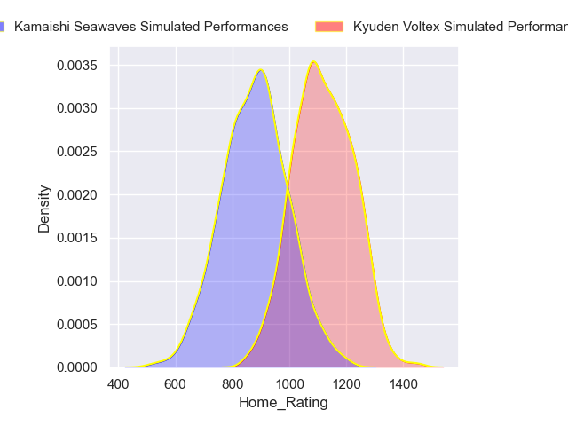
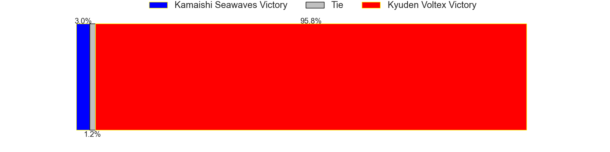
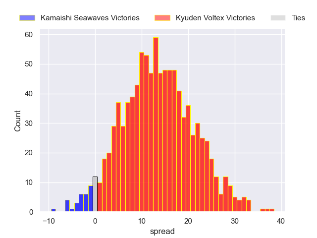

## Week 6

### Urayasu D-Rocks V Toyota Shuttles Aichi on 2024/01/13

Average Margin: Urayasu D-Rocks by 7.1

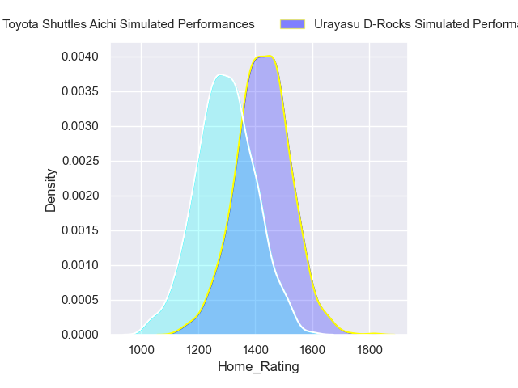
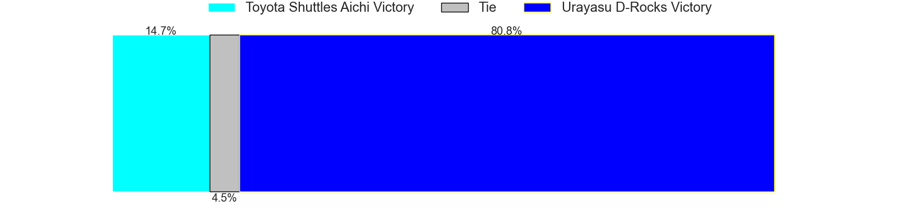
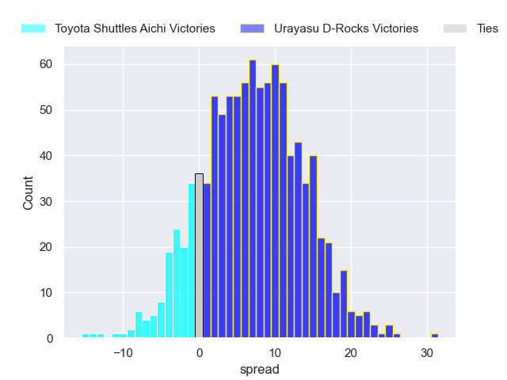

### Red Hurricanes Osaka V Green Rockets Tokatsu on 2024/01/13

Average Margin: Green Rockets Tokatsu by 6.0

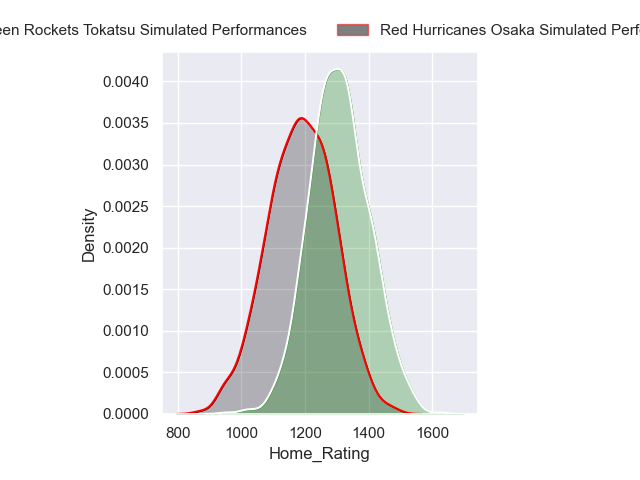
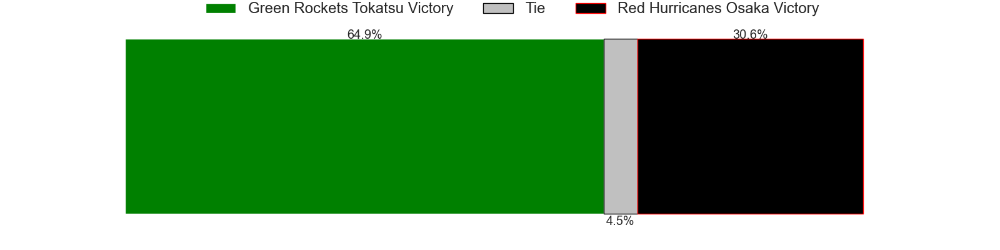
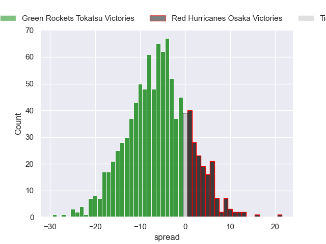

## Week 7

### Toyota Shuttles Aichi V Kyuden Voltex on 2024/01/28

Average Margin: Toyota Shuttles Aichi by 15.6

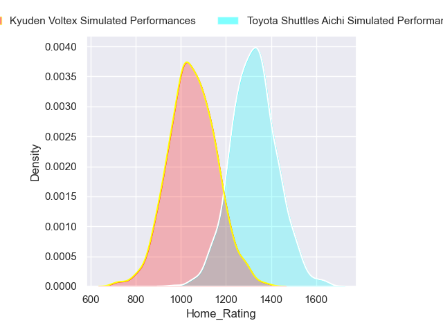
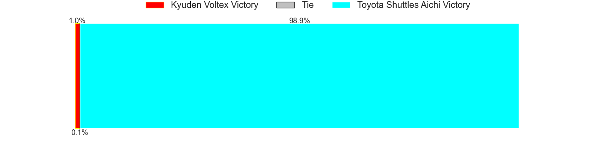
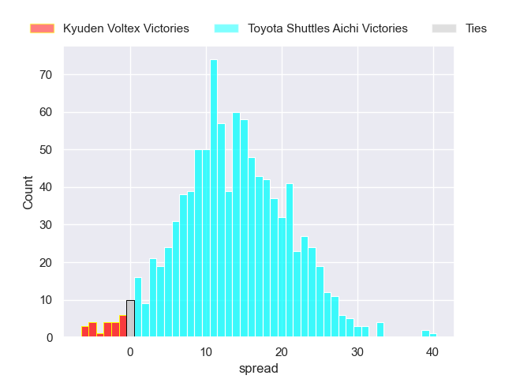

## Week 8

### Urayasu D-Rocks V Red Hurricanes Osaka on 2024/02/03

Average Margin: Urayasu D-Rocks by 15.3

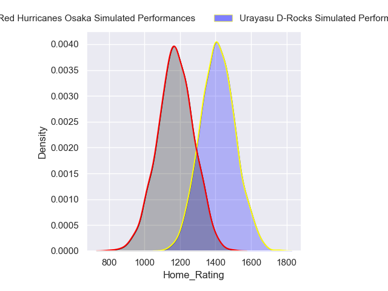
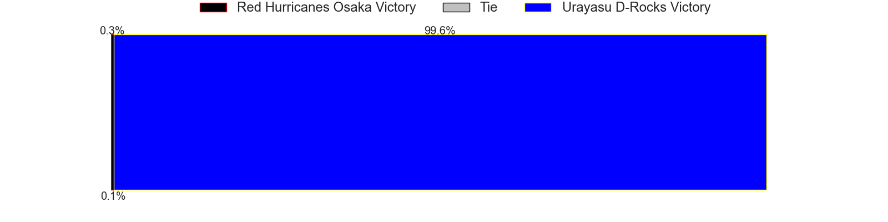
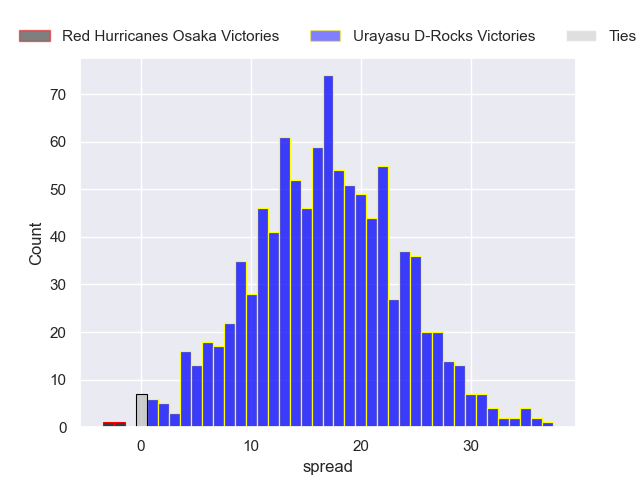

### Green Rockets Tokatsu V Kamaishi Seawaves on 2024/02/04

Average Margin: Green Rockets Tokatsu by 25.6

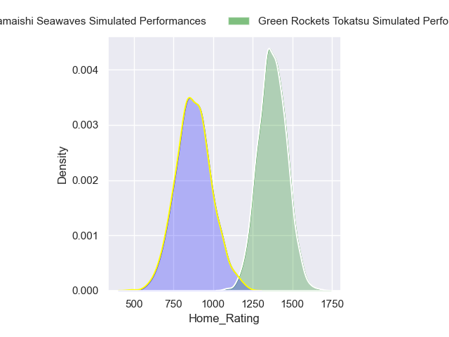

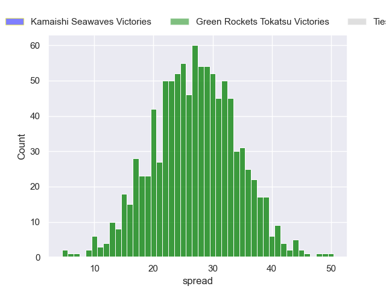

## Week 9

### Red Hurricanes Osaka V Toyota Shuttles Aichi on 2024/02/10

Average Margin: Toyota Shuttles Aichi by 5.0

## Week 10

### Urayasu D-Rocks V Kamaishi Seawaves on 2024/02/17

Average Margin: Urayasu D-Rocks by 28.7

## Week 11

### Kyuden Voltex V Green Rockets Tokatsu on 2024/02/24

Average Margin: Green Rockets Tokatsu by 9.8

## Week 12

### Red Hurricanes Osaka V Urayasu D-Rocks on 2024/03/03

Average Margin: Urayasu D-Rocks by 8.1

### Kyuden Voltex V Toyota Shuttles Aichi on 2024/03/03

Average Margin: Toyota Shuttles Aichi by 8.7

### Kamaishi Seawaves V Green Rockets Tokatsu on 2024/03/03

Average Margin: Green Rockets Tokatsu by 19.0

## Week 13

### Green Rockets Tokatsu V Red Hurricanes Osaka on 2024/03/10

Average Margin: Green Rockets Tokatsu by 12.5

### Kamaishi Seawaves V Kyuden Voltex on 2024/03/10

Average Margin: Kyuden Voltex by 6.3

## Week 14

### Toyota Shuttles Aichi V Urayasu D-Rocks on 2024/03/17

Average Margin: Urayasu D-Rocks by 0.0

## Week 15

### Kamaishi Seawaves V Red Hurricanes Osaka on 2024/03/24

Average Margin: Red Hurricanes Osaka by 10.1

### Kyuden Voltex V Urayasu D-Rocks on 2024/03/24

Average Margin: Urayasu D-Rocks by 12.5

### Green Rockets Tokatsu V Toyota Shuttles Aichi on 2024/03/24

Average Margin: Green Rockets Tokatsu by 4.2

## Week 16

### Urayasu D-Rocks V Green Rockets Tokatsu on 2024/03/30

Average Margin: Urayasu D-Rocks by 6.1

### Toyota Shuttles Aichi V Kamaishi Seawaves on 2024/03/30

Average Margin: Toyota Shuttles Aichi by 25.0

### Red Hurricanes Osaka V Kyuden Voltex on 2024/03/31

Average Margin: Red Hurricanes Osaka by 6.8

