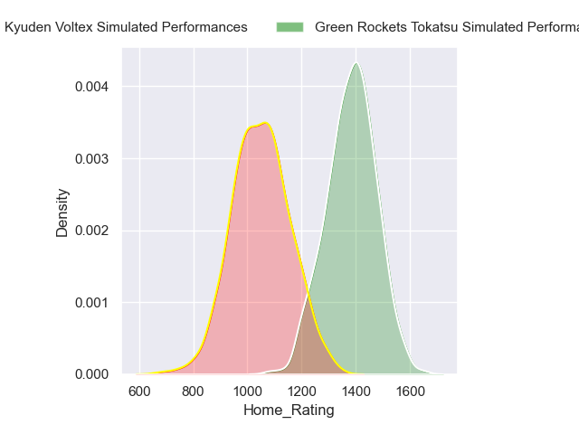
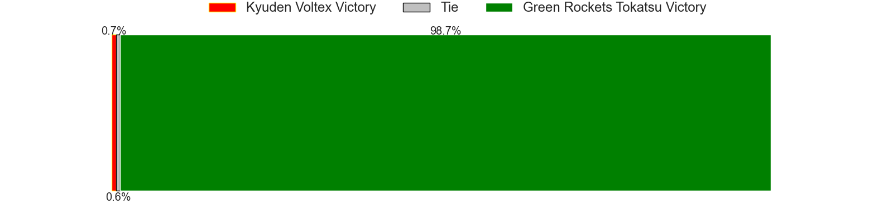
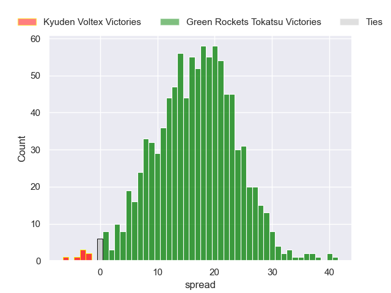
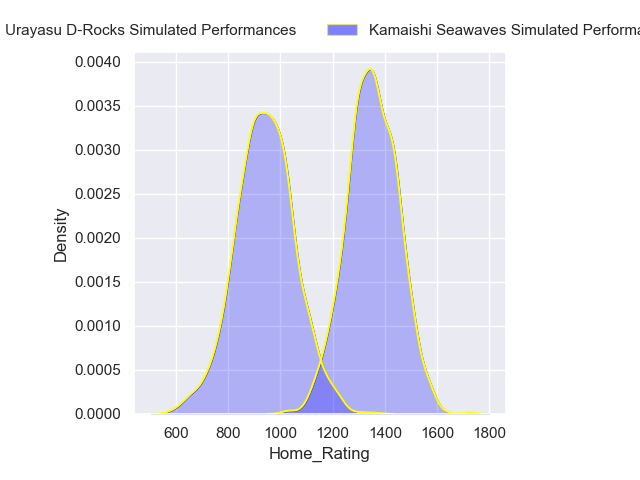
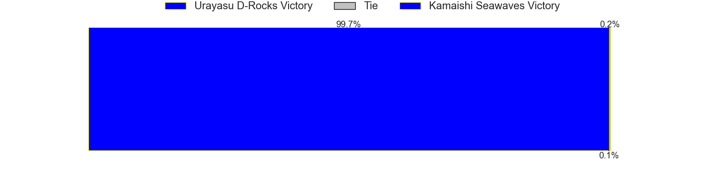
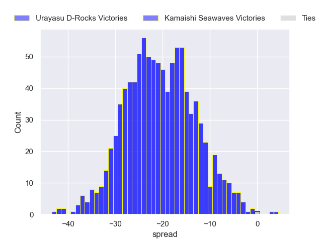
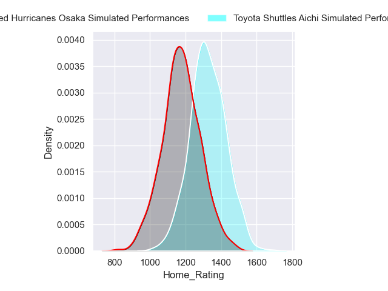
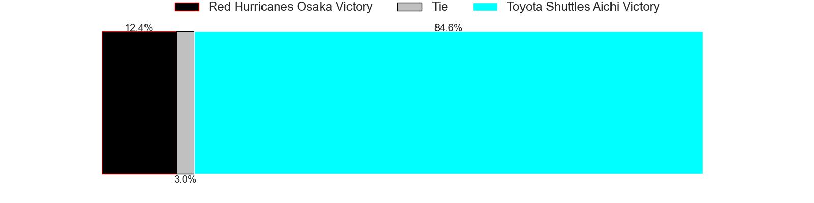
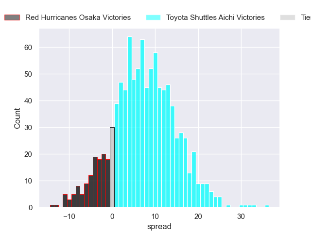

---  
title: "Japan Rugby League One D2 2023 Status"  
date: 2023-12-18 6:00:00 -0500  
categories: model review projection  
layout: article  
aside:  
    toc: true  
---
# Current Team Rankings

# Standings

## Current Standings

| Club                  |   Played |   Wins |   Point Differential |   Losing Bonus Points |   Try Bonus Points |   Competition Points |
|:----------------------|---------:|-------:|---------------------:|----------------------:|-------------------:|---------------------:|
| Toyota Shuttles Aichi |        3 |      3 |                  101 |                     0 |                nan |                   13 |
| Red Hurricanes Osaka  |        3 |      3 |                   10 |                     0 |                nan |                   12 |
| Green Rockets Tokatsu |        3 |      2 |                   -5 |                     0 |                nan |                    8 |
| Urayasu D-Rocks       |        3 |      1 |                   39 |                     2 |                nan |                    7 |
| Kyuden Voltex         |        3 |      0 |                  -53 |                     2 |                nan |                    2 |
| Kamaishi Seawaves     |        3 |      0 |                  -92 |                     1 |                nan |                    2 |

## Projected Remaining Table

| Club                  |   Matches Remaining |   Wins |   Point Differential |   Losing Bonus Points |   Try Bonus Points |   Competition Points |
|:----------------------|--------------------:|-------:|---------------------:|----------------------:|-------------------:|---------------------:|
| Urayasu D-Rocks       |                   8 |    7   |              90.5067 |                   0.9 |                6.8 |                 35.5 |
| Green Rockets Tokatsu |                   8 |    6.5 |              81.8697 |                   1   |                6.4 |                 33.4 |
| Toyota Shuttles Aichi |                   8 |    4.9 |              35.5089 |                   1.7 |                4.9 |                 26.4 |
| Red Hurricanes Osaka  |                   8 |    3.1 |             -17.0936 |                   2.1 |                3.1 |                 17.6 |
| Kyuden Voltex         |                   8 |    2.1 |             -50.3836 |                   1.6 |                2.2 |                 12.3 |
| Kamaishi Seawaves     |                   8 |    0.4 |            -140.408  |                   0.9 |                1   |                  3.5 |

## Projected Total Table

| Club                  |   Total Matches |   Wins |   Point Differential |   Losing Bonus Points |   Try Bonus Points |   Competition Points |
|:----------------------|----------------:|-------:|---------------------:|----------------------:|-------------------:|---------------------:|
| Urayasu D-Rocks       |              11 |    8   |            129.507   |                   2.9 |                6.8 |                 42.5 |
| Green Rockets Tokatsu |              11 |    8.5 |             76.8697  |                   1   |                6.4 |                 41.4 |
| Toyota Shuttles Aichi |              11 |    7.9 |            136.509   |                   1.7 |                4.9 |                 39.4 |
| Red Hurricanes Osaka  |              11 |    6.1 |             -7.09356 |                   2.1 |                3.1 |                 29.6 |
| Kyuden Voltex         |              11 |    2.1 |           -103.384   |                   3.6 |                2.2 |                 14.3 |
| Kamaishi Seawaves     |              11 |    0.4 |           -232.408   |                   1.9 |                1   |                  5.5 |

# Completed Match Review

| Model | Percent Correct Predictions | Spread Error |
| ------ | ------ | ------ |
| Club Level | 66.7% | 18.4 |
| Player Level: Lineup | 66.7% | 18.1 |
| Player Level: Minutes | 66.7% | 18.1 |

# Future Predictions

## Week 4

### Green Rockets Tokatsu V Kyuden Voltex on 2023/12/23

Average Margin: Green Rockets Tokatsu by 16.7

### Kamaishi Seawaves V Urayasu D-Rocks on 2023/12/24

Average Margin: Urayasu D-Rocks by 20.5

### Toyota Shuttles Aichi V Red Hurricanes Osaka on 2023/12/24

Average Margin: Toyota Shuttles Aichi by 7.5

## Week 5

### Kyuden Voltex V Kamaishi Seawaves on 2024/01/06

Average Margin: Kyuden Voltex by 12.0

## Week 6

### Urayasu D-Rocks V Toyota Shuttles Aichi on 2024/01/13

Average Margin: Urayasu D-Rocks by 8.2

### Red Hurricanes Osaka V Green Rockets Tokatsu on 2024/01/13

Average Margin: Green Rockets Tokatsu by 3.2

## Week 7

### Toyota Shuttles Aichi V Kyuden Voltex on 2024/01/28

Average Margin: Toyota Shuttles Aichi by 13.7

## Week 8

### Urayasu D-Rocks V Red Hurricanes Osaka on 2024/02/03

Average Margin: Urayasu D-Rocks by 12.0

### Green Rockets Tokatsu V Kamaishi Seawaves on 2024/02/04

Average Margin: Green Rockets Tokatsu by 24.8

## Week 9

### Red Hurricanes Osaka V Toyota Shuttles Aichi on 2024/02/10

Average Margin: Toyota Shuttles Aichi by 0.6

## Week 10

### Urayasu D-Rocks V Kamaishi Seawaves on 2024/02/17

Average Margin: Urayasu D-Rocks by 26.7

## Week 11

### Kyuden Voltex V Green Rockets Tokatsu on 2024/02/24

Average Margin: Green Rockets Tokatsu by 9.5

## Week 12

### Kyuden Voltex V Toyota Shuttles Aichi on 2024/03/03

Average Margin: Toyota Shuttles Aichi by 7.0

### Kamaishi Seawaves V Green Rockets Tokatsu on 2024/03/03

Average Margin: Green Rockets Tokatsu by 17.9

### Red Hurricanes Osaka V Urayasu D-Rocks on 2024/03/03

Average Margin: Urayasu D-Rocks by 5.3

## Week 13

### Green Rockets Tokatsu V Red Hurricanes Osaka on 2024/03/10

Average Margin: Green Rockets Tokatsu by 9.7

### Kamaishi Seawaves V Kyuden Voltex on 2024/03/10

Average Margin: Kyuden Voltex by 5.3

## Week 14

### Toyota Shuttles Aichi V Urayasu D-Rocks on 2024/03/17

Average Margin: Urayasu D-Rocks by 1.2

## Week 15

### Kyuden Voltex V Urayasu D-Rocks on 2024/03/24

Average Margin: Urayasu D-Rocks by 11.2

### Green Rockets Tokatsu V Toyota Shuttles Aichi on 2024/03/24

Average Margin: Green Rockets Tokatsu by 5.5

### Kamaishi Seawaves V Red Hurricanes Osaka on 2024/03/24

Average Margin: Red Hurricanes Osaka by 11.4

## Week 16

### Urayasu D-Rocks V Green Rockets Tokatsu on 2024/03/30

Average Margin: Urayasu D-Rocks by 5.4

### Toyota Shuttles Aichi V Kamaishi Seawaves on 2024/03/30

Average Margin: Toyota Shuttles Aichi by 21.8

### Red Hurricanes Osaka V Kyuden Voltex on 2024/03/31

Average Margin: Red Hurricanes Osaka by 9.7

