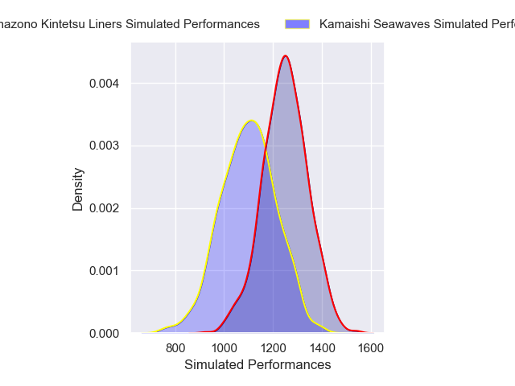
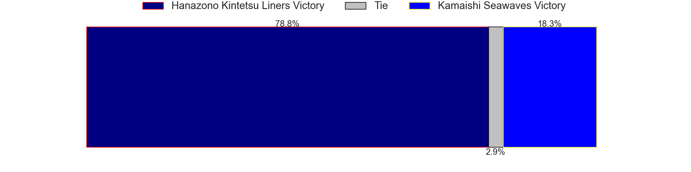
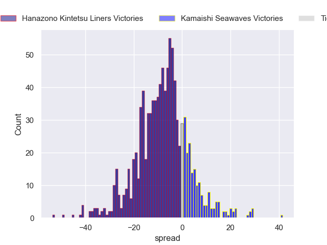

---  
title: "Japan Rugby League One D2 2024 Status"  
date: 2025-01-24 6:00:00 -0500  
categories: model review projection  
layout: article  
aside:  
    toc: true  
---
# Current Team Rankings

# Standings

## Current Standings

| Club                     |   Played |   Wins |   Point Differential |   Losing Bonus Points |   Try Bonus Points |   Competition Points |
|:-------------------------|---------:|-------:|---------------------:|----------------------:|-------------------:|---------------------:|
| Red Hurricanes Osaka     |        4 |      4 |                   67 |                     0 |                  4 |                   20 |
| Toyota Shuttles Aichi    |        4 |      3 |                   54 |                     0 |                  2 |                   14 |
| Green Rockets Tokatsu    |        4 |      2 |                   16 |                     0 |                  2 |                   10 |
| Kyuden Voltex            |        4 |      2 |                  -15 |                     0 |                  2 |                   10 |
| Shimizu Blue Sharks      |        4 |      2 |                  -21 |                     0 |                  2 |                   10 |
| Kamaishi Seawaves        |        3 |      1 |                  -35 |                     1 |                  1 |                    6 |
| Hino Red Dolphins        |        4 |      0 |                  -43 |                     2 |                  2 |                    6 |
| Hanazono Kintetsu Liners |        3 |      0 |                  -23 |                     1 |                  1 |                    4 |

## Projected Remaining Table

| Club                     |   Matches Remaining |   Wins |   Point Differential |   Losing Bonus Points |   Try Bonus Points |   Competition Points |
|:-------------------------|--------------------:|-------:|---------------------:|----------------------:|-------------------:|---------------------:|
| Toyota Shuttles Aichi    |                  10 |    7.9 |             107.976  |                   1.2 |                6.5 |                 39.2 |
| Hanazono Kintetsu Liners |                  11 |    7.5 |              67.2798 |                   1.7 |                6.6 |                 38.2 |
| Red Hurricanes Osaka     |                  10 |    7.5 |              83.7368 |                   1.5 |                6.1 |                 37.7 |
| Green Rockets Tokatsu    |                  10 |    7.5 |              80.1981 |                   1.5 |                5.9 |                 37.2 |
| Kamaishi Seawaves        |                  11 |    3.2 |             -82.2097 |                   2.3 |                5   |                 20.2 |
| Kyuden Voltex            |                  10 |    2.8 |             -71.285  |                   2.2 |                3.2 |                 16.7 |
| Hino Red Dolphins        |                  10 |    2.7 |             -77.1202 |                   2.2 |                3.6 |                 16.6 |
| Shimizu Blue Sharks      |                  10 |    1.9 |            -108.576  |                   2.2 |                3   |                 12.7 |

## Projected Total Table

| Club                     |   Total Matches |   Wins |   Point Differential |   Losing Bonus Points |   Try Bonus Points |   Competition Points |
|:-------------------------|----------------:|-------:|---------------------:|----------------------:|-------------------:|---------------------:|
| Red Hurricanes Osaka     |              14 |   11.5 |             150.737  |                   1.5 |               10.1 |                 57.7 |
| Toyota Shuttles Aichi    |              14 |   10.9 |             161.976  |                   1.2 |                8.5 |                 53.2 |
| Green Rockets Tokatsu    |              14 |    9.5 |              96.1981 |                   1.5 |                7.9 |                 47.2 |
| Hanazono Kintetsu Liners |              14 |    7.5 |              44.2798 |                   2.7 |                7.6 |                 42.2 |
| Kyuden Voltex            |              14 |    4.8 |             -86.285  |                   2.2 |                5.2 |                 26.7 |
| Kamaishi Seawaves        |              14 |    4.2 |            -117.21   |                   3.3 |                6   |                 26.2 |
| Shimizu Blue Sharks      |              14 |    3.9 |            -129.576  |                   2.2 |                5   |                 22.7 |
| Hino Red Dolphins        |              14 |    2.7 |            -120.12   |                   4.2 |                5.6 |                 22.6 |

# Completed Match Review

| Model | Percent Correct Predictions | Spread Error |
| ------ | ------ | ------ |
| Club Level | 40.0% | 18.3 |
| Player Level: Lineup | 36.4% | 15.7 |
| Player Level: Minutes | 36.4% | 16.0 |

# Future Predictions

## Week 5

### Kamaishi Seawaves V Hanazono Kintetsu Liners on 2025/01/25

Average Margin: Hanazono Kintetsu Liners by 8.0

Average Scoreline: 31-23

## Week 6

### Hino Red Dolphins V Kamaishi Seawaves on 2025/02/01

Average Margin: Hino Red Dolphins by 4.4

Average Scoreline: 34-30

### Green Rockets Tokatsu V Hanazono Kintetsu Liners on 2025/02/02

Average Margin: Green Rockets Tokatsu by 4.6

Average Scoreline: 30-25

## Week 7

### Shimizu Blue Sharks V Toyota Shuttles Aichi on 2025/02/08

Average Margin: Toyota Shuttles Aichi by 14.3

Average Scoreline: 33-18

### Red Hurricanes Osaka V Kyuden Voltex on 2025/02/09

Average Margin: Red Hurricanes Osaka by 14.4

Average Scoreline: 36-22

## Week 8

### Toyota Shuttles Aichi V Kamaishi Seawaves on 2025/02/15

Average Margin: Toyota Shuttles Aichi by 18.4

Average Scoreline: 39-21

## Week 9

### Red Hurricanes Osaka V Hino Red Dolphins on 2025/02/22

Average Margin: Red Hurricanes Osaka by 16.4

Average Scoreline: 40-23

### Kyuden Voltex V Hanazono Kintetsu Liners on 2025/02/22

Average Margin: Hanazono Kintetsu Liners by 7.4

Average Scoreline: 31-24

### Green Rockets Tokatsu V Shimizu Blue Sharks on 2025/02/22

Average Margin: Green Rockets Tokatsu by 17.5

Average Scoreline: 41-24

## Week 10

### Toyota Shuttles Aichi V Hino Red Dolphins on 2025/03/01

Average Margin: Toyota Shuttles Aichi by 17.1

Average Scoreline: 43-26

### Green Rockets Tokatsu V Kyuden Voltex on 2025/03/01

Average Margin: Green Rockets Tokatsu by 13.6

Average Scoreline: 32-18

### Hanazono Kintetsu Liners V Shimizu Blue Sharks on 2025/03/01

Average Margin: Hanazono Kintetsu Liners by 16.1

Average Scoreline: 47-30

## Week 11

### Kamaishi Seawaves V Red Hurricanes Osaka on 2025/03/08

Average Margin: Red Hurricanes Osaka by 9.3

Average Scoreline: 32-22

## Week 12

### Red Hurricanes Osaka V Toyota Shuttles Aichi on 2025/03/15

Average Margin: Red Hurricanes Osaka by 1.1

Average Scoreline: 27-25

### Kamaishi Seawaves V Hino Red Dolphins on 2025/03/15

Average Margin: Kamaishi Seawaves by 3.5

Average Scoreline: 32-29

### Kyuden Voltex V Green Rockets Tokatsu on 2025/03/15

Average Margin: Green Rockets Tokatsu by 8.0

Average Scoreline: 33-25

### Shimizu Blue Sharks V Hanazono Kintetsu Liners on 2025/03/15

Average Margin: Hanazono Kintetsu Liners by 9.5

Average Scoreline: 29-19

## Week 13

### Toyota Shuttles Aichi V Shimizu Blue Sharks on 2025/03/22

Average Margin: Toyota Shuttles Aichi by 19.0

Average Scoreline: 43-24

### Hanazono Kintetsu Liners V Kamaishi Seawaves on 2025/03/22

Average Margin: Hanazono Kintetsu Liners by 14.3

Average Scoreline: 40-26

### Hino Red Dolphins V Green Rockets Tokatsu on 2025/03/23

Average Margin: Green Rockets Tokatsu by 8.9

Average Scoreline: 32-23

### Kyuden Voltex V Red Hurricanes Osaka on 2025/03/23

Average Margin: Red Hurricanes Osaka by 8.4

Average Scoreline: 27-18

## Week 14

### Shimizu Blue Sharks V Red Hurricanes Osaka on 2025/03/29

Average Margin: Red Hurricanes Osaka by 11.1

Average Scoreline: 26-15

### Hanazono Kintetsu Liners V Hino Red Dolphins on 2025/03/29

Average Margin: Hanazono Kintetsu Liners by 13.5

Average Scoreline: 41-27

### Green Rockets Tokatsu V Kamaishi Seawaves on 2025/03/29

Average Margin: Green Rockets Tokatsu by 15.2

Average Scoreline: 36-21

## Week 15

### Toyota Shuttles Aichi V Kyuden Voltex on 2025/04/05

Average Margin: Toyota Shuttles Aichi by 15.8

Average Scoreline: 37-21

## Week 16

### Shimizu Blue Sharks V Green Rockets Tokatsu on 2025/04/12

Average Margin: Green Rockets Tokatsu by 10.0

Average Scoreline: 32-22

### Kyuden Voltex V Hino Red Dolphins on 2025/04/12

Average Margin: Kyuden Voltex by 4.5

Average Scoreline: 29-25

### Kamaishi Seawaves V Toyota Shuttles Aichi on 2025/04/12

Average Margin: Toyota Shuttles Aichi by 9.4

Average Scoreline: 34-25

### Red Hurricanes Osaka V Hanazono Kintetsu Liners on 2025/04/12

Average Margin: Red Hurricanes Osaka by 5.1

Average Scoreline: 30-25

## Week 17

### Kamaishi Seawaves V Shimizu Blue Sharks on 2025/04/20

Average Margin: Kamaishi Seawaves by 5.4

Average Scoreline: 31-26

### Green Rockets Tokatsu V Toyota Shuttles Aichi on 2025/04/20

Average Margin: Green Rockets Tokatsu by 1.6

Average Scoreline: 25-24

### Hanazono Kintetsu Liners V Kyuden Voltex on 2025/04/20

Average Margin: Hanazono Kintetsu Liners by 12.5

Average Scoreline: 35-22

### Hino Red Dolphins V Red Hurricanes Osaka on 2025/04/20

Average Margin: Red Hurricanes Osaka by 7.0

Average Scoreline: 30-23

## Week 18

### Hino Red Dolphins V Toyota Shuttles Aichi on 2025/05/03

Average Margin: Toyota Shuttles Aichi by 9.6

Average Scoreline: 33-23

### Hanazono Kintetsu Liners V Green Rockets Tokatsu on 2025/05/03

Average Margin: Hanazono Kintetsu Liners by 2.9

Average Scoreline: 30-27

### Kyuden Voltex V Shimizu Blue Sharks on 2025/05/03

Average Margin: Kyuden Voltex by 6.8

Average Scoreline: 28-21

### Red Hurricanes Osaka V Kamaishi Seawaves on 2025/05/03

Average Margin: Red Hurricanes Osaka by 14.4

Average Scoreline: 37-23

## Week 19

### Green Rockets Tokatsu V Red Hurricanes Osaka on 2025/05/10

Average Margin: Green Rockets Tokatsu by 3.6

Average Scoreline: 28-24

### Shimizu Blue Sharks V Hino Red Dolphins on 2025/05/10

Average Margin: Shimizu Blue Sharks by 1.1

Average Scoreline: 30-29

### Kamaishi Seawaves V Kyuden Voltex on 2025/05/10

Average Margin: Kamaishi Seawaves by 2.4

Average Scoreline: 30-28

### Toyota Shuttles Aichi V Hanazono Kintetsu Liners on 2025/05/10

Average Margin: Toyota Shuttles Aichi by 7.1

Average Scoreline: 29-22

