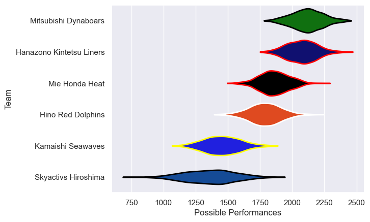

---  
title: "Japan Rugby League One D2 21/22 Status"  
date: 2025-07-28 6:00:00 -0500  
categories: model review projection  
layout: article  
aside:  
    toc: true  
---
# Current Team Rankings

# Standings

## Current Standings

| Club                     |   Played |   Wins |   Point Differential |   Losing Bonus Points | Try Bonus Points   |   Competition Points |
|:-------------------------|---------:|-------:|---------------------:|----------------------:|:-------------------|---------------------:|
| Hanazono Kintetsu Liners |       10 |      8 |                  315 |                     1 |                    |                   33 |
| Mitsubishi Dynaboars     |        9 |      8 |                  192 |                     1 |                    |                   33 |
| Mie Honda Heat           |       10 |      7 |                   29 |                     0 |                    |                   28 |
| Hino Red Dolphins        |        9 |      3 |                   17 |                     2 |                    |                   14 |
| Kamaishi Seawaves        |        9 |      1 |                 -267 |                     2 |                    |                    6 |
| Skyactivs Hiroshima      |        9 |      1 |                 -286 |                     0 |                    |                    4 |

# Completed Match Review

| Model | Percent Correct Predictions | Spread Error |
| ------ | ------ | ------ |
| Club Level | 78.6% | 16.1 |
| Player Level: Lineup | nan% | nan |
| Player Level: Minutes | nan% | nan |

