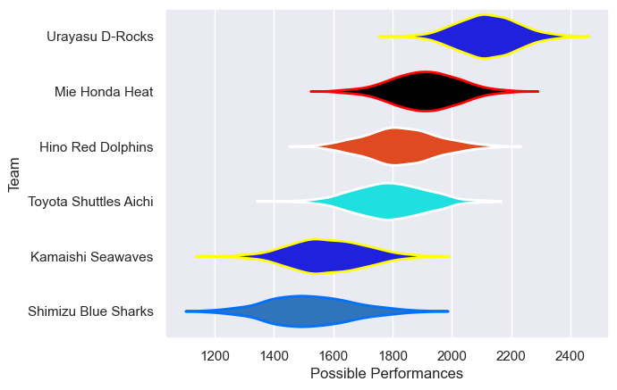

---  
title: "Japan Rugby League One D2 22/23"  
date: 2025-07-29 6:00:00 -0500  
categories: model review projection  
layout: article  
aside:  
    toc: true  
---
# Current Team Rankings

# Standings

## Current Standings

| Club                  |   Played |   Wins |   Point Differential |   Losing Bonus Points |   Try Bonus Points |   Competition Points |
|:----------------------|---------:|-------:|---------------------:|----------------------:|-------------------:|---------------------:|
| Urayasu D-Rocks       |        9 |      9 |                  340 |                     0 |                  8 |                   44 |
| Mie Honda Heat        |        9 |      7 |                  159 |                     0 |                  6 |                   34 |
| Toyota Shuttles Aichi |        9 |      5 |                  -32 |                     0 |                  5 |                   25 |
| Kamaishi Seawaves     |        9 |      1 |                 -254 |                     1 |                  6 |                   11 |
| Hino Red Dolphins     |        4 |      1 |                    0 |                     2 |                  3 |                    9 |
| Shimizu Blue Sharks   |        8 |      1 |                 -213 |                     0 |                  1 |                    5 |

## Projected Remaining Table

| Club              |   To Play |   Projected Wins |   Projected Differential |   Projected Losing Bonus Points | Projected Try Bonus Points   |   Projected Competition Points |
|:------------------|----------:|-----------------:|-------------------------:|--------------------------------:|:-----------------------------|-------------------------------:|
| Hino Red Dolphins |         1 |            0.594 |                    4.643 |                           0.178 |                              |                          2.636 |
| Kamaishi Seawaves |         1 |            0.365 |                   -4.643 |                           0.207 |                              |                          1.749 |

## Projected Total Table

| Club                  |   Played |   Wins |   Point Differential |   Losing Bonus Points |   Try Bonus Points |   Competition Points |
|:----------------------|---------:|-------:|---------------------:|----------------------:|-------------------:|---------------------:|
| Urayasu D-Rocks       |        9 |  9     |              340     |                 0     |                  8 |               44     |
| Mie Honda Heat        |        9 |  7     |              159     |                 0     |                  6 |               34     |
| Toyota Shuttles Aichi |        9 |  5     |              -32     |                 0     |                  5 |               25     |
| Kamaishi Seawaves     |       10 |  1.365 |             -258.643 |                 1.207 |                  6 |               12.749 |
| Hino Red Dolphins     |        5 |  1.594 |                4.643 |                 2.178 |                  3 |               11.636 |
| Shimizu Blue Sharks   |        8 |  1     |             -213     |                 0     |                  1 |                5     |

# Completed Match Review

| Model | Percent Correct Predictions | Spread Error |
| ------ | ------ | ------ |
| Club Level | 92.0% | 18.0 |
| Player Level: Lineup | nan% | nan |
| Player Level: Minutes | nan% | nan |

# Future Predictions

## Week 10

### Kamaishi Seawaves V Hino Red Dolphins on 2023/03/26

Average Margin: Hino Red Dolphins by 4.6

