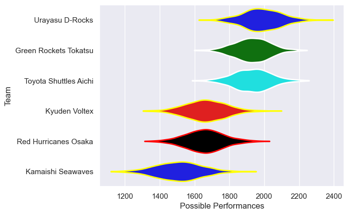

---  
title: "Japan Rugby League One D2 23/24"  
date: 2025-07-29 6:00:00 -0500  
categories: model review projection  
layout: article  
aside:  
    toc: true  
---
# Current Team Rankings

# Standings

## Current Standings

| Club                  |   Played |   Wins |   Point Differential |   Losing Bonus Points |   Try Bonus Points |   Competition Points |
|:----------------------|---------:|-------:|---------------------:|----------------------:|-------------------:|---------------------:|
| Urayasu D-Rocks       |       10 |      9 |                  213 |                     1 |                  6 |                   43 |
| Green Rockets Tokatsu |       10 |      8 |                  187 |                     1 |                  7 |                   40 |
| Toyota Shuttles Aichi |       10 |      7 |                  150 |                     2 |                  6 |                   36 |
| Red Hurricanes Osaka  |       10 |      3 |                 -202 |                     0 |                  2 |                   14 |
| Kyuden Voltex         |       10 |      2 |                 -101 |                     4 |                  1 |                   13 |
| Kamaishi Seawaves     |       10 |      1 |                 -247 |                     2 |                  4 |                   10 |

# Completed Match Review

| Model | Percent Correct Predictions | Spread Error |
| ------ | ------ | ------ |
| Club Level | 83.3% | 15.4 |
| Player Level: Lineup | nan% | nan |
| Player Level: Minutes | nan% | nan |

