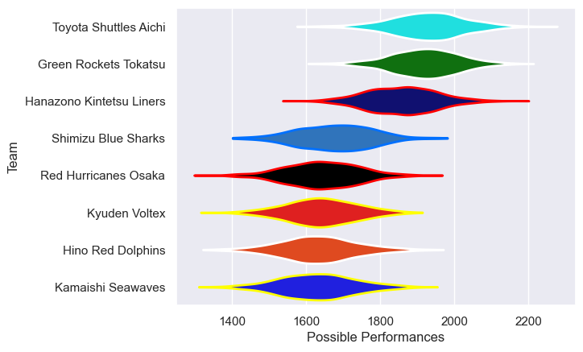

---  
title: "Japan Rugby League One D2 24/25"  
date: 2025-07-29 6:00:00 -0500  
categories: model review projection  
layout: article  
aside:  
    toc: true  
---
# Current Team Rankings

# Standings

## Current Standings

| Club                     |   Played |   Wins |   Point Differential |   Losing Bonus Points |   Try Bonus Points |   Competition Points |
|:-------------------------|---------:|-------:|---------------------:|----------------------:|-------------------:|---------------------:|
| Toyota Shuttles Aichi    |       14 |     11 |                  216 |                     1 |                  9 |                   54 |
| Hanazono Kintetsu Liners |       14 |     10 |                  193 |                     2 |                  9 |                   53 |
| Green Rockets Tokatsu    |       14 |     10 |                  200 |                     0 |                  8 |                   48 |
| Red Hurricanes Osaka     |       14 |      6 |                  -19 |                     3 |                  8 |                   35 |
| Shimizu Blue Sharks      |       14 |      5 |                 -142 |                     2 |                  6 |                   30 |
| Hino Red Dolphins        |       14 |      5 |                 -159 |                     2 |                  5 |                   29 |
| Kyuden Voltex            |       14 |      5 |                 -109 |                     3 |                  3 |                   28 |
| Kamaishi Seawaves        |       14 |      2 |                 -180 |                     3 |                  5 |                   16 |

# Completed Match Review

| Model | Percent Correct Predictions | Spread Error |
| ------ | ------ | ------ |
| Club Level | 57.1% | 15.9 |
| Player Level: Lineup | nan% | nan |
| Player Level: Minutes | nan% | nan |

