# Team Rankings

# Standings

## Current Standings

| Club                     |   Played |   Wins |   Point Differential |   Losing Bonus Points |   Try Bonus Points |   Competition Points |
|:-------------------------|---------:|-------:|---------------------:|----------------------:|-------------------:|---------------------:|
| Hanazono Kintetsu Liners |        4 |      4 |                   74 |                     0 |                  3 |                   19 |
| Shimizu Blue Sharks      |        4 |      4 |                   39 |                     0 |                  2 |                   18 |
| Toyota Shuttles Aichi    |        4 |      2 |                   31 |                     1 |                  3 |                   12 |
| Kamaishi Seawaves        |        4 |      2 |                    8 |                     1 |                    |                    9 |
| Kyuden Voltex            |        3 |      2 |                   -5 |                     0 |                    |                    8 |
| Green Rockets Tokatsu    |        3 |      1 |                  -29 |                     0 |                  1 |                    5 |
| Hino Red Dolphins        |        4 |      0 |                  -48 |                     1 |                  1 |                    2 |
| Red Hurricanes Osaka     |        4 |      0 |                  -70 |                     2 |                    |                    2 |

## Projected Remaining Table

| Club                     |   To Play |   Projected Wins |   Projected Differential |   Projected Losing Bonus Points | Projected Try Bonus Points   |   Projected Competition Points |
|:-------------------------|----------:|-----------------:|-------------------------:|--------------------------------:|:-----------------------------|-------------------------------:|
| Green Rockets Tokatsu    |         2 |            1.269 |                    8.118 |                           0.347 |                              |                          5.573 |
| Kyuden Voltex            |         2 |            0.912 |                   -0.937 |                           0.48  |                              |                          4.278 |
| Toyota Shuttles Aichi    |         1 |            0.695 |                    6.557 |                           0.147 |                              |                          2.993 |
| Hanazono Kintetsu Liners |         1 |            0.692 |                    5.877 |                           0.146 |                              |                          2.986 |
| Red Hurricanes Osaka     |         1 |            0.422 |                   -1.921 |                           0.25  |                              |                          2.012 |
| Kamaishi Seawaves        |         1 |            0.285 |                   -5.26  |                           0.255 |                              |                          1.469 |
| Shimizu Blue Sharks      |         1 |            0.272 |                   -5.877 |                           0.25  |                              |                          1.41  |
| Hino Red Dolphins        |         1 |            0.272 |                   -6.557 |                           0.226 |                              |                          1.38  |

## Projected Total Table

| Club                     |   Played |   Wins |   Point Differential |   Losing Bonus Points |   Try Bonus Points |   Competition Points |
|:-------------------------|---------:|-------:|---------------------:|----------------------:|-------------------:|---------------------:|
| Hanazono Kintetsu Liners |        5 |  4.692 |               79.877 |                 0.146 |                  3 |               21.986 |
| Shimizu Blue Sharks      |        5 |  4.272 |               33.123 |                 0.25  |                  2 |               19.41  |
| Toyota Shuttles Aichi    |        5 |  2.695 |               37.557 |                 1.147 |                  3 |               14.993 |
| Kyuden Voltex            |        5 |  2.912 |               -5.937 |                 0.48  |                    |               12.278 |
| Green Rockets Tokatsu    |        5 |  2.269 |              -20.882 |                 0.347 |                  1 |               10.573 |
| Kamaishi Seawaves        |        5 |  2.285 |                2.74  |                 1.255 |                    |               10.469 |
| Red Hurricanes Osaka     |        5 |  0.422 |              -71.921 |                 2.25  |                    |                4.012 |
| Hino Red Dolphins        |        5 |  0.272 |              -54.557 |                 1.226 |                  1 |                3.38  |

# Completed Match Review

| Model | Percent Correct Predictions | Spread Error |
| ------ | ------ | ------ |
| Club Level | 70.0% | 12.7 |
| Player Level: Lineup | nan% | nan |
| Player Level: Minutes | nan% | nan |

# Future Predictions

## Week 5

### Kyuden Voltex V Green Rockets Tokatsu on 2026/01/24

Average Margin: Green Rockets Tokatsu by 2.9

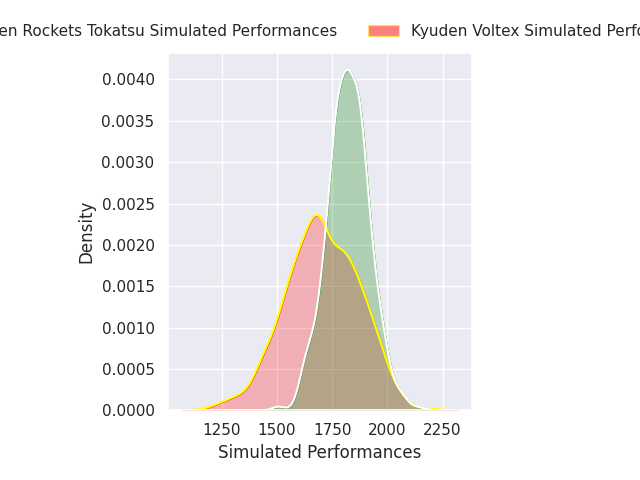
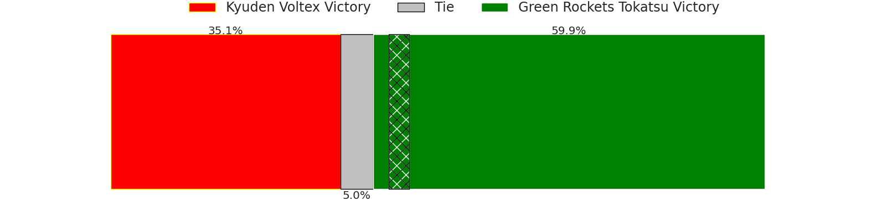
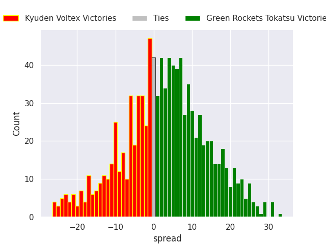

## Week 6

### Hino Red Dolphins V Toyota Shuttles Aichi on 2026/01/31

Average Margin: Toyota Shuttles Aichi by 6.6

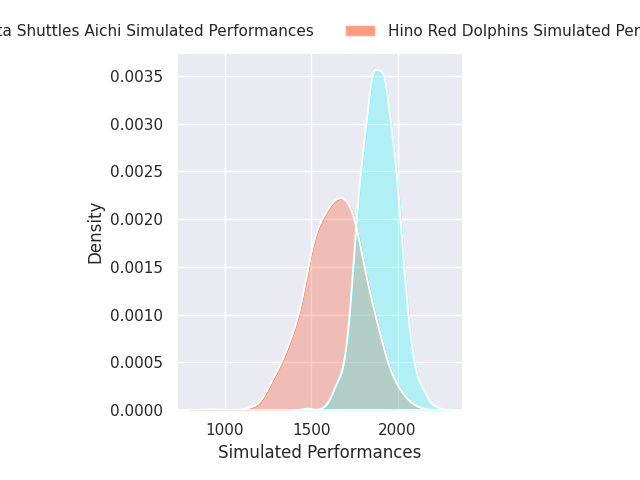
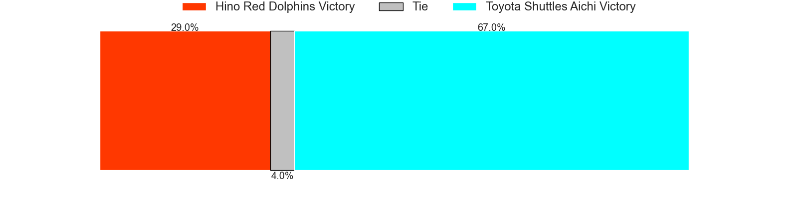
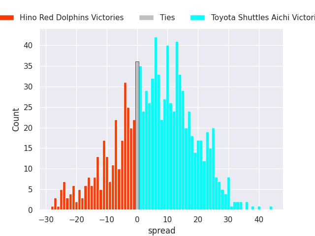

## Week 7

### Shimizu Blue Sharks V Hanazono Kintetsu Liners on 2026/02/07

Average Margin: Hanazono Kintetsu Liners by 5.9

### Green Rockets Tokatsu V Kamaishi Seawaves on 2026/02/08

Average Margin: Green Rockets Tokatsu by 5.3

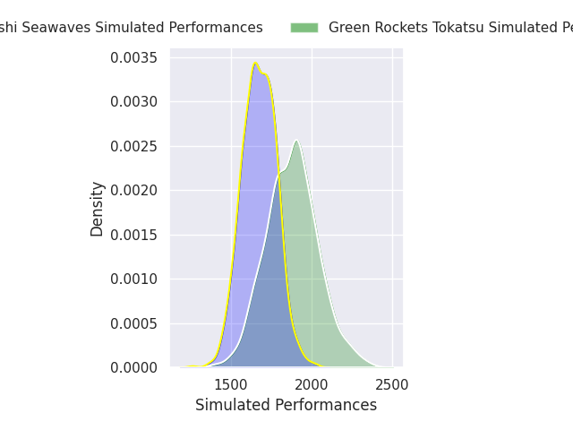
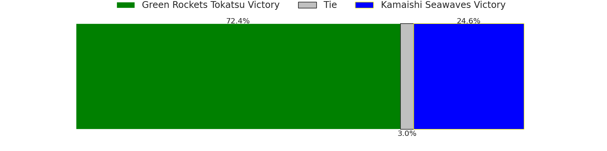
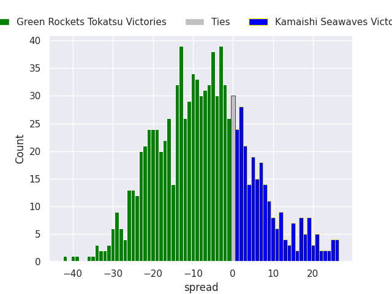

### Kyuden Voltex V Red Hurricanes Osaka on 2026/02/08

Average Margin: Kyuden Voltex by 1.9

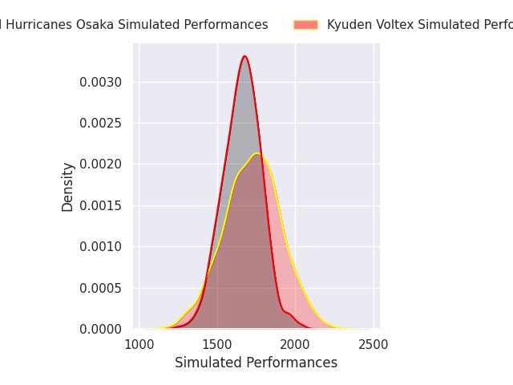

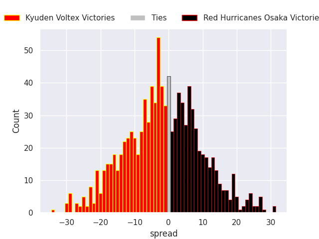

