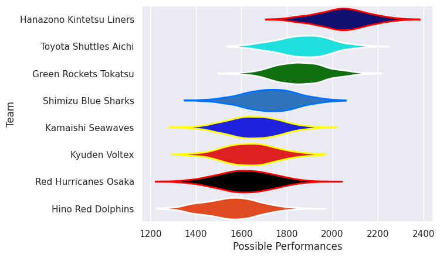

---  
title: "Japan Rugby League One D2 25/26"  
date: 2025-12-19 6:00:00 -0500  
categories: model review projection  
layout: article  
aside:  
    toc: true  
---
# Team Rankings

# Standings

## Current Standings

| Club                     |   Played |   Wins |   Point Differential |   Losing Bonus Points | Try Bonus Points   |   Competition Points |
|:-------------------------|---------:|-------:|---------------------:|----------------------:|:-------------------|---------------------:|
| Hanazono Kintetsu Liners |        1 |      1 |                   26 |                     0 |                    |                    4 |
| Green Rockets Tokatsu    |        1 |      1 |                   17 |                     0 |                    |                    4 |
| Shimizu Blue Sharks      |        1 |      1 |                   11 |                     0 |                    |                    4 |
| Kyuden Voltex            |        1 |      1 |                    3 |                     0 |                    |                    4 |
| Hino Red Dolphins        |        1 |      0 |                   -3 |                     1 |                    |                    1 |
| Kamaishi Seawaves        |        1 |      0 |                  -11 |                     0 |                    |                    0 |
| Red Hurricanes Osaka     |        1 |      0 |                  -17 |                     0 |                    |                    0 |
| Toyota Shuttles Aichi    |        1 |      0 |                  -26 |                     0 |                    |                    0 |

## Projected Remaining Table

| Club                     |   To Play |   Projected Wins |   Projected Differential |   Projected Losing Bonus Points | Projected Try Bonus Points   |   Projected Competition Points |
|:-------------------------|----------:|-----------------:|-------------------------:|--------------------------------:|:-----------------------------|-------------------------------:|
| Hanazono Kintetsu Liners |         1 |            0.622 |                    4.191 |                           0.172 |                              |                          2.744 |
| Toyota Shuttles Aichi    |         1 |            0.606 |                    3.482 |                           0.189 |                              |                          2.701 |
| Kyuden Voltex            |         1 |            0.534 |                    1.815 |                           0.22  |                              |                          2.474 |
| Kamaishi Seawaves        |         1 |            0.53  |                    1.265 |                           0.211 |                              |                          2.415 |
| Hino Red Dolphins        |         1 |            0.428 |                   -1.265 |                           0.243 |                              |                          2.039 |
| Shimizu Blue Sharks      |         1 |            0.407 |                   -1.815 |                           0.25  |                              |                          1.996 |
| Red Hurricanes Osaka     |         1 |            0.35  |                   -3.482 |                           0.249 |                              |                          1.737 |
| Green Rockets Tokatsu    |         1 |            0.336 |                   -4.191 |                           0.232 |                              |                          1.66  |

## Projected Total Table

| Club                     |   Played |   Wins |   Point Differential |   Losing Bonus Points | Try Bonus Points   |   Competition Points |
|:-------------------------|---------:|-------:|---------------------:|----------------------:|:-------------------|---------------------:|
| Hanazono Kintetsu Liners |        2 |  1.622 |               30.191 |                 0.172 |                    |                6.744 |
| Kyuden Voltex            |        2 |  1.534 |                4.815 |                 0.22  |                    |                6.474 |
| Shimizu Blue Sharks      |        2 |  1.407 |                9.185 |                 0.25  |                    |                5.996 |
| Green Rockets Tokatsu    |        2 |  1.336 |               12.809 |                 0.232 |                    |                5.66  |
| Hino Red Dolphins        |        2 |  0.428 |               -4.265 |                 1.243 |                    |                3.039 |
| Toyota Shuttles Aichi    |        2 |  0.606 |              -22.518 |                 0.189 |                    |                2.701 |
| Kamaishi Seawaves        |        2 |  0.53  |               -9.735 |                 0.211 |                    |                2.415 |
| Red Hurricanes Osaka     |        2 |  0.35  |              -20.482 |                 0.249 |                    |                1.737 |

# Completed Match Review

| Model | Percent Correct Predictions | Spread Error |
| ------ | ------ | ------ |
| Club Level | 62.5% | 11.8 |
| Player Level: Lineup | nan% | nan |
| Player Level: Minutes | nan% | nan |

# Future Predictions

## Week 2

### Hanazono Kintetsu Liners V Green Rockets Tokatsu on 2025/12/20

Average Margin: Hanazono Kintetsu Liners by 4.2

### Kyuden Voltex V Shimizu Blue Sharks on 2025/12/20

Average Margin: Kyuden Voltex by 1.8

### Kamaishi Seawaves V Hino Red Dolphins on 2025/12/21

Average Margin: Kamaishi Seawaves by 1.3

### Red Hurricanes Osaka V Toyota Shuttles Aichi on 2025/12/21

Average Margin: Toyota Shuttles Aichi by 3.5

