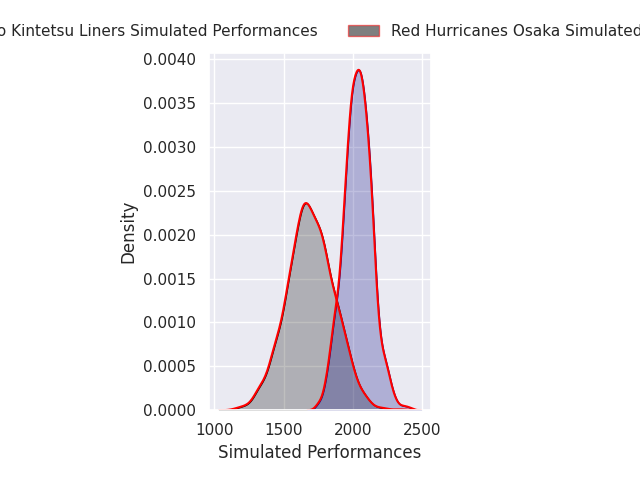
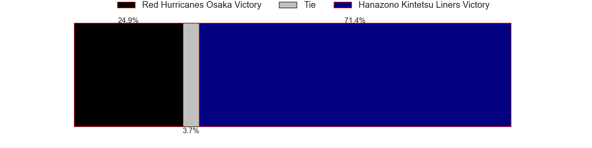
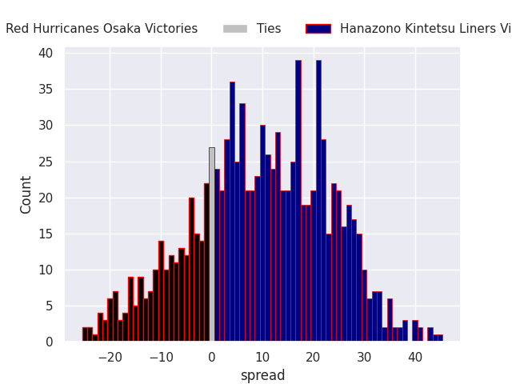
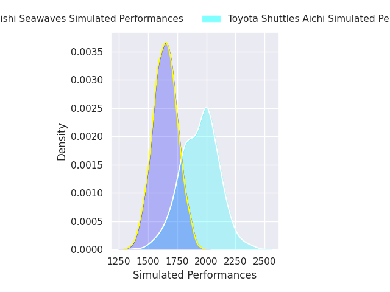
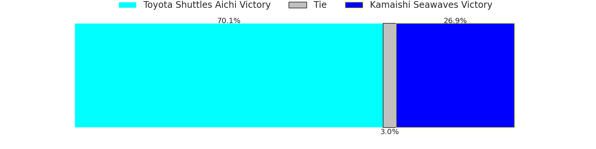
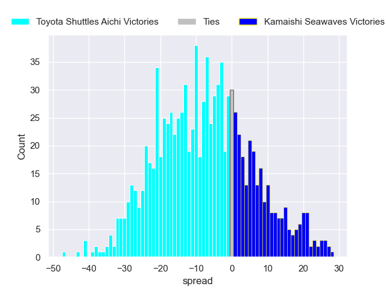
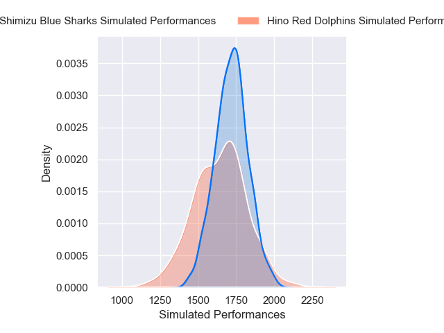
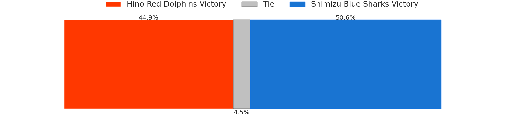
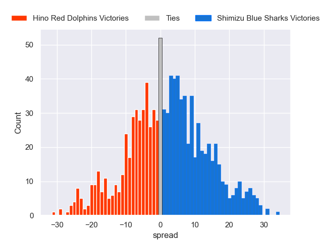

# Team Rankings

# Standings

## Current Standings

| Club                     |   Played |   Wins |   Point Differential |   Losing Bonus Points |   Try Bonus Points |   Competition Points |
|:-------------------------|---------:|-------:|---------------------:|----------------------:|-------------------:|---------------------:|
| Hanazono Kintetsu Liners |        3 |      3 |                   69 |                     0 |                  3 |                   15 |
| Shimizu Blue Sharks      |        3 |      3 |                   29 |                     0 |                  2 |                   14 |
| Toyota Shuttles Aichi    |        3 |      2 |                   33 |                     0 |                  2 |                   10 |
| Kyuden Voltex            |        3 |      2 |                   -5 |                     0 |                    |                    8 |
| Kamaishi Seawaves        |        3 |      1 |                    6 |                     1 |                    |                    5 |
| Green Rockets Tokatsu    |        3 |      1 |                  -29 |                     0 |                  1 |                    5 |
| Hino Red Dolphins        |        3 |      0 |                  -38 |                     1 |                  1 |                    2 |
| Red Hurricanes Osaka     |        3 |      0 |                  -65 |                     1 |                    |                    1 |

## Projected Remaining Table

| Club                     |   To Play |   Projected Wins |   Projected Differential |   Projected Losing Bonus Points | Projected Try Bonus Points   |   Projected Competition Points |
|:-------------------------|----------:|-----------------:|-------------------------:|--------------------------------:|:-----------------------------|-------------------------------:|
| Hanazono Kintetsu Liners |         2 |            1.435 |                   15.403 |                           0.272 |                              |                          6.148 |
| Toyota Shuttles Aichi    |         2 |            1.418 |                   15.745 |                           0.266 |                              |                          6.074 |
| Green Rockets Tokatsu    |         2 |            1.293 |                    8.915 |                           0.351 |                              |                          5.675 |
| Kyuden Voltex            |         2 |            0.913 |                   -0.982 |                           0.499 |                              |                          4.325 |
| Shimizu Blue Sharks      |         2 |            0.77  |                   -5.691 |                           0.445 |                              |                          3.683 |
| Hino Red Dolphins        |         2 |            0.739 |                   -7.715 |                           0.412 |                              |                          3.53  |
| Red Hurricanes Osaka     |         2 |            0.635 |                  -10.761 |                           0.453 |                              |                          3.151 |
| Kamaishi Seawaves        |         2 |            0.495 |                  -14.914 |                           0.454 |                              |                          2.566 |

## Projected Total Table

| Club                     |   Played |   Wins |   Point Differential |   Losing Bonus Points |   Try Bonus Points |   Competition Points |
|:-------------------------|---------:|-------:|---------------------:|----------------------:|-------------------:|---------------------:|
| Hanazono Kintetsu Liners |        5 |  4.435 |               84.403 |                 0.272 |                  3 |               21.148 |
| Shimizu Blue Sharks      |        5 |  3.77  |               23.309 |                 0.445 |                  2 |               17.683 |
| Toyota Shuttles Aichi    |        5 |  3.418 |               48.745 |                 0.266 |                  2 |               16.074 |
| Kyuden Voltex            |        5 |  2.913 |               -5.982 |                 0.499 |                    |               12.325 |
| Green Rockets Tokatsu    |        5 |  2.293 |              -20.085 |                 0.351 |                  1 |               10.675 |
| Kamaishi Seawaves        |        5 |  1.495 |               -8.914 |                 1.454 |                    |                7.566 |
| Hino Red Dolphins        |        5 |  0.739 |              -45.715 |                 1.412 |                  1 |                5.53  |
| Red Hurricanes Osaka     |        5 |  0.635 |              -75.761 |                 1.453 |                    |                4.151 |

# Completed Match Review

| Model | Percent Correct Predictions | Spread Error |
| ------ | ------ | ------ |
| Club Level | 65.0% | 13.4 |
| Player Level: Lineup | nan% | nan |
| Player Level: Minutes | nan% | nan |

# Future Predictions

## Week 4

### Red Hurricanes Osaka V Hanazono Kintetsu Liners on 2026/01/17

Average Margin: Hanazono Kintetsu Liners by 8.7

### Toyota Shuttles Aichi V Kamaishi Seawaves on 2026/01/17

Average Margin: Toyota Shuttles Aichi by 9.0

### Hino Red Dolphins V Shimizu Blue Sharks on 2026/01/18

Average Margin: Shimizu Blue Sharks by 1.0

## Week 5

### Kyuden Voltex V Green Rockets Tokatsu on 2026/01/24

Average Margin: Green Rockets Tokatsu by 3.0

## Week 6

### Hino Red Dolphins V Toyota Shuttles Aichi on 2026/01/31

Average Margin: Toyota Shuttles Aichi by 6.7

## Week 7

### Shimizu Blue Sharks V Hanazono Kintetsu Liners on 2026/02/07

Average Margin: Hanazono Kintetsu Liners by 6.7

### Green Rockets Tokatsu V Kamaishi Seawaves on 2026/02/08

Average Margin: Green Rockets Tokatsu by 5.9

### Kyuden Voltex V Red Hurricanes Osaka on 2026/02/08

Average Margin: Kyuden Voltex by 2.0

