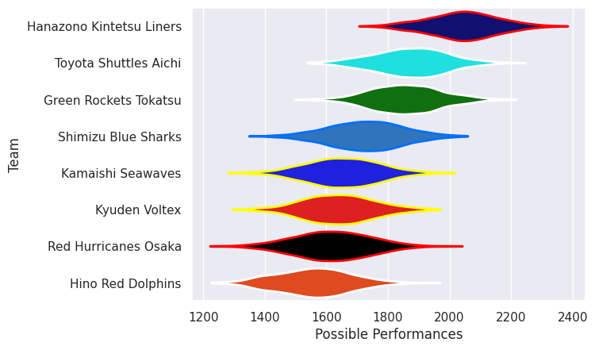
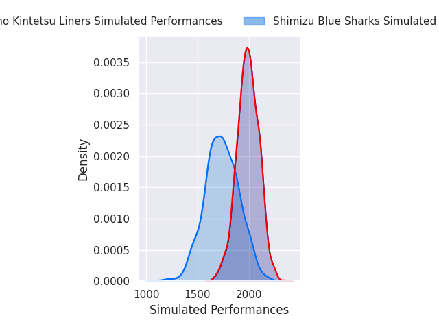
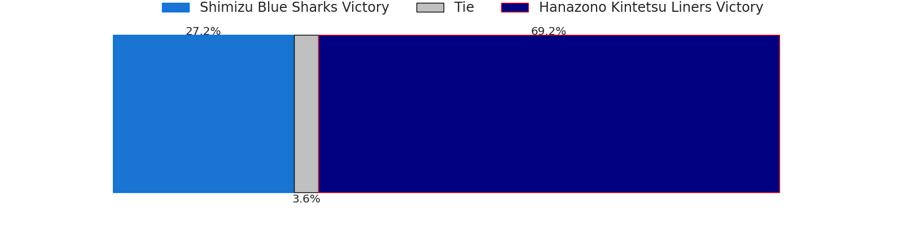
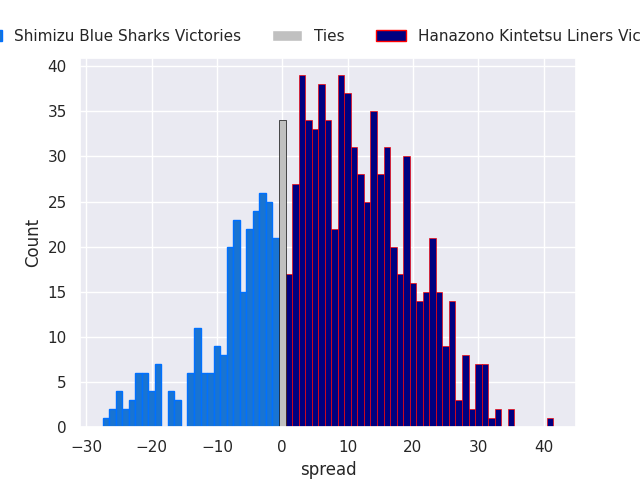
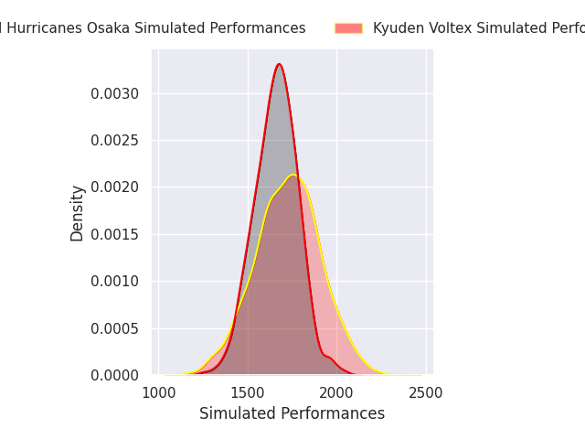
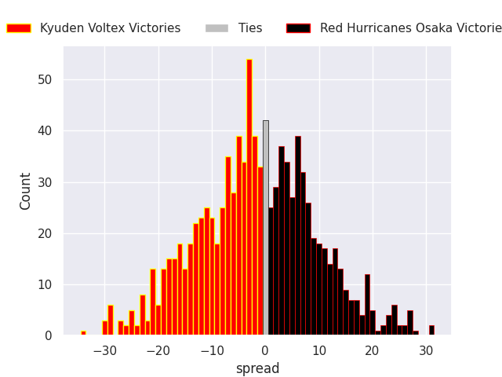
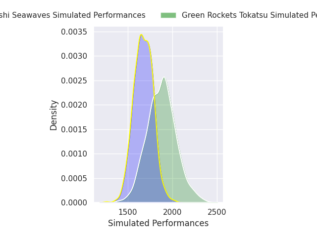
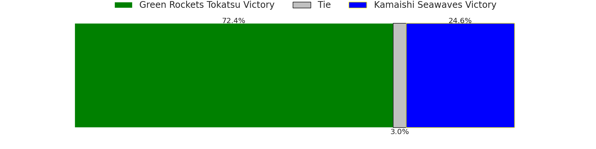
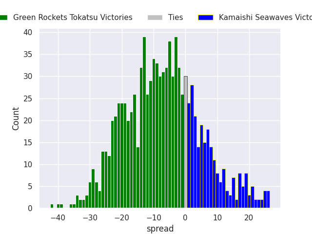

# Team Rankings

# Standings

## Current Standings

| Club                     |   Played |   Wins |   Point Differential |   Losing Bonus Points |   Try Bonus Points |   Competition Points |
|:-------------------------|---------:|-------:|---------------------:|----------------------:|-------------------:|---------------------:|
| Hanazono Kintetsu Liners |        4 |      4 |                   74 |                     0 |                  3 |                   19 |
| Shimizu Blue Sharks      |        4 |      4 |                   39 |                     0 |                  2 |                   18 |
| Toyota Shuttles Aichi    |        5 |      3 |                   81 |                     1 |                  3 |                   16 |
| Kamaishi Seawaves        |        4 |      2 |                    8 |                     1 |                    |                    9 |
| Kyuden Voltex            |        4 |      2 |                   -7 |                     1 |                    |                    9 |
| Green Rockets Tokatsu    |        4 |      2 |                  -27 |                     0 |                  1 |                    9 |
| Red Hurricanes Osaka     |        4 |      0 |                  -70 |                     2 |                    |                    2 |
| Hino Red Dolphins        |        5 |      0 |                  -98 |                     1 |                  1 |                    2 |

## Projected Remaining Table

| Club                     |   To Play |   Projected Wins |   Projected Differential |   Projected Losing Bonus Points | Projected Try Bonus Points   |   Projected Competition Points |
|:-------------------------|----------:|-----------------:|-------------------------:|--------------------------------:|:-----------------------------|-------------------------------:|
| Hanazono Kintetsu Liners |         1 |            0.67  |                    5.981 |                           0.158 |                              |                          2.918 |
| Green Rockets Tokatsu    |         1 |            0.626 |                    4.624 |                           0.184 |                              |                          2.784 |
| Kyuden Voltex            |         1 |            0.534 |                    1.562 |                           0.216 |                              |                          2.46  |
| Red Hurricanes Osaka     |         1 |            0.412 |                   -1.562 |                           0.243 |                              |                          1.999 |
| Kamaishi Seawaves        |         1 |            0.326 |                   -4.624 |                           0.235 |                              |                          1.635 |
| Shimizu Blue Sharks      |         1 |            0.29  |                   -5.981 |                           0.216 |                              |                          1.456 |

## Projected Total Table

| Club                     |   Played |   Wins |   Point Differential |   Losing Bonus Points |   Try Bonus Points |   Competition Points |
|:-------------------------|---------:|-------:|---------------------:|----------------------:|-------------------:|---------------------:|
| Hanazono Kintetsu Liners |        5 |  4.67  |               79.981 |                 0.158 |                  3 |               21.918 |
| Shimizu Blue Sharks      |        5 |  4.29  |               33.019 |                 0.216 |                  2 |               19.456 |
| Toyota Shuttles Aichi    |        5 |  3     |               81     |                 1     |                  3 |               16     |
| Green Rockets Tokatsu    |        5 |  2.626 |              -22.376 |                 0.184 |                  1 |               11.784 |
| Kyuden Voltex            |        5 |  2.534 |               -5.438 |                 1.216 |                    |               11.46  |
| Kamaishi Seawaves        |        5 |  2.326 |                3.376 |                 1.235 |                    |               10.635 |
| Red Hurricanes Osaka     |        5 |  0.412 |              -71.562 |                 2.243 |                    |                3.999 |
| Hino Red Dolphins        |        5 |  0     |              -98     |                 1     |                  1 |                2     |

# Completed Match Review

| Model | Percent Correct Predictions | Spread Error |
| ------ | ------ | ------ |
| Club Level | 65.0% | 15.1 |
| Player Level: Lineup | nan% | nan |
| Player Level: Minutes | nan% | nan |

# Future Predictions

## Week 6

### Shimizu Blue Sharks V Hanazono Kintetsu Liners on 2026/02/07

Average Margin: Hanazono Kintetsu Liners by 6.0

### Kyuden Voltex V Red Hurricanes Osaka on 2026/02/08

Average Margin: Kyuden Voltex by 1.6

### Green Rockets Tokatsu V Kamaishi Seawaves on 2026/02/08

Average Margin: Green Rockets Tokatsu by 4.6

