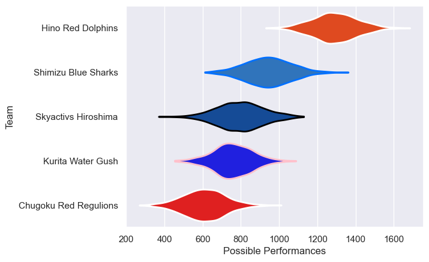
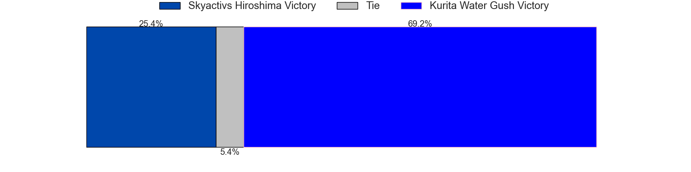
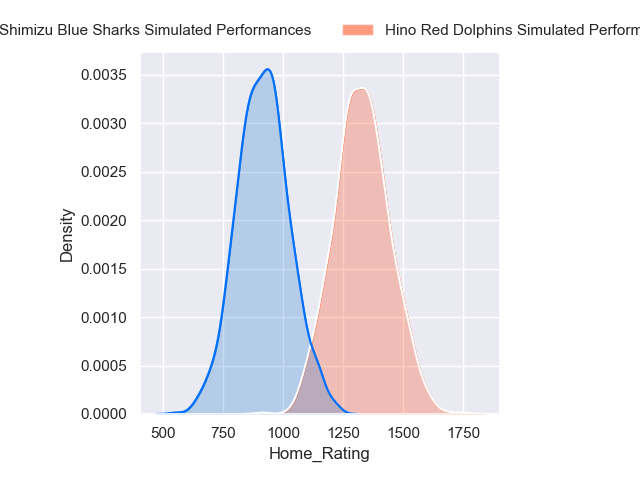
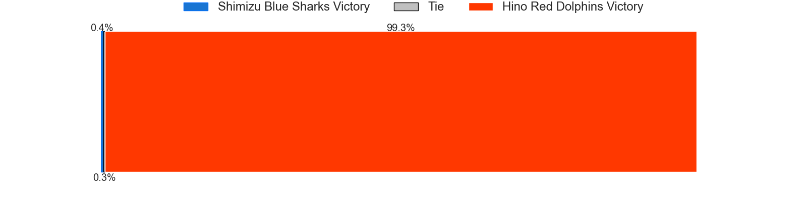
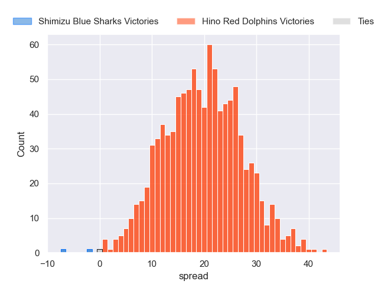

---  
title: "Japan Rugby League One D3 2023 Status"  
date: 2024-04-29 6:00:00 -0500  
categories: model review projection  
layout: article  
aside:  
    toc: true  
---
# Current Team Rankings

# Standings

## Current Standings

| Club                  |   Played |   Wins |   Point Differential |   Losing Bonus Points |   Try Bonus Points |   Competition Points |
|:----------------------|---------:|-------:|---------------------:|----------------------:|-------------------:|---------------------:|
| Hino Red Dolphins     |       10 |      9 |                  238 |                     0 |                nan |                   47 |
| Shimizu Blue Sharks   |       11 |      8 |                  104 |                     1 |                  7 |                   40 |
| Skyactivs Hiroshima   |       11 |      4 |                 -145 |                     1 |                nan |                   22 |
| Kurita Water Gush     |       11 |      4 |                  -88 |                     0 |                nan |                   21 |
| Chugoku Red Regulions |       11 |      1 |                 -109 |                     3 |                nan |                   12 |

## Projected Remaining Table

| Club                |   Matches Remaining |   Wins |   Point Differential |   Losing Bonus Points |   Try Bonus Points |   Competition Points |
|:--------------------|--------------------:|-------:|---------------------:|----------------------:|-------------------:|---------------------:|
| Hino Red Dolphins   |                   1 |    1   |             15.9701  |                   0   |                0.9 |                  4.9 |
| Kurita Water Gush   |                   1 |    0.8 |              6.56704 |                   0.1 |                0.5 |                  4   |
| Skyactivs Hiroshima |                   1 |    0.2 |             -6.56704 |                   0.4 |                0.3 |                  1.3 |
| Shimizu Blue Sharks |                   1 |    0   |            -15.9701  |                   0.1 |                0.3 |                  0.4 |

## Projected Total Table

| Club                  |   Total Matches |   Wins |   Point Differential |   Losing Bonus Points |   Try Bonus Points |   Competition Points |
|:----------------------|----------------:|-------:|---------------------:|----------------------:|-------------------:|---------------------:|
| Hino Red Dolphins     |              11 |   10   |             253.97   |                   0   |                0.9 |                 51.9 |
| Shimizu Blue Sharks   |              12 |    8   |              88.0299 |                   1.1 |                7.3 |                 40.4 |
| Kurita Water Gush     |              12 |    4.8 |             -81.433  |                   0.1 |                0.5 |                 25   |
| Skyactivs Hiroshima   |              12 |    4.2 |            -151.567  |                   1.4 |                0.3 |                 23.3 |
| Chugoku Red Regulions |              11 |    1   |            -109      |                   3   |                0   |                 12   |

# Completed Match Review

| Model | Percent Correct Predictions | Spread Error |
| ------ | ------ | ------ |
| Club Level | 81.5% | 12.6 |
| Player Level: Lineup | 72.0% | 14.3 |
| Player Level: Minutes | 76.0% | 14.7 |

# Future Predictions

## Week 12

### Kurita Water Gush V Skyactivs Hiroshima on 2024/05/04

Average Margin: Kurita Water Gush by 6.6

Average Scoreline: 30-23

### Hino Red Dolphins V Shimizu Blue Sharks on 2024/05/04

Average Margin: Hino Red Dolphins by 16.0

Average Scoreline: 45-29

