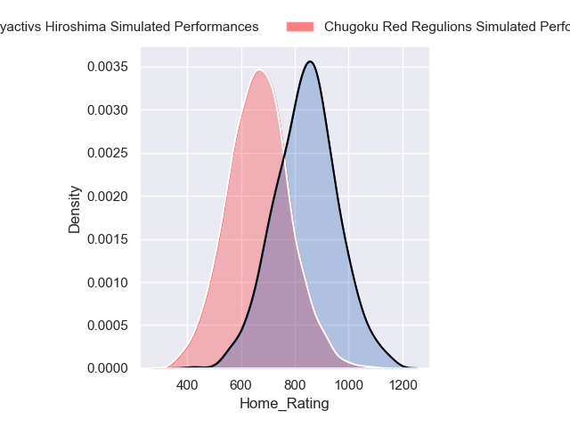
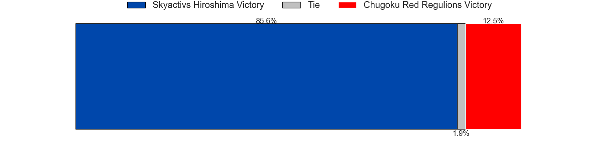
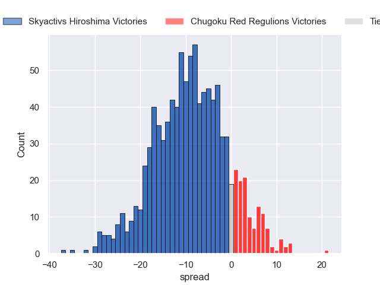

---  
title: "Japan Rugby League One D3 2023 Status"  
date: 2024-01-22 6:00:00 -0500  
categories: model review projection  
layout: article  
aside:  
    toc: true  
---
# Current Team Rankings

# Standings

## Current Standings

| Club                  |   Played |   Wins |   Point Differential |   Losing Bonus Points |   Try Bonus Points |   Competition Points |
|:----------------------|---------:|-------:|---------------------:|----------------------:|-------------------:|---------------------:|
| Hino Red Dolphins     |        4 |      4 |                   85 |                     0 |                  4 |                   20 |
| Skyactivs Hiroshima   |        4 |      3 |                  -11 |                     0 |                  1 |                   13 |
| Shimizu Blue Sharks   |        5 |      2 |                    2 |                     1 |                  3 |                   12 |
| Kurita Water Gush     |        5 |      1 |                  -46 |                     0 |                  2 |                    6 |
| Chugoku Red Regulions |        2 |      0 |                  -30 |                     0 |                  0 |                    0 |

## Projected Remaining Table

| Club                  |   Matches Remaining |   Wins |   Point Differential |   Losing Bonus Points |   Try Bonus Points |   Competition Points |
|:----------------------|--------------------:|-------:|---------------------:|----------------------:|-------------------:|---------------------:|
| Hino Red Dolphins     |                   8 |    8   |            201.257   |                   0   |                7.2 |                 39.2 |
| Skyactivs Hiroshima   |                   9 |    4.8 |             -9.22334 |                   1.4 |                5.1 |                 25.8 |
| Shimizu Blue Sharks   |                   8 |    4.9 |              5.14159 |                   0.9 |                4.6 |                 24.9 |
| Kurita Water Gush     |                   8 |    2.5 |            -55.8035  |                   1.6 |                3.6 |                 15.4 |
| Chugoku Red Regulions |                   9 |    0.8 |           -141.371   |                   1.6 |                1.9 |                  6.7 |

## Projected Total Table

| Club                  |   Total Matches |   Wins |   Point Differential |   Losing Bonus Points |   Try Bonus Points |   Competition Points |
|:----------------------|----------------:|-------:|---------------------:|----------------------:|-------------------:|---------------------:|
| Hino Red Dolphins     |              12 |   12   |            286.257   |                   0   |               11.2 |                 59.2 |
| Skyactivs Hiroshima   |              13 |    7.8 |            -20.2233  |                   1.4 |                6.1 |                 38.8 |
| Shimizu Blue Sharks   |              13 |    6.9 |              7.14159 |                   1.9 |                7.6 |                 36.9 |
| Kurita Water Gush     |              13 |    3.5 |           -101.804   |                   1.6 |                5.6 |                 21.4 |
| Chugoku Red Regulions |              11 |    0.8 |           -171.371   |                   1.6 |                1.9 |                  6.7 |

# Completed Match Review

| Model | Percent Correct Predictions | Spread Error |
| ------ | ------ | ------ |
| Club Level | 75.0% | 10.8 |
| Player Level: Lineup | 62.5% | 10.8 |
| Player Level: Minutes | 62.5% | 11.4 |

# Future Predictions

## Week 6

### Chugoku Red Regulions V Skyactivs Hiroshima on 2024/01/27

Average Margin: Skyactivs Hiroshima by 8.9

Average Scoreline: 28-19

## Week 7

### Kurita Water Gush V Chugoku Red Regulions on 2024/02/10

Average Margin: Kurita Water Gush by 10.5

Average Scoreline: 36-25

### Hino Red Dolphins V Skyactivs Hiroshima on 2024/02/11

Average Margin: Hino Red Dolphins by 25.3

Average Scoreline: 47-21

## Week 8

### Shimizu Blue Sharks V Kurita Water Gush on 2024/02/24

Average Margin: Shimizu Blue Sharks by 11.1

Average Scoreline: 33-22

### Chugoku Red Regulions V Skyactivs Hiroshima on 2024/02/25

Average Margin: Skyactivs Hiroshima by 8.5

Average Scoreline: 28-19

## Week 9

### Hino Red Dolphins V Chugoku Red Regulions on 2024/03/02

Average Margin: Hino Red Dolphins by 36.7

Average Scoreline: 50-13

### Skyactivs Hiroshima V Shimizu Blue Sharks on 2024/03/02

Average Margin: Skyactivs Hiroshima by 0.4

Average Scoreline: 26-26

## Week 10

### Kurita Water Gush V Hino Red Dolphins on 2024/03/09

Average Margin: Hino Red Dolphins by 23.2

Average Scoreline: 43-20

### Chugoku Red Regulions V Shimizu Blue Sharks on 2024/03/09

Average Margin: Shimizu Blue Sharks by 11.1

Average Scoreline: 35-24

## Week 11

### Skyactivs Hiroshima V Kurita Water Gush on 2024/03/23

Average Margin: Skyactivs Hiroshima by 7.9

Average Scoreline: 27-19

### Hino Red Dolphins V Shimizu Blue Sharks on 2024/03/24

Average Margin: Hino Red Dolphins by 22.1

Average Scoreline: 45-22

## Week 12

### Chugoku Red Regulions V Hino Red Dolphins on 2024/03/31

Average Margin: Hino Red Dolphins by 30.2

Average Scoreline: 45-15

### Shimizu Blue Sharks V Skyactivs Hiroshima on 2024/03/31

Average Margin: Shimizu Blue Sharks by 6.4

Average Scoreline: 28-21

## Week 13

### Kurita Water Gush V Shimizu Blue Sharks on 2024/04/06

Average Margin: Shimizu Blue Sharks by 4.1

Average Scoreline: 31-27

### Skyactivs Hiroshima V Chugoku Red Regulions on 2024/04/06

Average Margin: Skyactivs Hiroshima by 14.6

Average Scoreline: 34-19

## Week 14

### Kurita Water Gush V Hino Red Dolphins on 2024/04/20

Average Margin: Hino Red Dolphins by 22.5

Average Scoreline: 44-22

### Shimizu Blue Sharks V Chugoku Red Regulions on 2024/04/20

Average Margin: Shimizu Blue Sharks by 17.5

Average Scoreline: 43-26

## Week 15

### Chugoku Red Regulions V Kurita Water Gush on 2024/04/27

Average Margin: Kurita Water Gush by 3.5

Average Scoreline: 28-25

### Skyactivs Hiroshima V Hino Red Dolphins on 2024/04/27

Average Margin: Hino Red Dolphins by 18.7

Average Scoreline: 39-21

## Week 16

### Hino Red Dolphins V Shimizu Blue Sharks on 2024/05/04

Average Margin: Hino Red Dolphins by 22.5

Average Scoreline: 44-22

### Kurita Water Gush V Skyactivs Hiroshima on 2024/05/04

Average Margin: Skyactivs Hiroshima by 1.0

Average Scoreline: 28-27

