---  
title: "Japan Rugby League One D3 2023 Status"  
date: 2024-04-22 6:00:00 -0500  
categories: model review projection  
layout: article  
aside:  
    toc: true  
---
# Current Team Rankings

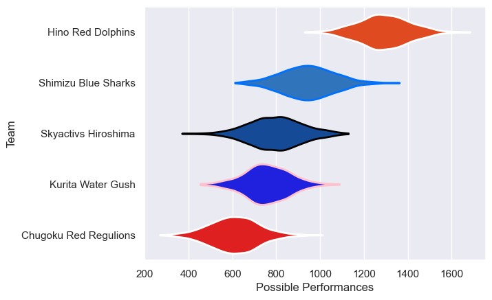
# Standings

## Current Standings

| Club                  |   Played |   Wins |   Point Differential |   Losing Bonus Points |   Try Bonus Points |   Competition Points |
|:----------------------|---------:|-------:|---------------------:|----------------------:|-------------------:|---------------------:|
| Hino Red Dolphins     |        9 |      8 |                  230 |                     0 |                nan |                   42 |
| Shimizu Blue Sharks   |       11 |      8 |                  104 |                     1 |                nan |                   40 |
| Skyactivs Hiroshima   |       10 |      4 |                 -137 |                     1 |                  5 |                   22 |
| Kurita Water Gush     |       10 |      3 |                  -96 |                     0 |                nan |                   16 |
| Chugoku Red Regulions |       10 |      1 |                 -101 |                     3 |                nan |                   12 |

## Projected Remaining Table

| Club                  |   Matches Remaining |   Wins |   Point Differential |   Losing Bonus Points |   Try Bonus Points |   Competition Points |
|:----------------------|--------------------:|-------:|---------------------:|----------------------:|-------------------:|---------------------:|
| Hino Red Dolphins     |                   2 |    2   |            40.8443   |                   0   |                1.8 |                  9.8 |
| Kurita Water Gush     |                   2 |    1.4 |             7.59734  |                   0.5 |                1.1 |                  7.1 |
| Chugoku Red Regulions |                   1 |    0.5 |            -0.680665 |                   0.4 |                0.4 |                  2.6 |
| Skyactivs Hiroshima   |                   2 |    0.2 |           -30.0855   |                   0.4 |                0.7 |                  1.7 |
| Shimizu Blue Sharks   |                   1 |    0   |           -17.6754   |                   0.1 |                0.3 |                  0.4 |

## Projected Total Table

| Club                  |   Total Matches |   Wins |   Point Differential |   Losing Bonus Points |   Try Bonus Points |   Competition Points |
|:----------------------|----------------:|-------:|---------------------:|----------------------:|-------------------:|---------------------:|
| Hino Red Dolphins     |              11 |   10   |             270.844  |                   0   |                1.8 |                 51.8 |
| Shimizu Blue Sharks   |              12 |    8   |              86.3246 |                   1.1 |                0.3 |                 40.4 |
| Skyactivs Hiroshima   |              12 |    4.2 |            -167.085  |                   1.4 |                5.7 |                 23.7 |
| Kurita Water Gush     |              12 |    4.4 |             -88.4027 |                   0.5 |                1.1 |                 23.1 |
| Chugoku Red Regulions |              11 |    1.5 |            -101.681  |                   3.4 |                0.4 |                 14.6 |

# Completed Match Review

| Model | Percent Correct Predictions | Spread Error |
| ------ | ------ | ------ |
| Club Level | 80.0% | 12.7 |
| Player Level: Lineup | 69.6% | 14.8 |
| Player Level: Minutes | 73.9% | 15.2 |

# Future Predictions

## Week 12

### Chugoku Red Regulions V Kurita Water Gush on 2024/04/27

Average Margin: Kurita Water Gush by 0.7

Average Scoreline: 37-36

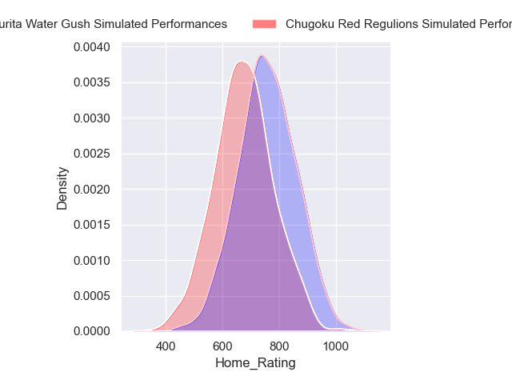
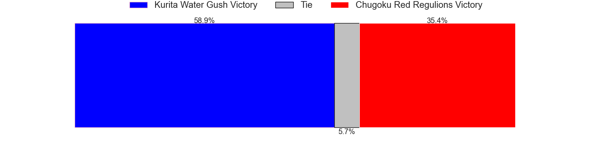
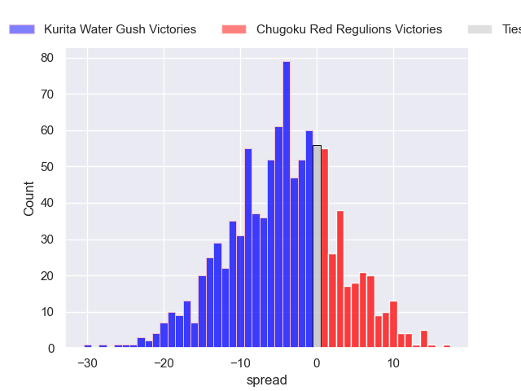

### Skyactivs Hiroshima V Hino Red Dolphins on 2024/04/27

Average Margin: Hino Red Dolphins by 23.2

Average Scoreline: 47-24

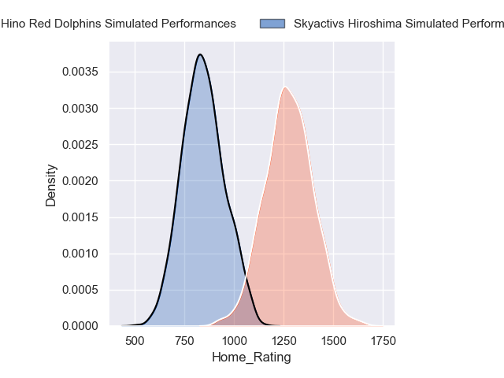
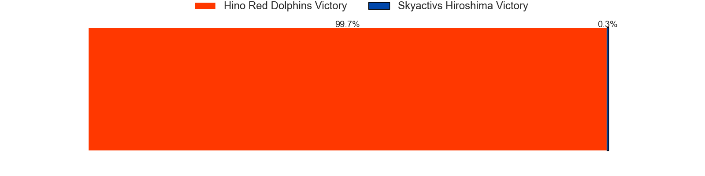
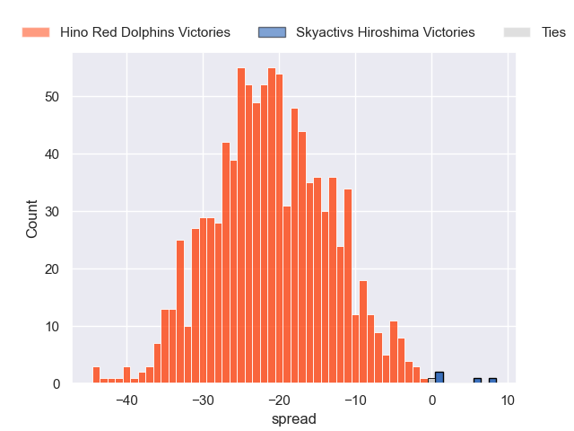

## Week 13

### Hino Red Dolphins V Shimizu Blue Sharks on 2024/05/04

Average Margin: Hino Red Dolphins by 17.7

Average Scoreline: 46-29

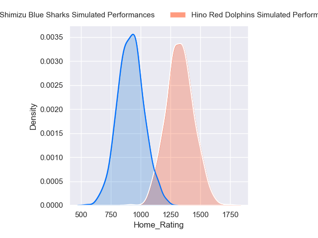
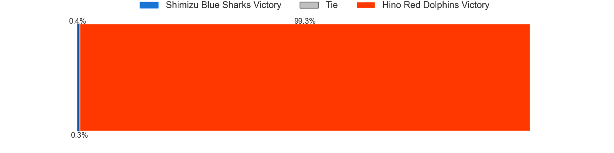
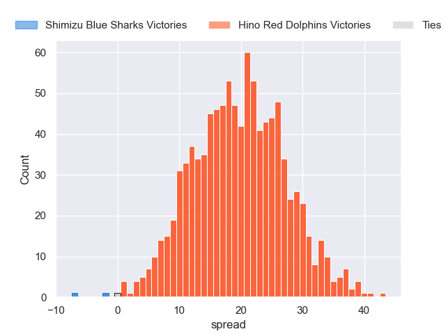

### Kurita Water Gush V Skyactivs Hiroshima on 2024/05/04

Average Margin: Kurita Water Gush by 6.9

Average Scoreline: 33-26

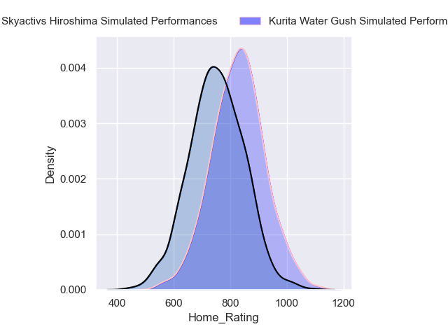
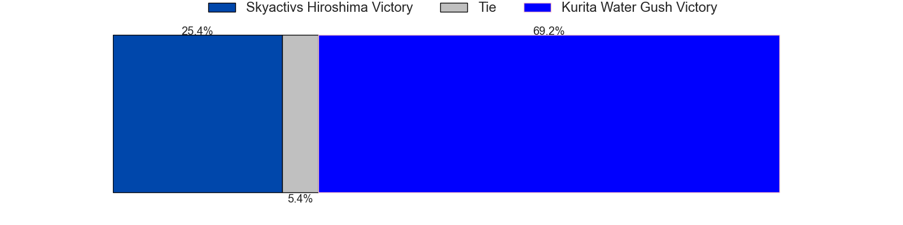
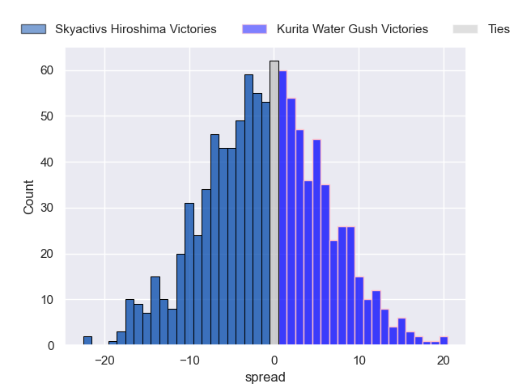

