---  
title: "Japan Rugby League One D3 2023 Status"  
date: 2024-01-15 6:00:00 -0500  
categories: model review projection  
layout: article  
aside:  
    toc: true  
---
# Current Team Rankings

# Standings

## Current Standings

| Club                  |   Played |   Wins |   Point Differential |   Losing Bonus Points |   Try Bonus Points |   Competition Points |
|:----------------------|---------:|-------:|---------------------:|----------------------:|-------------------:|---------------------:|
| Hino Red Dolphins     |        4 |      4 |                   85 |                     0 |                  4 |                   20 |
| Skyactivs Hiroshima   |        4 |      3 |                  -11 |                     0 |                  1 |                   13 |
| Shimizu Blue Sharks   |        4 |      1 |                  -16 |                     1 |                  2 |                    7 |
| Kurita Water Gush     |        4 |      1 |                  -28 |                     0 |                  2 |                    6 |
| Chugoku Red Regulions |        2 |      0 |                  -30 |                     0 |                  0 |                    0 |

## Projected Remaining Table

| Club                  |   Matches Remaining |   Wins |   Point Differential |   Losing Bonus Points |   Try Bonus Points |   Competition Points |
|:----------------------|--------------------:|-------:|---------------------:|----------------------:|-------------------:|---------------------:|
| Hino Red Dolphins     |                   8 |    8   |            203.353   |                   0   |                7   |                 38.9 |
| Shimizu Blue Sharks   |                   9 |    5.6 |              9.77325 |                   1   |                4.3 |                 27.6 |
| Skyactivs Hiroshima   |                   9 |    4.9 |             -8.3825  |                   1.4 |                4.2 |                 25.1 |
| Kurita Water Gush     |                   9 |    2.8 |            -61.8493  |                   1.8 |                3.5 |                 16.6 |
| Chugoku Red Regulions |                   9 |    0.8 |           -142.894   |                   1.6 |                1.8 |                  6.5 |

## Projected Total Table

| Club                  |   Total Matches |   Wins |   Point Differential |   Losing Bonus Points |   Try Bonus Points |   Competition Points |
|:----------------------|----------------:|-------:|---------------------:|----------------------:|-------------------:|---------------------:|
| Hino Red Dolphins     |              12 |   12   |            288.353   |                   0   |               11   |                 58.9 |
| Skyactivs Hiroshima   |              13 |    7.9 |            -19.3825  |                   1.4 |                5.2 |                 38.1 |
| Shimizu Blue Sharks   |              13 |    6.6 |             -6.22675 |                   2   |                6.3 |                 34.6 |
| Kurita Water Gush     |              13 |    3.8 |            -89.8493  |                   1.8 |                5.5 |                 22.6 |
| Chugoku Red Regulions |              11 |    0.8 |           -172.894   |                   1.6 |                1.8 |                  6.5 |

# Completed Match Review

| Model | Percent Correct Predictions | Spread Error |
| ------ | ------ | ------ |
| Club Level | 71.4% | 11.7 |
| Player Level: Lineup | 71.4% | 9.1 |
| Player Level: Minutes | 71.4% | 9.5 |

# Future Predictions

## Week 5

### Chugoku Red Regulions V Skyactivs Hiroshima on 2024/01/20

Average Margin: Skyactivs Hiroshima by 8.8

Average Scoreline: 27-19

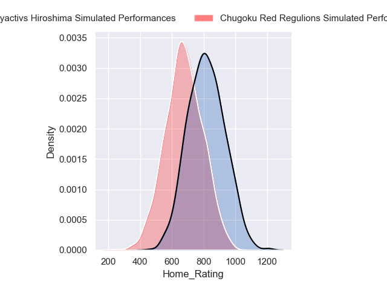

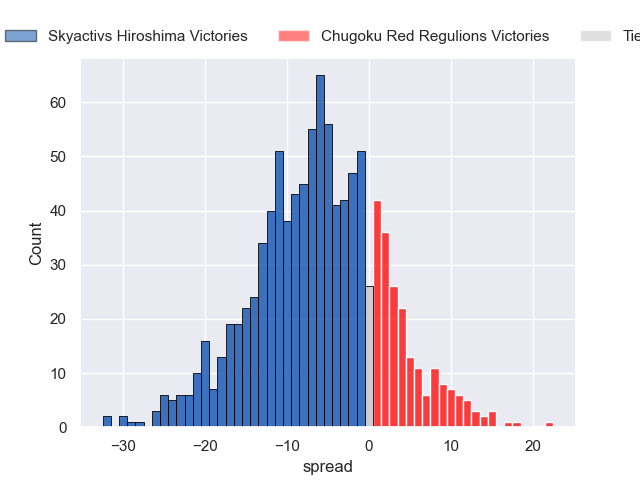

### Shimizu Blue Sharks V Kurita Water Gush on 2024/01/20

Average Margin: Shimizu Blue Sharks by 10.1

Average Scoreline: 33-23

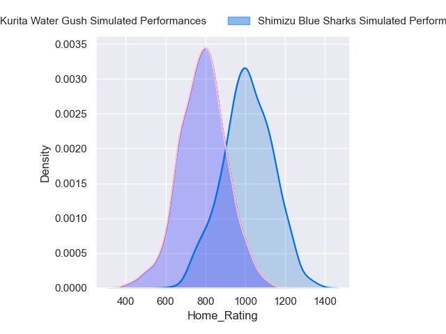
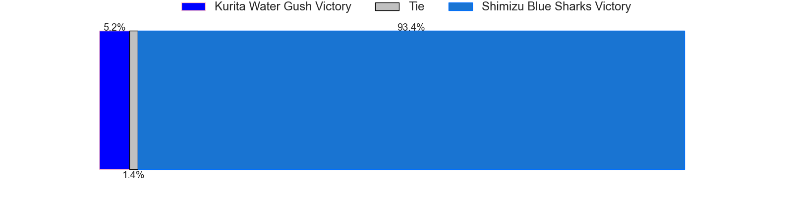
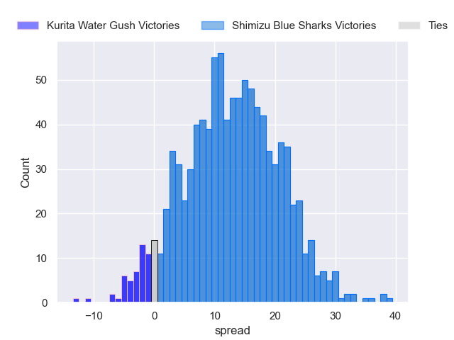

## Week 6

### Kurita Water Gush V Chugoku Red Regulions on 2024/02/10

Average Margin: Kurita Water Gush by 11.1

Average Scoreline: 35-24

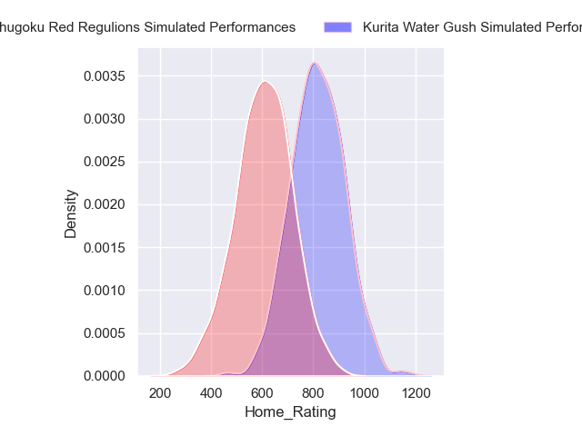
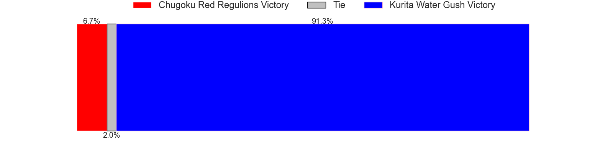
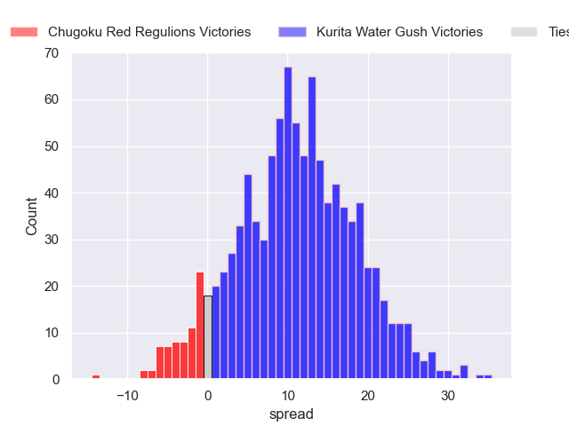

### Hino Red Dolphins V Skyactivs Hiroshima on 2024/02/11

Average Margin: Hino Red Dolphins by 25.6

Average Scoreline: 49-23

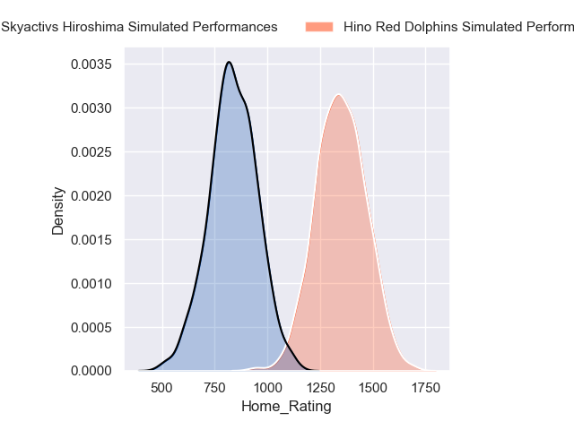

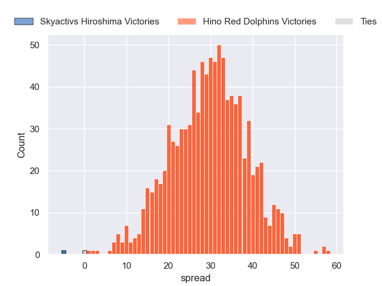

## Week 7

### Shimizu Blue Sharks V Kurita Water Gush on 2024/02/24

Average Margin: Shimizu Blue Sharks by 10.1

Average Scoreline: 29-19

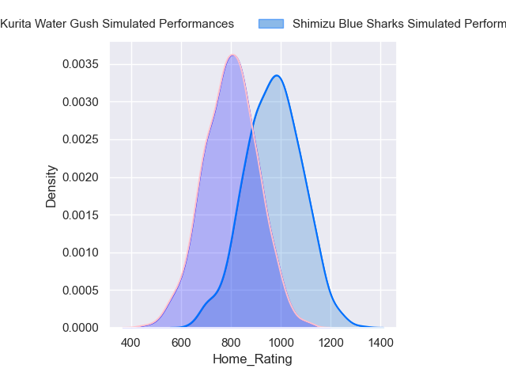
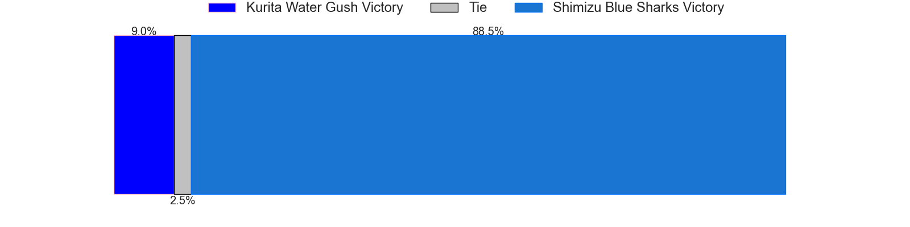
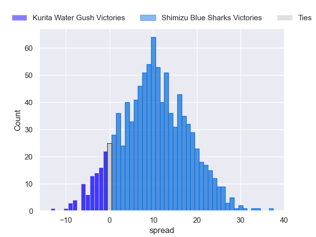

### Chugoku Red Regulions V Skyactivs Hiroshima on 2024/02/25

Average Margin: Skyactivs Hiroshima by 8.4

Average Scoreline: 29-20

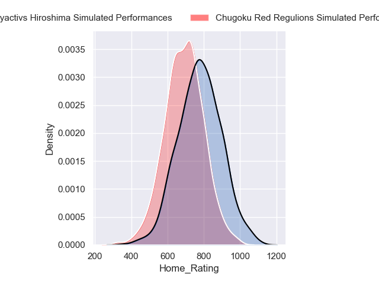
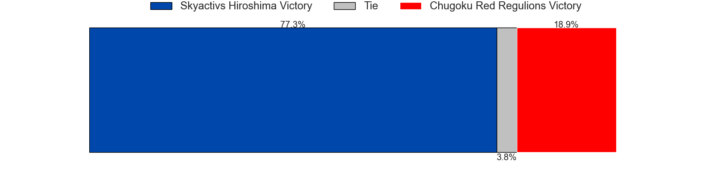
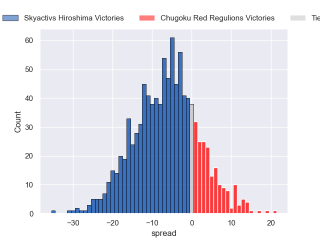

## Week 8

### Hino Red Dolphins V Chugoku Red Regulions on 2024/03/02

Average Margin: Hino Red Dolphins by 37.1

Average Scoreline: 41-4

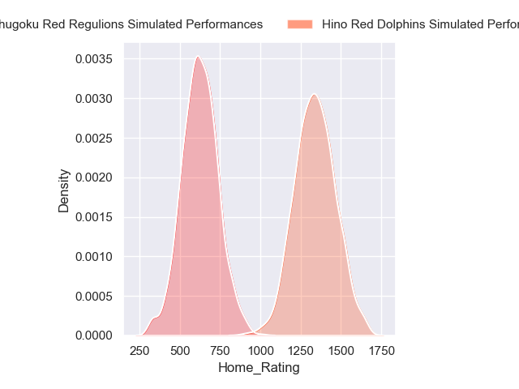

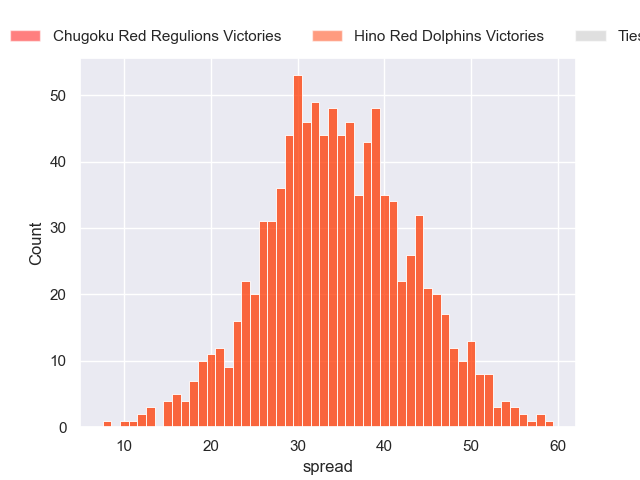

### Skyactivs Hiroshima V Shimizu Blue Sharks on 2024/03/02

Average Margin: Skyactivs Hiroshima by 1.1

Average Scoreline: 33-32

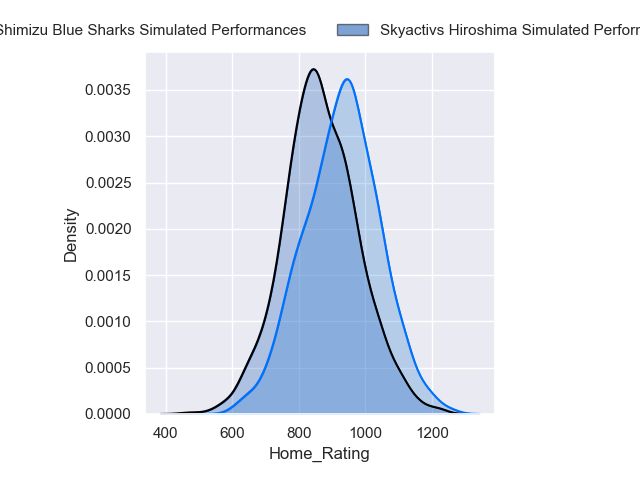
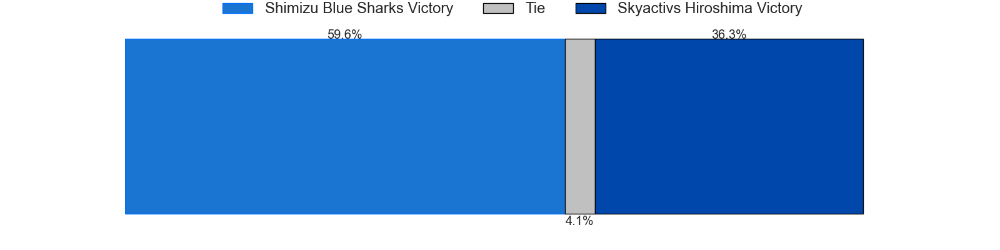
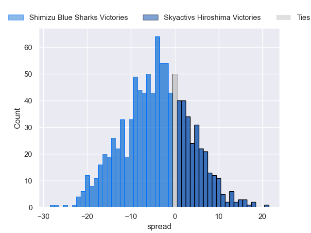

## Week 9

### Kurita Water Gush V Hino Red Dolphins on 2024/03/09

Average Margin: Hino Red Dolphins by 23.2

Average Scoreline: 40-17

### Chugoku Red Regulions V Shimizu Blue Sharks on 2024/03/09

Average Margin: Shimizu Blue Sharks by 10.8

Average Scoreline: 31-20

## Week 10

### Skyactivs Hiroshima V Kurita Water Gush on 2024/03/23

Average Margin: Skyactivs Hiroshima by 7.7

Average Scoreline: 29-21

### Hino Red Dolphins V Shimizu Blue Sharks on 2024/03/24

Average Margin: Hino Red Dolphins by 23.1

Average Scoreline: 45-22

## Week 11

### Chugoku Red Regulions V Hino Red Dolphins on 2024/03/31

Average Margin: Hino Red Dolphins by 30.7

Average Scoreline: 44-13

### Shimizu Blue Sharks V Skyactivs Hiroshima on 2024/03/31

Average Margin: Shimizu Blue Sharks by 5.4

Average Scoreline: 31-26

## Week 12

### Kurita Water Gush V Shimizu Blue Sharks on 2024/04/06

Average Margin: Shimizu Blue Sharks by 3.1

Average Scoreline: 28-25

### Skyactivs Hiroshima V Chugoku Red Regulions on 2024/04/06

Average Margin: Skyactivs Hiroshima by 14.7

Average Scoreline: 33-18

## Week 13

### Shimizu Blue Sharks V Chugoku Red Regulions on 2024/04/20

Average Margin: Shimizu Blue Sharks by 17.0

Average Scoreline: 40-23

### Kurita Water Gush V Hino Red Dolphins on 2024/04/20

Average Margin: Hino Red Dolphins by 22.5

Average Scoreline: 39-17

## Week 14

### Chugoku Red Regulions V Kurita Water Gush on 2024/04/27

Average Margin: Kurita Water Gush by 4.3

Average Scoreline: 28-24

### Skyactivs Hiroshima V Hino Red Dolphins on 2024/04/27

Average Margin: Hino Red Dolphins by 18.6

Average Scoreline: 39-20

## Week 15

### Hino Red Dolphins V Shimizu Blue Sharks on 2024/05/04

Average Margin: Hino Red Dolphins by 22.6

Average Scoreline: 43-20

### Kurita Water Gush V Skyactivs Hiroshima on 2024/05/04

Average Margin: Skyactivs Hiroshima by 0.6

Average Scoreline: 24-23

