---  
title: "Japan Rugby League One D3 2023 Status"  
date: 2023-12-18 6:00:00 -0500  
categories: model review projection  
layout: article  
aside:  
    toc: true  
---
# Current Team Rankings

# Standings

## Current Standings

| Club                |   Played |   Wins |   Point Differential |   Losing Bonus Points |   Try Bonus Points |   Competition Points |
|:--------------------|---------:|-------:|---------------------:|----------------------:|-------------------:|---------------------:|
| Skyactivs Hiroshima |        1 |      1 |                   15 |                     0 |                nan |                    4 |
| Hino Red Dolphins   |        1 |      1 |                   14 |                     0 |                nan |                    4 |
| Shimizu Blue Sharks |        1 |      0 |                  -14 |                     0 |                nan |                    0 |
| Kurita Water Gush   |        1 |      0 |                  -15 |                     0 |                nan |                    0 |

## Projected Remaining Table

| Club                  |   Matches Remaining |   Wins |   Point Differential |   Losing Bonus Points |   Try Bonus Points |   Competition Points |
|:----------------------|--------------------:|-------:|---------------------:|----------------------:|-------------------:|---------------------:|
| Hino Red Dolphins     |                  11 |   11   |             283.597  |                   0   |               10.9 |                 54.8 |
| Shimizu Blue Sharks   |                  11 |    7.9 |              53.8687 |                   0.9 |                7.8 |                 40.2 |
| Kurita Water Gush     |                  11 |    4.2 |             -64.0936 |                   1.8 |                4.3 |                 23.1 |
| Skyactivs Hiroshima   |                  11 |    3.2 |             -97.8887 |                   2   |                3.4 |                 18.3 |
| Chugoku Red Regulions |                  12 |    1.7 |            -175.483  |                   2.2 |                1.9 |                 10.9 |

## Projected Total Table

| Club                  |   Total Matches |   Wins |   Point Differential |   Losing Bonus Points |   Try Bonus Points |   Competition Points |
|:----------------------|----------------:|-------:|---------------------:|----------------------:|-------------------:|---------------------:|
| Hino Red Dolphins     |              12 |   12   |             297.597  |                   0   |               10.9 |                 58.8 |
| Shimizu Blue Sharks   |              12 |    7.9 |              39.8687 |                   0.9 |                7.8 |                 40.2 |
| Kurita Water Gush     |              12 |    4.2 |             -79.0936 |                   1.8 |                4.3 |                 23.1 |
| Skyactivs Hiroshima   |              12 |    4.2 |             -82.8887 |                   2   |                3.4 |                 22.3 |
| Chugoku Red Regulions |              12 |    1.7 |            -175.483  |                   2.2 |                1.9 |                 10.9 |

# Completed Match Review

| Model | Percent Correct Predictions | Spread Error |
| ------ | ------ | ------ |
| Club Level | 50.0% | 11.3 |
| Player Level: Lineup | nan% | nan |
| Player Level: Minutes | nan% | nan |

# Future Predictions

## Week 2

### Chugoku Red Regulions V Shimizu Blue Sharks on 2023/12/23

Average Margin: Shimizu Blue Sharks by 11.8

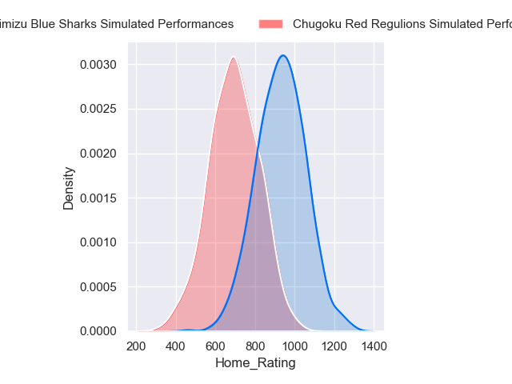
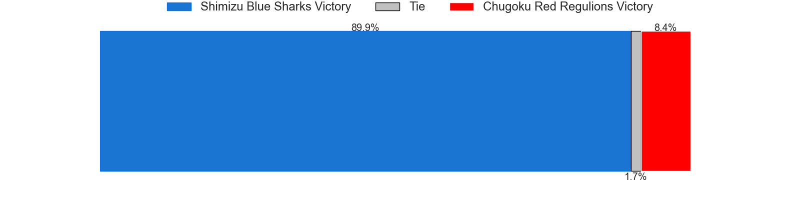
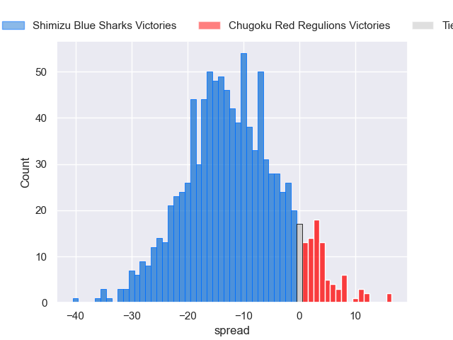

### Hino Red Dolphins V Kurita Water Gush on 2023/12/24

Average Margin: Hino Red Dolphins by 28.3

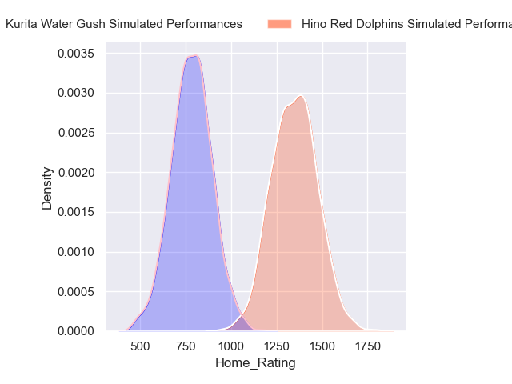

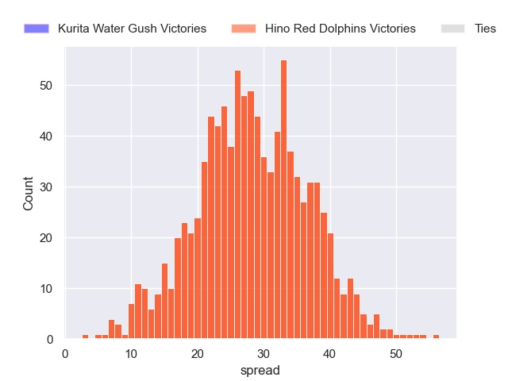

## Week 3

### Skyactivs Hiroshima V Hino Red Dolphins on 2024/01/06

Average Margin: Hino Red Dolphins by 23.2

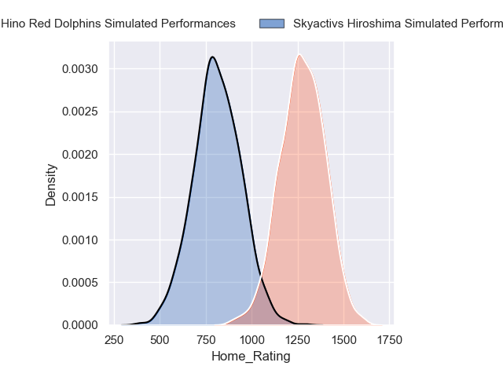
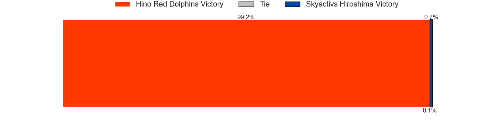
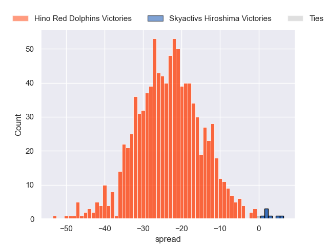

### Kurita Water Gush V Chugoku Red Regulions on 2024/01/06

Average Margin: Kurita Water Gush by 10.9

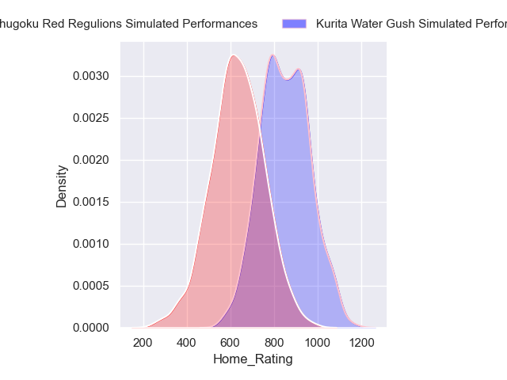
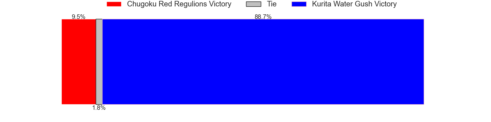
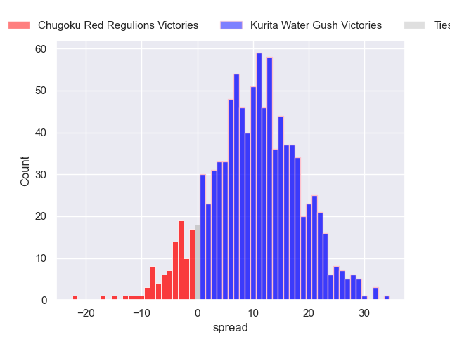

## Week 4

### Shimizu Blue Sharks V Skyactivs Hiroshima on 2024/01/13

Average Margin: Shimizu Blue Sharks by 12.8

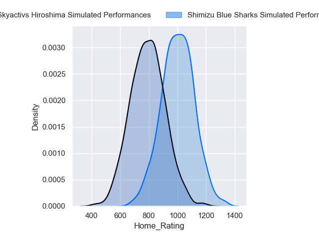
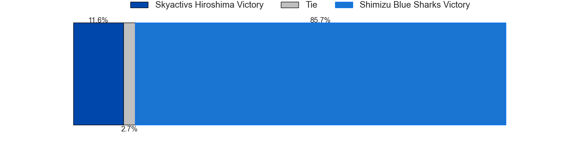
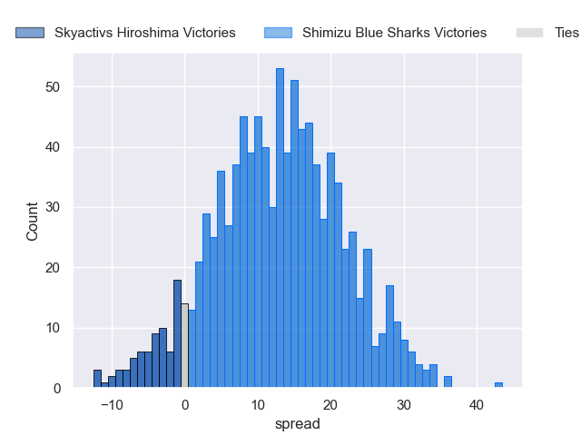

### Hino Red Dolphins V Chugoku Red Regulions on 2024/01/13

Average Margin: Hino Red Dolphins by 35.2

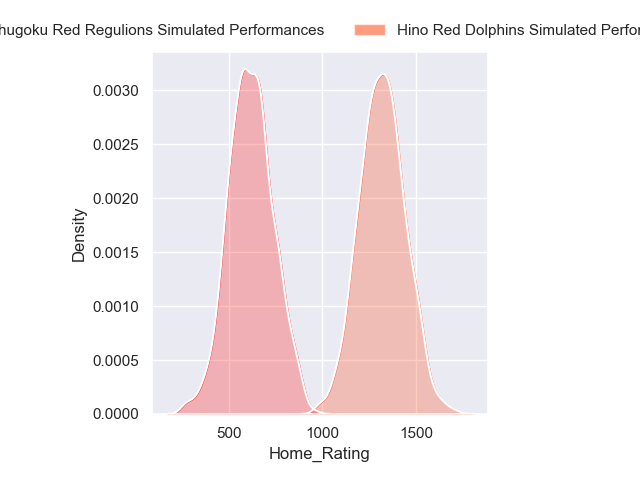

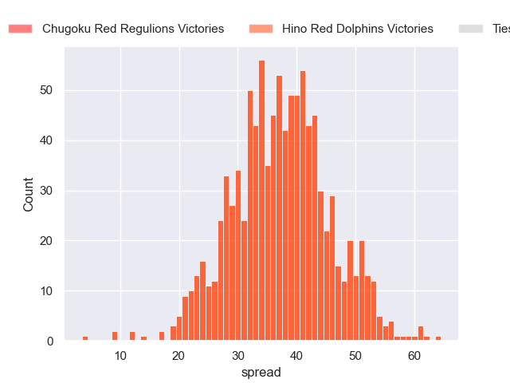

## Week 5

### Shimizu Blue Sharks V Kurita Water Gush on 2024/01/20

Average Margin: Shimizu Blue Sharks by 11.2

### Chugoku Red Regulions V Skyactivs Hiroshima on 2024/01/20

Average Margin: Skyactivs Hiroshima by 1.9

## Week 6

### Kurita Water Gush V Chugoku Red Regulions on 2024/02/10

Average Margin: Kurita Water Gush by 10.8

### Hino Red Dolphins V Skyactivs Hiroshima on 2024/02/11

Average Margin: Hino Red Dolphins by 29.6

## Week 7

### Shimizu Blue Sharks V Kurita Water Gush on 2024/02/24

Average Margin: Shimizu Blue Sharks by 10.2

### Chugoku Red Regulions V Skyactivs Hiroshima on 2024/02/25

Average Margin: Skyactivs Hiroshima by 1.8

## Week 8

### Hino Red Dolphins V Chugoku Red Regulions on 2024/03/02

Average Margin: Hino Red Dolphins by 34.6

### Skyactivs Hiroshima V Shimizu Blue Sharks on 2024/03/02

Average Margin: Shimizu Blue Sharks by 5.7

## Week 9

### Kurita Water Gush V Hino Red Dolphins on 2024/03/09

Average Margin: Hino Red Dolphins by 20.9

### Chugoku Red Regulions V Shimizu Blue Sharks on 2024/03/09

Average Margin: Shimizu Blue Sharks by 10.7

## Week 10

### Skyactivs Hiroshima V Kurita Water Gush on 2024/03/23

Average Margin: Skyactivs Hiroshima by 1.3

### Hino Red Dolphins V Shimizu Blue Sharks on 2024/03/24

Average Margin: Hino Red Dolphins by 20.6

## Week 11

### Chugoku Red Regulions V Hino Red Dolphins on 2024/03/31

Average Margin: Hino Red Dolphins by 27.9

### Shimizu Blue Sharks V Skyactivs Hiroshima on 2024/03/31

Average Margin: Shimizu Blue Sharks by 12.3

## Week 12

### Kurita Water Gush V Shimizu Blue Sharks on 2024/04/06

Average Margin: Shimizu Blue Sharks by 3.0

### Skyactivs Hiroshima V Chugoku Red Regulions on 2024/04/06

Average Margin: Skyactivs Hiroshima by 8.6

## Week 13

### Kurita Water Gush V Hino Red Dolphins on 2024/04/20

Average Margin: Hino Red Dolphins by 20.3

### Shimizu Blue Sharks V Chugoku Red Regulions on 2024/04/20

Average Margin: Shimizu Blue Sharks by 17.4

## Week 14

### Skyactivs Hiroshima V Hino Red Dolphins on 2024/04/27

Average Margin: Hino Red Dolphins by 22.4

### Chugoku Red Regulions V Kurita Water Gush on 2024/04/27

Average Margin: Kurita Water Gush by 4.0

## Week 15

### Kurita Water Gush V Skyactivs Hiroshima on 2024/05/04

Average Margin: Kurita Water Gush by 5.4

### Hino Red Dolphins V Shimizu Blue Sharks on 2024/05/04

Average Margin: Hino Red Dolphins by 20.5

