---  
title: "Japan Rugby League One D3 2023 Status"  
date: 2024-03-07 6:00:00 -0500  
categories: model review projection  
layout: article  
aside:  
    toc: true  
---
# Current Team Rankings

# Standings

## Current Standings

| Club                  |   Played |   Wins |   Point Differential |   Losing Bonus Points |   Try Bonus Points |   Competition Points |
|:----------------------|---------:|-------:|---------------------:|----------------------:|-------------------:|---------------------:|
| Hino Red Dolphins     |        5 |      5 |                  154 |                     0 |                nan |                   24 |
| Shimizu Blue Sharks   |        6 |      4 |                   51 |                     1 |                nan |                   20 |
| Skyactivs Hiroshima   |        7 |      3 |                  -84 |                     1 |                nan |                   14 |
| Kurita Water Gush     |        6 |      2 |                  -43 |                     0 |                nan |                   11 |
| Chugoku Red Regulions |        6 |      1 |                  -78 |                     1 |                nan |                    6 |

## Projected Remaining Table

| Club                  |   Matches Remaining |   Wins |   Point Differential |   Losing Bonus Points |   Try Bonus Points |   Competition Points |
|:----------------------|--------------------:|-------:|---------------------:|----------------------:|-------------------:|---------------------:|
| Hino Red Dolphins     |                   6 |    6   |             133.467  |                   0   |                5.5 |                 29.5 |
| Shimizu Blue Sharks   |                   6 |    3.8 |              15.2304 |                   0.3 |                3.7 |                 19   |
| Kurita Water Gush     |                   6 |    2   |             -44.3775 |                   1.2 |                2.4 |                 11.6 |
| Skyactivs Hiroshima   |                   5 |    1.8 |             -27.5438 |                   0.9 |                2   |                 10.3 |
| Chugoku Red Regulions |                   5 |    0.4 |             -76.7758 |                   0.8 |                1.1 |                  3.5 |

## Projected Total Table

| Club                  |   Total Matches |   Wins |   Point Differential |   Losing Bonus Points |   Try Bonus Points |   Competition Points |
|:----------------------|----------------:|-------:|---------------------:|----------------------:|-------------------:|---------------------:|
| Hino Red Dolphins     |              11 |   11   |             287.467  |                   0   |                5.5 |                 53.5 |
| Shimizu Blue Sharks   |              12 |    7.8 |              66.2304 |                   1.3 |                3.7 |                 39   |
| Skyactivs Hiroshima   |              12 |    4.8 |            -111.544  |                   1.9 |                2   |                 24.3 |
| Kurita Water Gush     |              12 |    4   |             -87.3775 |                   1.2 |                2.4 |                 22.6 |
| Chugoku Red Regulions |              11 |    1.4 |            -154.776  |                   1.8 |                1.1 |                  9.5 |

# Completed Match Review

| Model | Percent Correct Predictions | Spread Error |
| ------ | ------ | ------ |
| Club Level | 80.0% | 9.3 |
| Player Level: Lineup | 63.6% | 12.2 |
| Player Level: Minutes | 63.6% | 12.9 |

# Future Predictions

## Week 8

### Chugoku Red Regulions V Shimizu Blue Sharks on 2024/03/09

Average Margin: Shimizu Blue Sharks by 13.8

Average Scoreline: 30-16

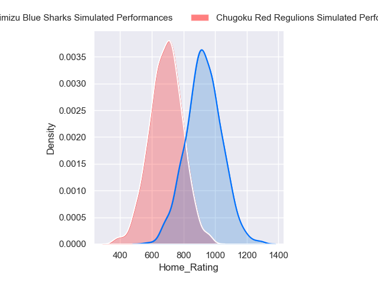
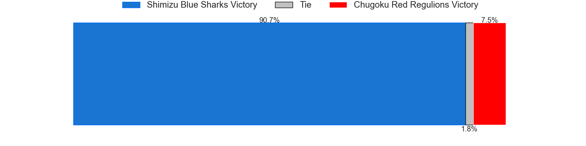
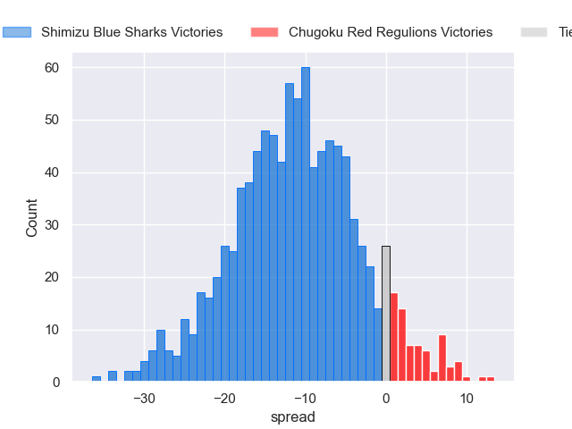

### Kurita Water Gush V Hino Red Dolphins on 2024/03/09

Average Margin: Hino Red Dolphins by 21.8

Average Scoreline: 44-22

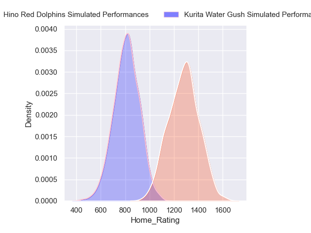
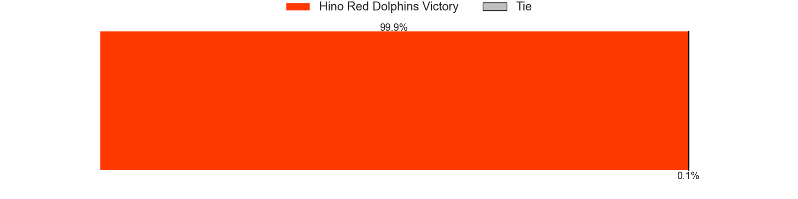
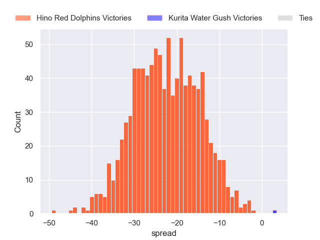

## Week 9

### Skyactivs Hiroshima V Kurita Water Gush on 2024/03/23

Average Margin: Skyactivs Hiroshima by 3.0

Average Scoreline: 27-24

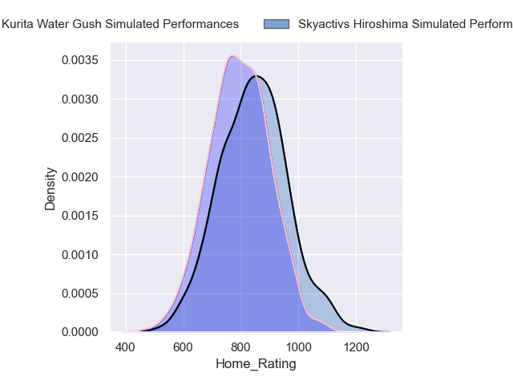
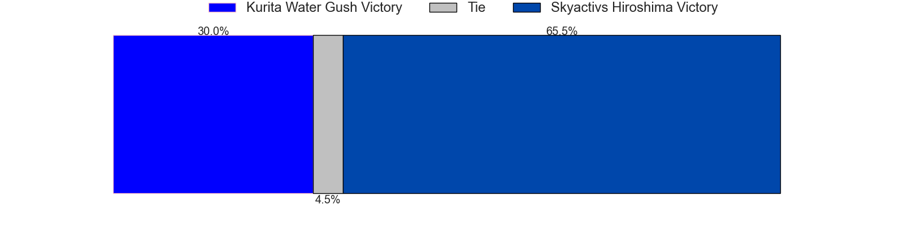
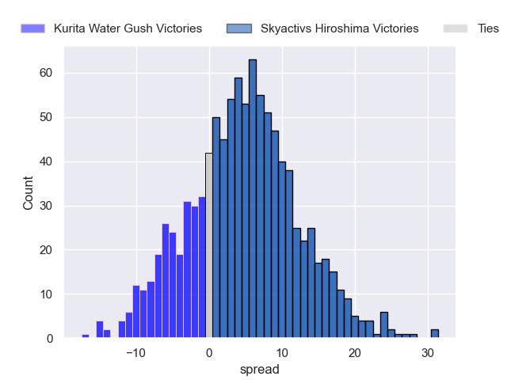

### Hino Red Dolphins V Shimizu Blue Sharks on 2024/03/24

Average Margin: Hino Red Dolphins by 19.4

Average Scoreline: 35-16

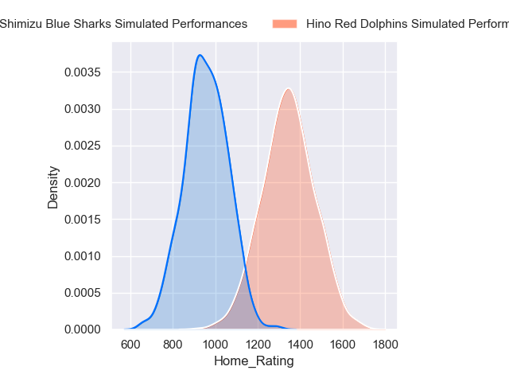

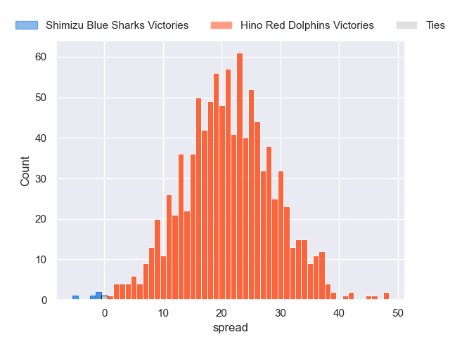

## Week 10

### Shimizu Blue Sharks V Skyactivs Hiroshima on 2024/03/31

Average Margin: Shimizu Blue Sharks by 13.8

Average Scoreline: 31-17

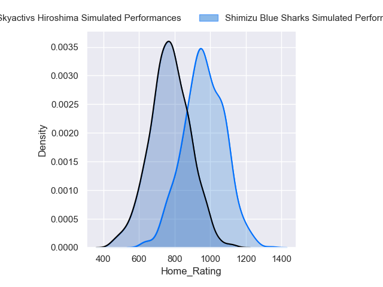
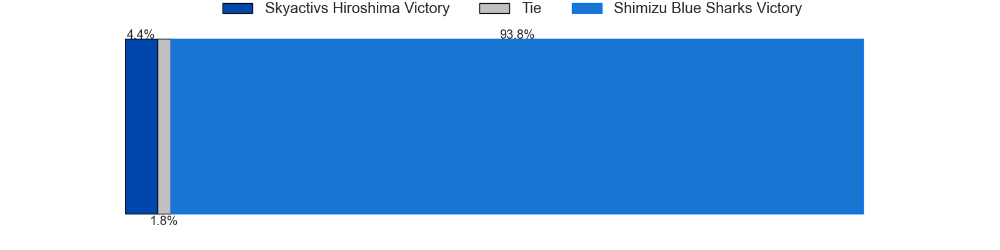
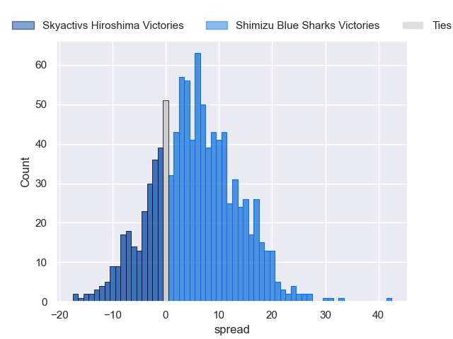

### Chugoku Red Regulions V Hino Red Dolphins on 2024/03/31

Average Margin: Hino Red Dolphins by 29.2

Average Scoreline: 45-15

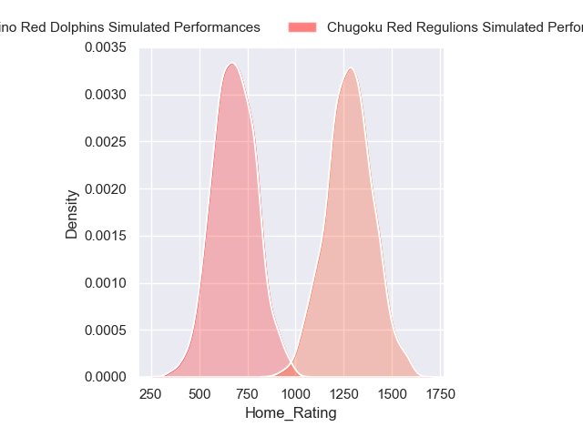

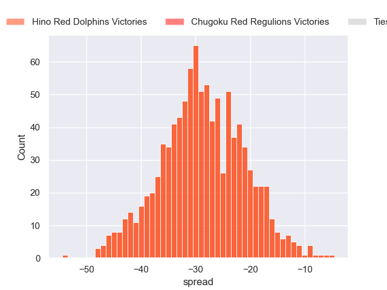

## Week 11

### Skyactivs Hiroshima V Chugoku Red Regulions on 2024/04/06

Average Margin: Skyactivs Hiroshima by 10.4

Average Scoreline: 30-20

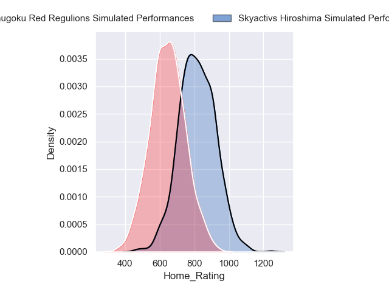
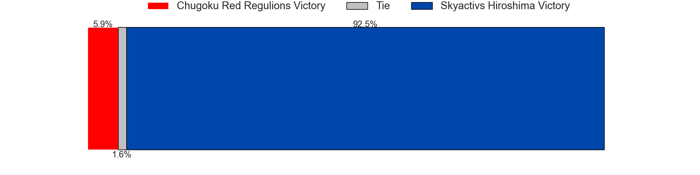
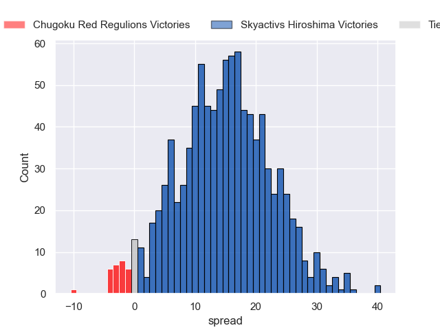

### Kurita Water Gush V Shimizu Blue Sharks on 2024/04/06

Average Margin: Shimizu Blue Sharks by 6.1

Average Scoreline: 31-25

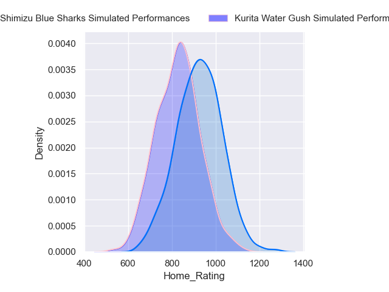
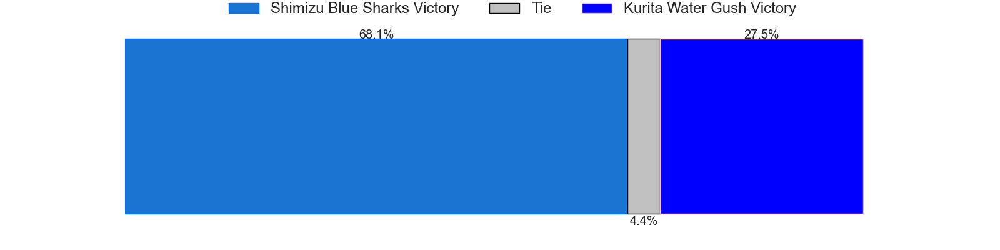
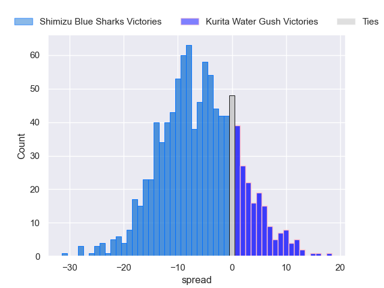

## Week 12

### Kurita Water Gush V Hino Red Dolphins on 2024/04/20

Average Margin: Hino Red Dolphins by 21.8

Average Scoreline: 43-21

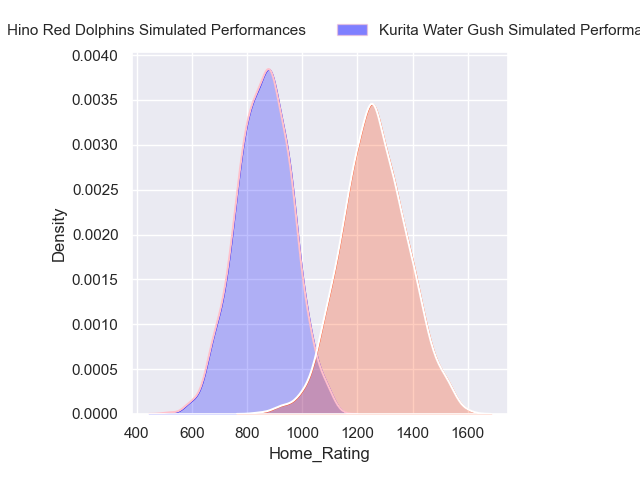
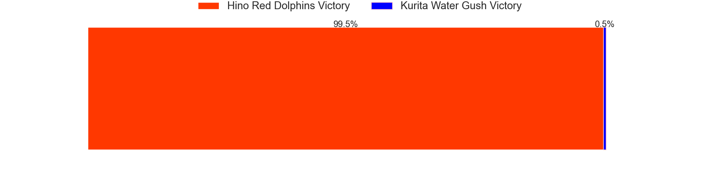
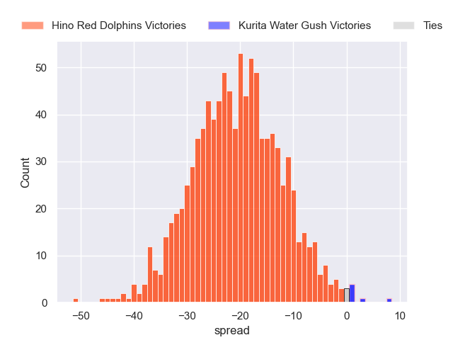

### Shimizu Blue Sharks V Chugoku Red Regulions on 2024/04/20

Average Margin: Shimizu Blue Sharks by 19.8

Average Scoreline: 36-16

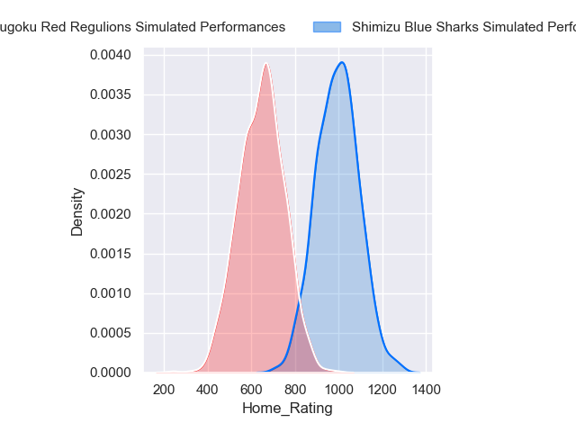
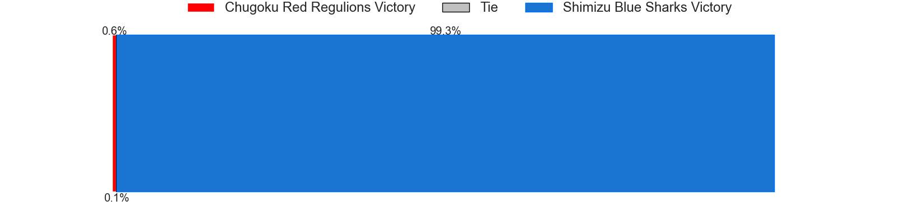
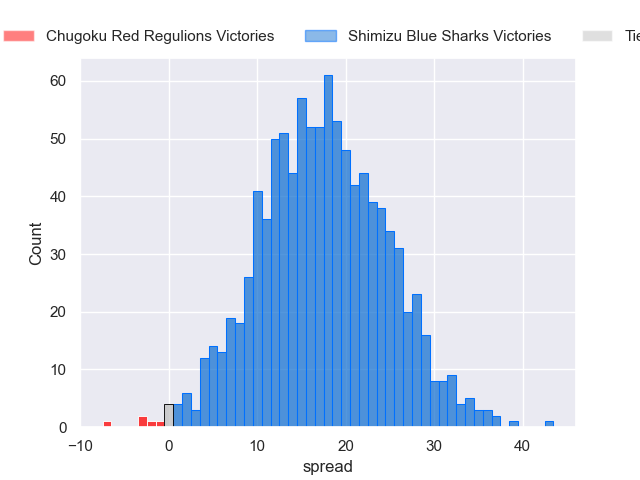

## Week 13

### Chugoku Red Regulions V Kurita Water Gush on 2024/04/27

Average Margin: Kurita Water Gush by 3.5

Average Scoreline: 32-29

### Skyactivs Hiroshima V Hino Red Dolphins on 2024/04/27

Average Margin: Hino Red Dolphins by 22.3

Average Scoreline: 44-22

## Week 14

### Kurita Water Gush V Skyactivs Hiroshima on 2024/05/04

Average Margin: Kurita Water Gush by 4.8

Average Scoreline: 30-25

### Hino Red Dolphins V Shimizu Blue Sharks on 2024/05/04

Average Margin: Hino Red Dolphins by 18.9

Average Scoreline: 35-16

