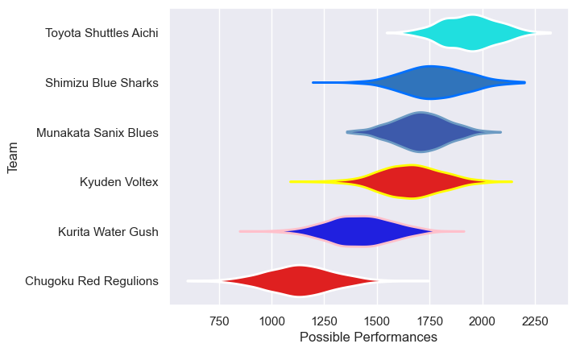

---  
title: "Japan Rugby League One D3 21/22"  
date: 2025-07-29 6:00:00 -0500  
categories: model review projection  
layout: article  
aside:  
    toc: true  
---
# Current Team Rankings

# Standings

## Current Standings

| Club                  |   Played |   Wins |   Point Differential |   Losing Bonus Points | Try Bonus Points   |   Competition Points |
|:----------------------|---------:|-------:|---------------------:|----------------------:|:-------------------|---------------------:|
| Munakata Sanix Blues  |        8 |      7 |                   82 |                     1 |                    |                   29 |
| Toyota Shuttles Aichi |        7 |      7 |                  228 |                     0 |                    |                   28 |
| Shimizu Blue Sharks   |        9 |      5 |                   48 |                     3 |                    |                   23 |
| Kyuden Voltex         |        7 |      2 |                  -16 |                     4 |                    |                   12 |
| Kurita Water Gush     |        6 |      1 |                  -85 |                     1 |                    |                    5 |
| Chugoku Red Regulions |        9 |      1 |                 -257 |                     1 |                    |                    5 |

# Completed Match Review

| Model | Percent Correct Predictions | Spread Error |
| ------ | ------ | ------ |
| Club Level | 82.6% | 15.7 |
| Player Level: Lineup | nan% | nan |
| Player Level: Minutes | nan% | nan |

