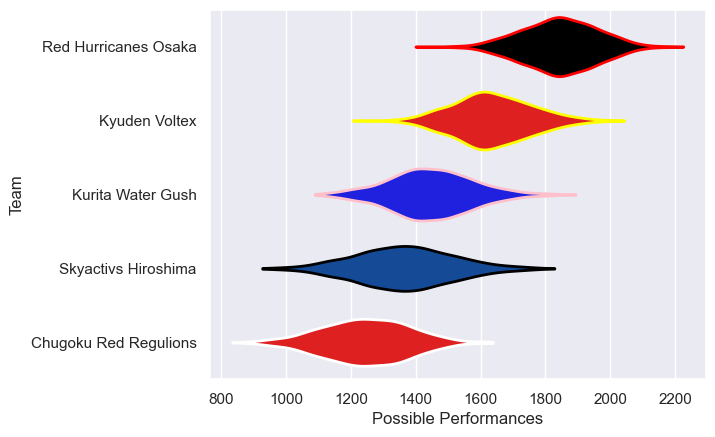

---  
title: "Japan Rugby League One D3 22/23 Status"  
date: 2025-07-28 6:00:00 -0500  
categories: model review projection  
layout: article  
aside:  
    toc: true  
---
# Current Team Rankings

# Standings

## Current Standings

| Club                  |   Played |   Wins |   Point Differential |   Losing Bonus Points |   Try Bonus Points |   Competition Points |
|:----------------------|---------:|-------:|---------------------:|----------------------:|-------------------:|---------------------:|
| Red Hurricanes Osaka  |       12 |     11 |                  252 |                     1 |                 10 |                   55 |
| Kyuden Voltex         |       12 |      9 |                  176 |                     2 |                  9 |                   47 |
| Kurita Water Gush     |       12 |      5 |                   -8 |                     2 |                  7 |                   29 |
| Skyactivs Hiroshima   |       12 |      3 |                 -197 |                     1 |                  4 |                   17 |
| Chugoku Red Regulions |       12 |      2 |                 -223 |                     1 |                  3 |                   12 |

# Completed Match Review

| Model | Percent Correct Predictions | Spread Error |
| ------ | ------ | ------ |
| Club Level | 90.0% | 13.9 |
| Player Level: Lineup | nan% | nan |
| Player Level: Minutes | nan% | nan |

