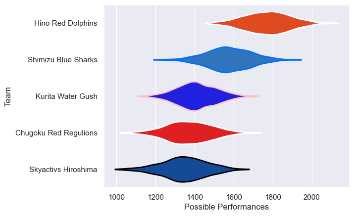

---  
title: "Japan Rugby League One D3 23/24"  
date: 2025-07-29 6:00:00 -0500  
categories: model review projection  
layout: article  
aside:  
    toc: true  
---
# Current Team Rankings

# Standings

## Current Standings

| Club                  |   Played |   Wins |   Point Differential |   Losing Bonus Points |   Try Bonus Points |   Competition Points |
|:----------------------|---------:|-------:|---------------------:|----------------------:|-------------------:|---------------------:|
| Hino Red Dolphins     |       11 |      9 |                  226 |                     0 |                 11 |                   49 |
| Shimizu Blue Sharks   |       12 |      9 |                  116 |                     1 |                  8 |                   45 |
| Kurita Water Gush     |       12 |      5 |                  -83 |                     0 |                  7 |                   27 |
| Skyactivs Hiroshima   |       12 |      4 |                 -150 |                     2 |                  7 |                   25 |
| Chugoku Red Regulions |       11 |      1 |                 -109 |                     3 |                  3 |                   12 |

# Completed Match Review

| Model | Percent Correct Predictions | Spread Error |
| ------ | ------ | ------ |
| Club Level | 75.9% | 13.0 |
| Player Level: Lineup | nan% | nan |
| Player Level: Minutes | nan% | nan |

