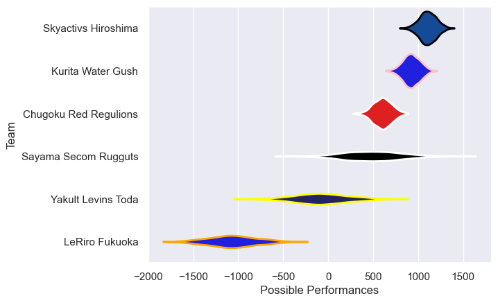

---  
title: "Japan Rugby League One D3 24/25 Status"  
date: 2025-07-28 6:00:00 -0500  
categories: model review projection  
layout: article  
aside:  
    toc: true  
---
# Current Team Rankings

# Standings

## Current Standings

| Club                  |   Played |   Wins |   Point Differential |   Losing Bonus Points |   Try Bonus Points |   Competition Points |
|:----------------------|---------:|-------:|---------------------:|----------------------:|-------------------:|---------------------:|
| Skyactivs Hiroshima   |       15 |     12 |                  362 |                     3 |                 10 |                   61 |
| Sayama Secom Rugguts  |       15 |     11 |                  276 |                     3 |                 10 |                   57 |
| Kurita Water Gush     |       15 |      9 |                  127 |                     2 |                  8 |                   46 |
| Yakult Levins Toda    |       15 |      5 |                 -239 |                     2 |                  4 |                   26 |
| Chugoku Red Regulions |       15 |      5 |                 -185 |                     1 |                  4 |                   25 |
| LeRiro Fukuoka        |       15 |      3 |                 -341 |                     1 |                  5 |                   18 |

# Completed Match Review

| Model | Percent Correct Predictions | Spread Error |
| ------ | ------ | ------ |
| Club Level | 62.2% | 30.9 |
| Player Level: Lineup | nan% | nan |
| Player Level: Minutes | nan% | nan |

