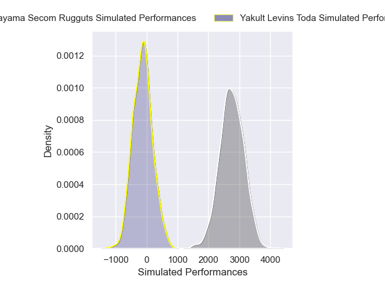
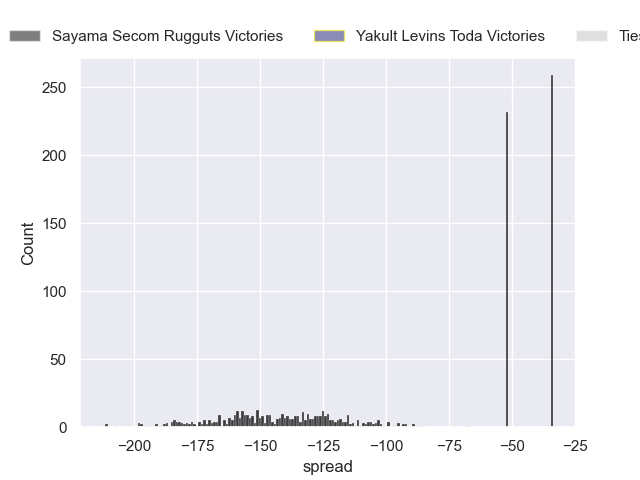

---  
title: "Japan Rugby League One D3 24/25 Status"  
date: 2025-01-30 6:00:00 -0500  
categories: model review projection  
layout: article  
aside:  
    toc: true  
---
# Current Team Rankings

# Standings

## Current Standings

| Club                  |   Played |   Wins |   Point Differential |   Losing Bonus Points |   Try Bonus Points |   Competition Points |
|:----------------------|---------:|-------:|---------------------:|----------------------:|-------------------:|---------------------:|
| Skyactivs Hiroshima   |        6 |      6 |                  237 |                     0 |                nan |                   29 |
| Sayama Secom Rugguts  |        4 |      3 |                   92 |                     1 |                  2 |                   15 |
| Yakult Levins Toda    |        4 |      2 |                  -17 |                     1 |                  2 |                   11 |
| Chugoku Red Regulions |        4 |      2 |                  -46 |                     0 |                  2 |                   10 |
| Kurita Water Gush     |        4 |      1 |                  -28 |                     0 |                  1 |                    5 |
| LeRiro Fukuoka        |        5 |      0 |                 -177 |                     0 |                  1 |                    1 |
| LeRIRO Fukuoka        |        1 |      0 |                  -61 |                     0 |                nan |                    0 |

## Projected Remaining Table

| Club                  |   Matches Remaining |   Wins |   Point Differential |   Losing Bonus Points |   Try Bonus Points |   Competition Points |
|:----------------------|--------------------:|-------:|---------------------:|----------------------:|-------------------:|---------------------:|
| Sayama Secom Rugguts  |                  11 |   10   |              775.917 |                   0.1 |                2.7 |                 43   |
| Skyactivs Hiroshima   |                  10 |    7.8 |              219.368 |                   0.4 |                7.8 |                 39.3 |
| Kurita Water Gush     |                  11 |    6.8 |              117.753 |                   1.2 |                7.2 |                 35.4 |
| Chugoku Red Regulions |                  11 |    4.6 |               19.107 |                   1.1 |                6.5 |                 26.1 |
| Yakult Levins Toda    |                  11 |    2.4 |             -397.08  |                   0.6 |                4.1 |                 14.4 |
| LeRiro Fukuoka        |                  10 |    0.4 |             -735.065 |                   0.8 |                2.9 |                  5.2 |

## Projected Total Table

| Club                  |   Total Matches |   Wins |   Point Differential |   Losing Bonus Points |   Try Bonus Points |   Competition Points |
|:----------------------|----------------:|-------:|---------------------:|----------------------:|-------------------:|---------------------:|
| Skyactivs Hiroshima   |              16 |   13.8 |             456.368  |                   0.4 |                7.8 |                 68.3 |
| Sayama Secom Rugguts  |              15 |   13   |             867.917  |                   1.1 |                4.7 |                 58   |
| Kurita Water Gush     |              15 |    7.8 |              89.7525 |                   1.2 |                8.2 |                 40.4 |
| Chugoku Red Regulions |              15 |    6.6 |             -26.893  |                   1.1 |                8.5 |                 36.1 |
| Yakult Levins Toda    |              15 |    4.4 |            -414.08   |                   1.6 |                6.1 |                 25.4 |
| LeRiro Fukuoka        |              15 |    0.4 |            -912.065  |                   0.8 |                3.9 |                  6.2 |
| LeRIRO Fukuoka        |               1 |    0   |             -61      |                   0   |                0   |                  0   |

# Completed Match Review

| Model | Percent Correct Predictions | Spread Error |
| ------ | ------ | ------ |
| Club Level | 21.4% | 56.6 |
| Player Level: Lineup | 50.0% | 31.8 |
| Player Level: Minutes | 60.0% | 29.2 |

# Future Predictions

## Week 7

### Kurita Water Gush V Chugoku Red Regulions on 2025/02/01

Average Margin: Kurita Water Gush by 11.6

Average Scoreline: 43-31

### Yakult Levins Toda V Sayama Secom Rugguts on 2025/02/02

Average Margin: Sayama Secom Rugguts by 93.8

Average Scoreline: 83--11

## Week 8

### Yakult Levins Toda V LeRiro Fukuoka on 2025/02/15

Average Margin: Yakult Levins Toda by 44.6

Average Scoreline: 47-2

### Sayama Secom Rugguts V Kurita Water Gush on 2025/02/15

Average Margin: Sayama Secom Rugguts by 64.0

Average Scoreline: 52--12

### Skyactivs Hiroshima V Chugoku Red Regulions on 2025/02/15

Average Margin: Skyactivs Hiroshima by 23.9

Average Scoreline: 42-18

## Week 9

### LeRiro Fukuoka V Sayama Secom Rugguts on 2025/02/22

Average Margin: Sayama Secom Rugguts by 120.2

Average Scoreline: 99--21

### Kurita Water Gush V Skyactivs Hiroshima on 2025/02/22

Average Margin: Skyactivs Hiroshima by 9.5

Average Scoreline: 27-18

### Chugoku Red Regulions V Yakult Levins Toda on 2025/02/22

Average Margin: Chugoku Red Regulions by 40.4

Average Scoreline: 55-15

## Week 10

### Skyactivs Hiroshima V Sayama Secom Rugguts on 2025/03/01

Average Margin: Sayama Secom Rugguts by 45.4

Average Scoreline: 64-19

### Yakult Levins Toda V Kurita Water Gush on 2025/03/01

Average Margin: Kurita Water Gush by 39.7

Average Scoreline: 51-11

### Chugoku Red Regulions V LeRiro Fukuoka on 2025/03/02

Average Margin: Chugoku Red Regulions by 66.0

Average Scoreline: 61--5

## Week 11

### Yakult Levins Toda V Skyactivs Hiroshima on 2025/03/08

Average Margin: Skyactivs Hiroshima by 46.0

Average Scoreline: 53-7

### Sayama Secom Rugguts V Chugoku Red Regulions on 2025/03/08

Average Margin: Sayama Secom Rugguts by 63.0

Average Scoreline: 58--5

## Week 12

### LeRiro Fukuoka V Kurita Water Gush on 2025/03/16

Average Margin: Kurita Water Gush by 66.1

Average Scoreline: 65--1

## Week 13

### Sayama Secom Rugguts V Yakult Levins Toda on 2025/03/22

Average Margin: Sayama Secom Rugguts by 93.2

Average Scoreline: 71--23

### Kurita Water Gush V Chugoku Red Regulions on 2025/03/22

Average Margin: Kurita Water Gush by 12.3

Average Scoreline: 42-29

### Skyactivs Hiroshima V LeRiro Fukuoka on 2025/03/22

Average Margin: Skyactivs Hiroshima by 76.7

Average Scoreline: 67--10

## Week 14

### Chugoku Red Regulions V Yakult Levins Toda on 2025/03/29

Average Margin: Chugoku Red Regulions by 39.7

Average Scoreline: 54-14

### Sayama Secom Rugguts V LeRiro Fukuoka on 2025/03/29

Average Margin: Sayama Secom Rugguts by 121.9

Average Scoreline: 82--40

### Kurita Water Gush V Skyactivs Hiroshima on 2025/03/29

Average Margin: Skyactivs Hiroshima by 9.3

Average Scoreline: 29-19

## Week 15

### Skyactivs Hiroshima V Sayama Secom Rugguts on 2025/04/13

Average Margin: Sayama Secom Rugguts by 30.7

Average Scoreline: 56-25

### LeRiro Fukuoka V Chugoku Red Regulions on 2025/04/13

Average Margin: Chugoku Red Regulions by 58.3

Average Scoreline: 62-3

### Yakult Levins Toda V Kurita Water Gush on 2025/04/13

Average Margin: Kurita Water Gush by 26.8

Average Scoreline: 44-17

## Week 16

### Skyactivs Hiroshima V Yakult Levins Toda on 2025/04/19

Average Margin: Skyactivs Hiroshima by 37.7

Average Scoreline: 50-12

### Kurita Water Gush V LeRiro Fukuoka on 2025/04/19

Average Margin: Kurita Water Gush by 66.8

Average Scoreline: 62--5

### Chugoku Red Regulions V Sayama Secom Rugguts on 2025/04/19

Average Margin: Sayama Secom Rugguts by 45.6

Average Scoreline: 61-15

## Week 17

### LeRiro Fukuoka V Skyactivs Hiroshima on 2025/04/27

Average Margin: Skyactivs Hiroshima by 68.4

Average Scoreline: 67--1

### Chugoku Red Regulions V Kurita Water Gush on 2025/04/27

Average Margin: Kurita Water Gush by 5.0

Average Scoreline: 25-20

### Sayama Secom Rugguts V Yakult Levins Toda on 2025/04/27

Average Margin: Sayama Secom Rugguts by 70.5

Average Scoreline: 61--10

## Week 18

### Yakult Levins Toda V LeRiro Fukuoka on 2025/05/10

Average Margin: Yakult Levins Toda by 46.1

Average Scoreline: 49-3

### Kurita Water Gush V Sayama Secom Rugguts on 2025/05/10

Average Margin: Sayama Secom Rugguts by 27.7

Average Scoreline: 47-19

### Skyactivs Hiroshima V Chugoku Red Regulions on 2025/05/10

Average Margin: Skyactivs Hiroshima by 23.9

Average Scoreline: 44-20

