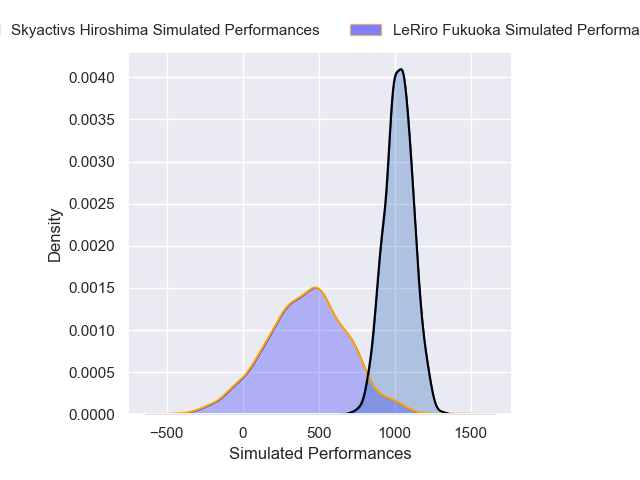
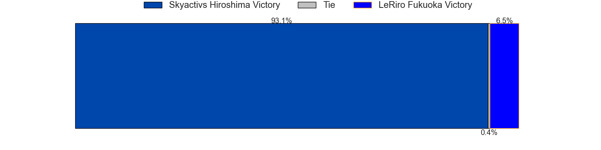
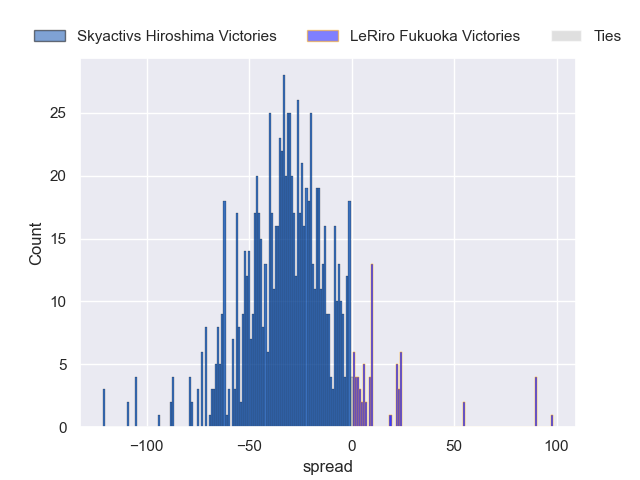

---  
title: "Japan Rugby League One D3 24/25 Status"  
date: 2025-04-28 6:00:00 -0500  
categories: model review projection  
layout: article  
aside:  
    toc: true  
---
# Current Team Rankings

# Standings

## Current Standings

| Club                  |   Played |   Wins |   Point Differential |   Losing Bonus Points |   Try Bonus Points |   Competition Points |
|:----------------------|---------:|-------:|---------------------:|----------------------:|-------------------:|---------------------:|
| Skyactivs Hiroshima   |       17 |     13 |                  425 |                     4 |                nan |                   66 |
| Kurita Water Gush     |       17 |     12 |                  188 |                     1 |                nan |                   56 |
| Sayama Secom Rugguts  |       14 |     10 |                  271 |                     3 |                nan |                   51 |
| Chugoku Red Regulions |       16 |      6 |                 -163 |                     1 |                nan |                   28 |
| Yakult Levins Toda    |       17 |      5 |                 -324 |                     2 |                nan |                   25 |
| LeRiro Fukuoka        |       15 |      2 |                 -398 |                     1 |                nan |                   14 |
| Sayama Rugguts        |        5 |      3 |                   62 |                     1 |                nan |                   13 |
| LeRIRO Fukuoka        |        1 |      0 |                  -61 |                     0 |                nan |                    0 |

## Projected Remaining Table

| Club                  |   Matches Remaining |   Wins |   Point Differential |   Losing Bonus Points |   Try Bonus Points |   Competition Points |
|:----------------------|--------------------:|-------:|---------------------:|----------------------:|-------------------:|---------------------:|
| Skyactivs Hiroshima   |                   2 |    1.9 |             61.7341  |                   0   |                1.9 |                  9.4 |
| Yakult Levins Toda    |                   1 |    0.8 |             15.0443  |                   0.1 |                0.5 |                  3.9 |
| Sayama Secom Rugguts  |                   1 |    0.6 |              3.69722 |                   0.2 |                0.5 |                  3.2 |
| Kurita Water Gush     |                   1 |    0.4 |             -3.69722 |                   0.2 |                0.4 |                  2.2 |
| LeRiro Fukuoka        |                   2 |    0.2 |            -45.2564  |                   0.2 |                0.6 |                  1.8 |
| Chugoku Red Regulions |                   1 |    0.1 |            -31.522   |                   0   |                0.2 |                  0.5 |

## Projected Total Table

| Club                  |   Total Matches |   Wins |   Point Differential |   Losing Bonus Points |   Try Bonus Points |   Competition Points |
|:----------------------|----------------:|-------:|---------------------:|----------------------:|-------------------:|---------------------:|
| Skyactivs Hiroshima   |              19 |   14.9 |              486.734 |                   4   |                1.9 |                 75.4 |
| Kurita Water Gush     |              18 |   12.4 |              184.303 |                   1.2 |                0.4 |                 58.2 |
| Sayama Secom Rugguts  |              15 |   10.6 |              274.697 |                   3.2 |                0.5 |                 54.2 |
| Yakult Levins Toda    |              18 |    5.8 |             -308.956 |                   2.1 |                0.5 |                 28.9 |
| Chugoku Red Regulions |              17 |    6.1 |             -194.522 |                   1   |                0.2 |                 28.5 |
| LeRiro Fukuoka        |              17 |    2.2 |             -443.256 |                   1.2 |                0.6 |                 15.8 |
| Sayama Rugguts        |               5 |    3   |               62     |                   1   |                0   |                 13   |
| LeRIRO Fukuoka        |               1 |    0   |              -61     |                   0   |                0   |                  0   |

# Completed Match Review

| Model | Percent Correct Predictions | Spread Error |
| ------ | ------ | ------ |
| Club Level | 49.0% | 49.6 |
| Player Level: Lineup | 60.9% | 25.3 |
| Player Level: Minutes | 69.6% | 24.4 |

# Future Predictions

## Week 18

### LeRiro Fukuoka V Skyactivs Hiroshima on 2025/05/04

Average Margin: Skyactivs Hiroshima by 30.2

Average Scoreline: 54-24

## Week 19

### Yakult Levins Toda V LeRiro Fukuoka on 2025/05/10

Average Margin: Yakult Levins Toda by 15.0

Average Scoreline: 35-20

### Kurita Water Gush V Sayama Secom Rugguts on 2025/05/10

Average Margin: Sayama Secom Rugguts by 3.7

Average Scoreline: 34-31

### Skyactivs Hiroshima V Chugoku Red Regulions on 2025/05/10

Average Margin: Skyactivs Hiroshima by 31.5

Average Scoreline: 41-9

