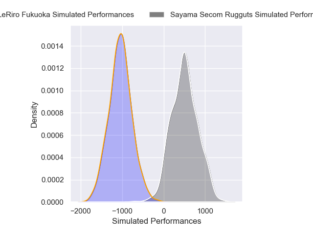
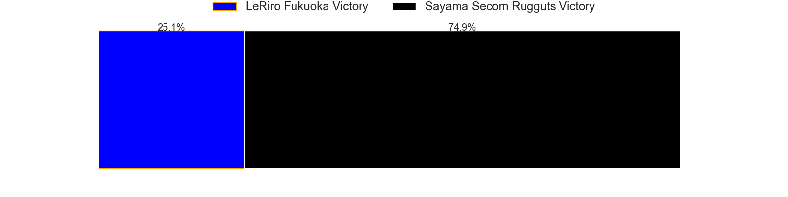
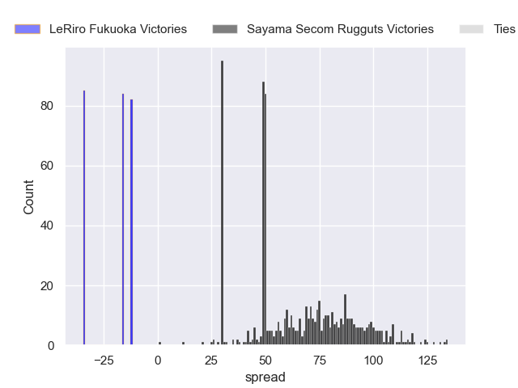
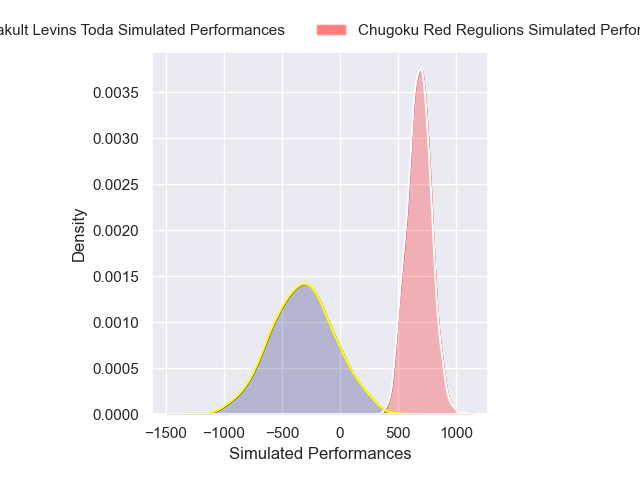
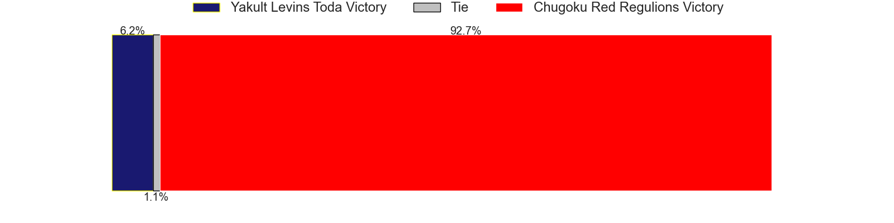
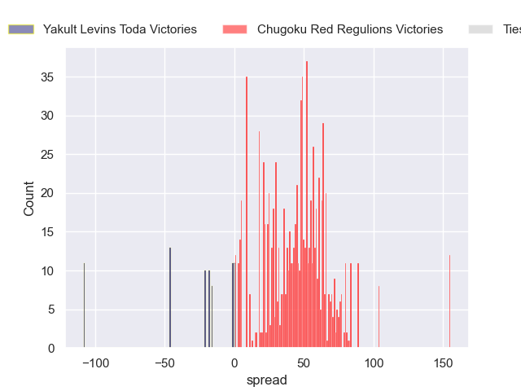

---  
title: "Japan Rugby League One D3 24/25 Status"  
date: 2025-03-31 6:00:00 -0500  
categories: model review projection  
layout: article  
aside:  
    toc: true  
---
# Current Team Rankings

# Standings

## Current Standings

| Club                  |   Played |   Wins |   Point Differential |   Losing Bonus Points |   Try Bonus Points |   Competition Points |
|:----------------------|---------:|-------:|---------------------:|----------------------:|-------------------:|---------------------:|
| Skyactivs Hiroshima   |       13 |     11 |                  359 |                     2 |                nan |                   52 |
| Kurita Water Gush     |       12 |      8 |                   92 |                     1 |                nan |                   36 |
| Sayama Secom Rugguts  |       10 |      7 |                  184 |                     2 |                nan |                   35 |
| Chugoku Red Regulions |       11 |      5 |                 -103 |                     0 |                nan |                   22 |
| Yakult Levins Toda    |       11 |      3 |                 -165 |                     2 |                nan |                   17 |
| Sayama Rugguts        |        5 |      3 |                   62 |                     1 |                nan |                   13 |
| LeRiro Fukuoka        |       11 |      0 |                 -368 |                     1 |                nan |                    3 |
| LeRIRO Fukuoka        |        1 |      0 |                  -61 |                     0 |                nan |                    0 |

## Projected Remaining Table

| Club                  |   Matches Remaining |   Wins |   Point Differential |   Losing Bonus Points |   Try Bonus Points |   Competition Points |
|:----------------------|--------------------:|-------:|---------------------:|----------------------:|-------------------:|---------------------:|
| Skyactivs Hiroshima   |                   4 |    3.7 |            165.135   |                   0.1 |                3.6 |                 18.5 |
| Kurita Water Gush     |                   4 |    3.7 |            150.297   |                   0.1 |                3.5 |                 18.4 |
| Chugoku Red Regulions |                   5 |    2.6 |             57.8789  |                   0.3 |                2.9 |                 13.8 |
| Sayama Secom Rugguts  |                   5 |    2.1 |              9.40961 |                   0.3 |                1.7 |                 10.3 |
| Yakult Levins Toda    |                   5 |    1.2 |           -132.926   |                   0.4 |                1.8 |                  7   |
| LeRiro Fukuoka        |                   5 |    0.7 |           -249.794   |                   0.4 |                1.3 |                  4.4 |

## Projected Total Table

| Club                  |   Total Matches |   Wins |   Point Differential |   Losing Bonus Points |   Try Bonus Points |   Competition Points |
|:----------------------|----------------:|-------:|---------------------:|----------------------:|-------------------:|---------------------:|
| Skyactivs Hiroshima   |              17 |   14.7 |             524.135  |                   2.1 |                3.6 |                 70.5 |
| Kurita Water Gush     |              16 |   11.7 |             242.297  |                   1.1 |                3.5 |                 54.4 |
| Sayama Secom Rugguts  |              15 |    9.1 |             193.41   |                   2.3 |                1.7 |                 45.3 |
| Chugoku Red Regulions |              16 |    7.6 |             -45.1211 |                   0.3 |                2.9 |                 35.8 |
| Yakult Levins Toda    |              16 |    4.2 |            -297.926  |                   2.4 |                1.8 |                 24   |
| Sayama Rugguts        |               5 |    3   |              62      |                   1   |                0   |                 13   |
| LeRiro Fukuoka        |              16 |    0.7 |            -617.794  |                   1.4 |                1.3 |                  7.4 |
| LeRIRO Fukuoka        |               1 |    0   |             -61      |                   0   |                0   |                  0   |

# Completed Match Review

| Model | Percent Correct Predictions | Spread Error |
| ------ | ------ | ------ |
| Club Level | 48.6% | 53.7 |
| Player Level: Lineup | 60.0% | 23.4 |
| Player Level: Minutes | 70.0% | 22.8 |

# Future Predictions

## Week 14

### Sayama Secom Rugguts V LeRiro Fukuoka on 2025/04/05

Average Margin: Sayama Secom Rugguts by 43.7

Average Scoreline: 62-18

### Chugoku Red Regulions V Yakult Levins Toda on 2025/04/05

Average Margin: Chugoku Red Regulions by 40.1

Average Scoreline: 45-5

## Week 15

### Skyactivs Hiroshima V Sayama Secom Rugguts on 2025/04/13

Average Margin: Skyactivs Hiroshima by 31.3

Average Scoreline: 43-12

### Yakult Levins Toda V Kurita Water Gush on 2025/04/13

Average Margin: Kurita Water Gush by 43.3

Average Scoreline: 52-9

### LeRiro Fukuoka V Chugoku Red Regulions on 2025/04/13

Average Margin: Chugoku Red Regulions by 46.8

Average Scoreline: 51-4

## Week 16

### Skyactivs Hiroshima V Yakult Levins Toda on 2025/04/19

Average Margin: Skyactivs Hiroshima by 40.7

Average Scoreline: 45-5

### Chugoku Red Regulions V Sayama Secom Rugguts on 2025/04/19

Average Margin: Chugoku Red Regulions by 12.5

Average Scoreline: 32-20

### Kurita Water Gush V LeRiro Fukuoka on 2025/04/19

Average Margin: Kurita Water Gush by 65.1

Average Scoreline: 57--9

## Week 17

### Sayama Secom Rugguts V Yakult Levins Toda on 2025/04/27

Average Margin: Sayama Secom Rugguts by 37.3

Average Scoreline: 43-5

### Chugoku Red Regulions V Kurita Water Gush on 2025/04/27

Average Margin: Kurita Water Gush by 14.1

Average Scoreline: 35-21

### LeRiro Fukuoka V Skyactivs Hiroshima on 2025/04/27

Average Margin: Skyactivs Hiroshima by 65.7

Average Scoreline: 62--4

## Week 18

### Yakult Levins Toda V LeRiro Fukuoka on 2025/05/10

Average Margin: Yakult Levins Toda by 28.4

Average Scoreline: 44-16

### Skyactivs Hiroshima V Chugoku Red Regulions on 2025/05/10

Average Margin: Skyactivs Hiroshima by 27.4

Average Scoreline: 43-16

### Kurita Water Gush V Sayama Secom Rugguts on 2025/05/10

Average Margin: Kurita Water Gush by 27.8

Average Scoreline: 39-11

