---  
title: "Japan Rugby League One D3 24/25 Status"  
date: 2025-04-10 6:00:00 -0500  
categories: model review projection  
layout: article  
aside:  
    toc: true  
---
# Current Team Rankings

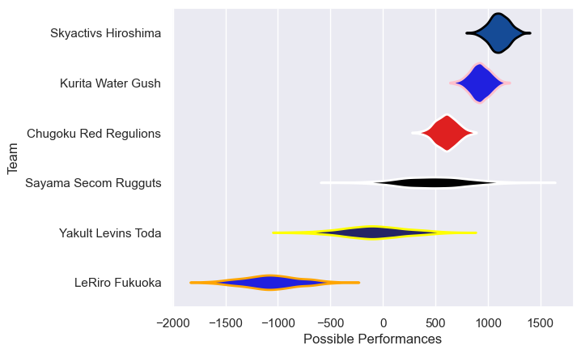
# Standings

## Current Standings

| Club                  |   Played |   Wins |   Point Differential |   Losing Bonus Points |   Try Bonus Points |   Competition Points |
|:----------------------|---------:|-------:|---------------------:|----------------------:|-------------------:|---------------------:|
| Skyactivs Hiroshima   |       13 |     11 |                  359 |                     2 |                nan |                   52 |
| Sayama Secom Rugguts  |       11 |      8 |                  227 |                     2 |                nan |                   39 |
| Kurita Water Gush     |       12 |      8 |                   92 |                     1 |                nan |                   36 |
| Chugoku Red Regulions |       12 |      5 |                 -116 |                     0 |                nan |                   22 |
| Yakult Levins Toda    |       12 |      4 |                 -152 |                     2 |                nan |                   21 |
| Sayama Rugguts        |        5 |      3 |                   62 |                     1 |                nan |                   13 |
| LeRiro Fukuoka        |       12 |      0 |                 -411 |                     1 |                nan |                    3 |
| LeRIRO Fukuoka        |        1 |      0 |                  -61 |                     0 |                nan |                    0 |

## Projected Remaining Table

| Club                  |   Matches Remaining |   Wins |   Point Differential |   Losing Bonus Points |   Try Bonus Points |   Competition Points |
|:----------------------|--------------------:|-------:|---------------------:|----------------------:|-------------------:|---------------------:|
| Skyactivs Hiroshima   |                   4 |    3.8 |            165.561   |                   0.1 |                3.6 |                 18.9 |
| Kurita Water Gush     |                   4 |    3.8 |            135.983   |                   0.1 |                3.4 |                 18.6 |
| Chugoku Red Regulions |                   4 |    1.7 |              8.59312 |                   0.3 |                2.1 |                  9   |
| Yakult Levins Toda    |                   4 |    1.2 |            -39.2722  |                   0.3 |                1.5 |                  6.6 |
| Sayama Secom Rugguts  |                   4 |    1.2 |            -54.4571  |                   0.5 |                0.9 |                  6.1 |
| LeRiro Fukuoka        |                   4 |    0.4 |           -216.408   |                   0.3 |                0.7 |                  2.5 |

## Projected Total Table

| Club                  |   Total Matches |   Wins |   Point Differential |   Losing Bonus Points |   Try Bonus Points |   Competition Points |
|:----------------------|----------------:|-------:|---------------------:|----------------------:|-------------------:|---------------------:|
| Skyactivs Hiroshima   |              17 |   14.8 |              524.561 |                   2.1 |                3.6 |                 70.9 |
| Kurita Water Gush     |              16 |   11.8 |              227.983 |                   1.1 |                3.4 |                 54.6 |
| Sayama Secom Rugguts  |              15 |    9.2 |              172.543 |                   2.5 |                0.9 |                 45.1 |
| Chugoku Red Regulions |              16 |    6.7 |             -107.407 |                   0.3 |                2.1 |                 31   |
| Yakult Levins Toda    |              16 |    5.2 |             -191.272 |                   2.3 |                1.5 |                 27.6 |
| Sayama Rugguts        |               5 |    3   |               62     |                   1   |                0   |                 13   |
| LeRiro Fukuoka        |              16 |    0.4 |             -627.408 |                   1.3 |                0.7 |                  5.5 |
| LeRIRO Fukuoka        |               1 |    0   |              -61     |                   0   |                0   |                  0   |

# Completed Match Review

| Model | Percent Correct Predictions | Spread Error |
| ------ | ------ | ------ |
| Club Level | 48.7% | 53.5 |
| Player Level: Lineup | 60.0% | 23.4 |
| Player Level: Minutes | 70.0% | 22.8 |

# Future Predictions

## Week 14

### Yakult Levins Toda V Kurita Water Gush on 2025/04/13

Average Margin: Kurita Water Gush by 30.6

Average Scoreline: 45-15

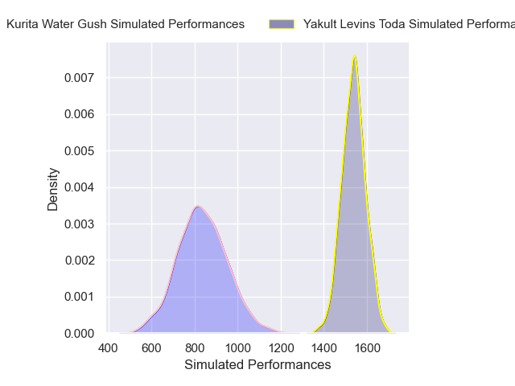
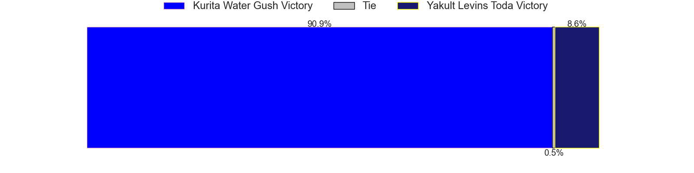
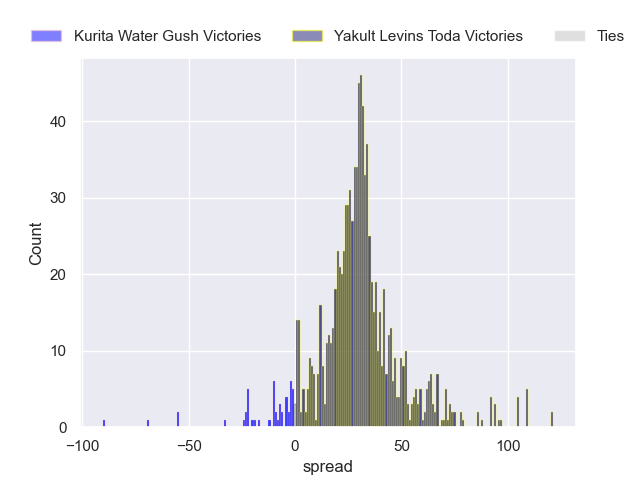

### Skyactivs Hiroshima V Sayama Secom Rugguts on 2025/04/13

Average Margin: Skyactivs Hiroshima by 32.3

Average Scoreline: 37-5

### LeRiro Fukuoka V Chugoku Red Regulions on 2025/04/13

Average Margin: Chugoku Red Regulions by 45.0

Average Scoreline: 52-7

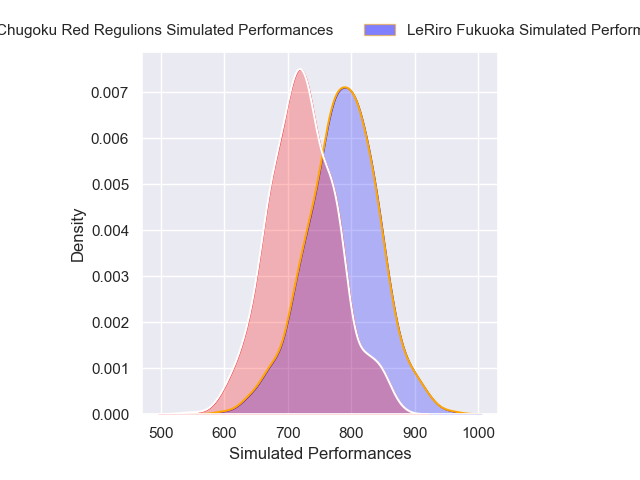
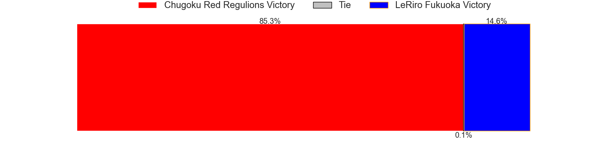
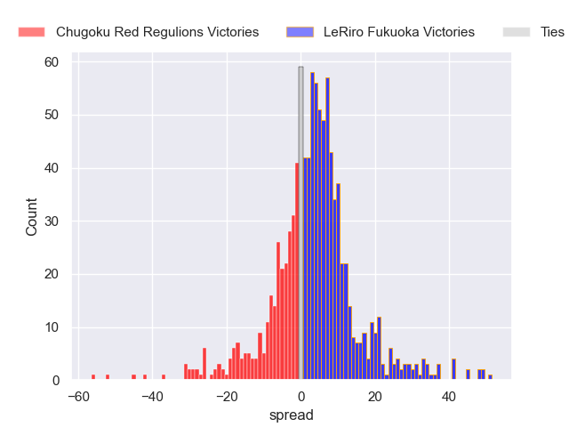

## Week 15

### Chugoku Red Regulions V Sayama Secom Rugguts on 2025/04/19

Average Margin: Chugoku Red Regulions by 9.6

Average Scoreline: 29-19

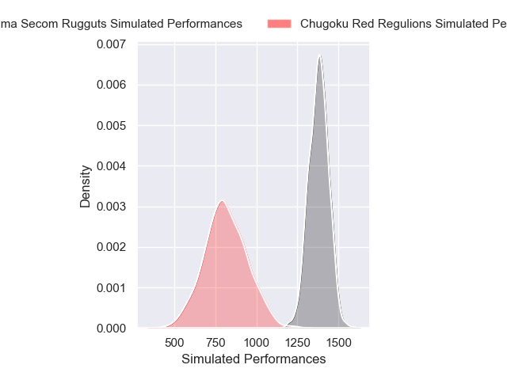
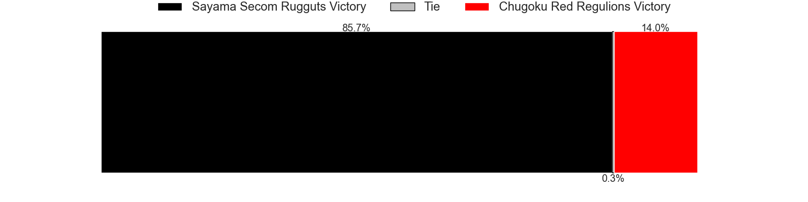
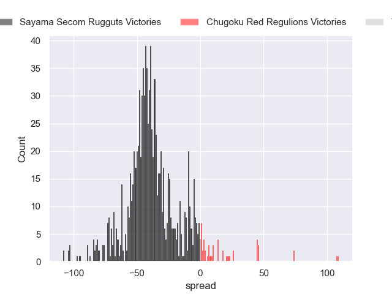

### Skyactivs Hiroshima V Yakult Levins Toda on 2025/04/19

Average Margin: Skyactivs Hiroshima by 38.2

Average Scoreline: 39-0

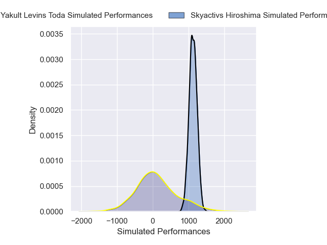
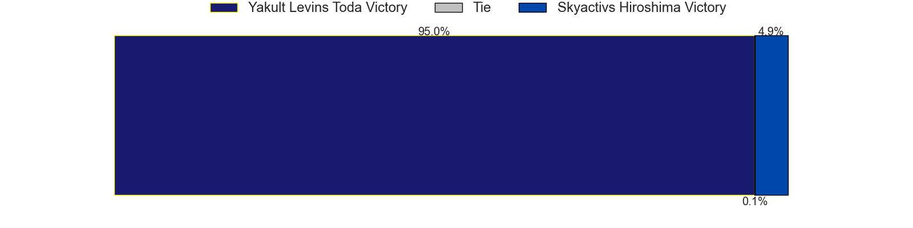
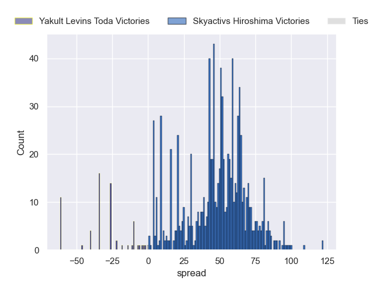

### Kurita Water Gush V LeRiro Fukuoka on 2025/04/19

Average Margin: Kurita Water Gush by 65.1

Average Scoreline: 75-10

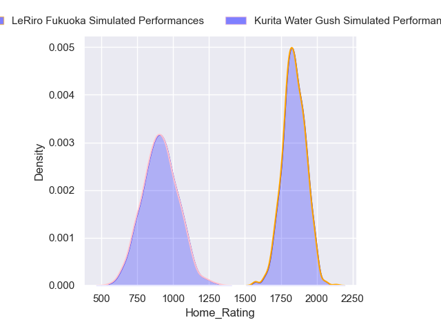
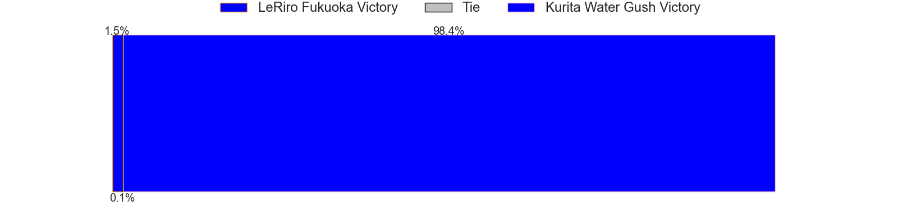
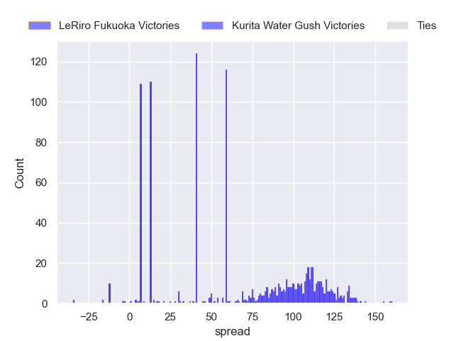

## Week 16

### LeRiro Fukuoka V Skyactivs Hiroshima on 2025/04/27

Average Margin: Skyactivs Hiroshima by 65.4

Average Scoreline: 61--5

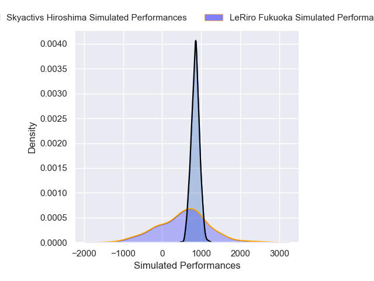
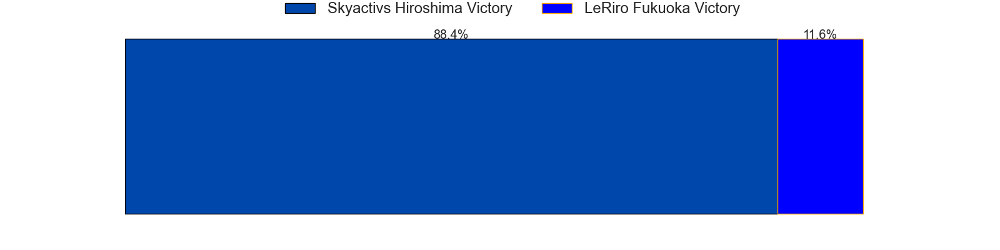
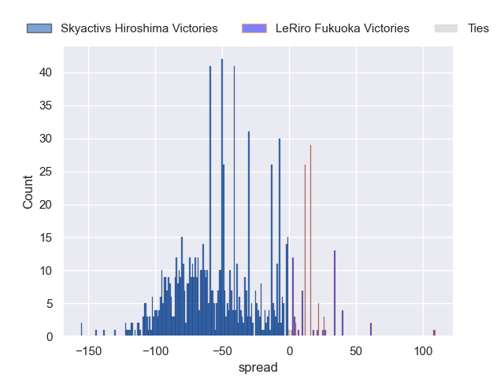

### Chugoku Red Regulions V Kurita Water Gush on 2025/04/27

Average Margin: Kurita Water Gush by 16.3

Average Scoreline: 43-26

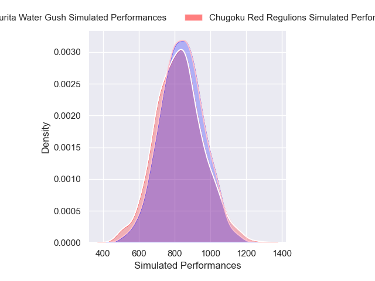
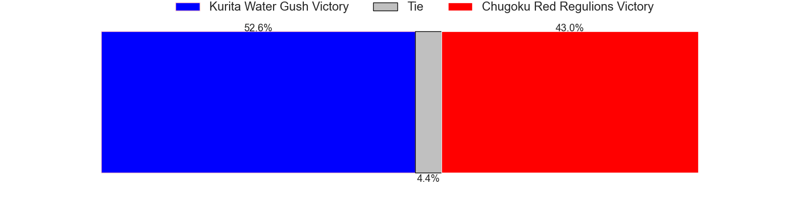
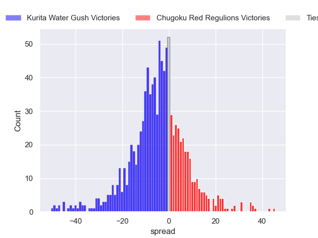

### Sayama Secom Rugguts V Yakult Levins Toda on 2025/04/27

Average Margin: Sayama Secom Rugguts by 11.4

Average Scoreline: 29-17

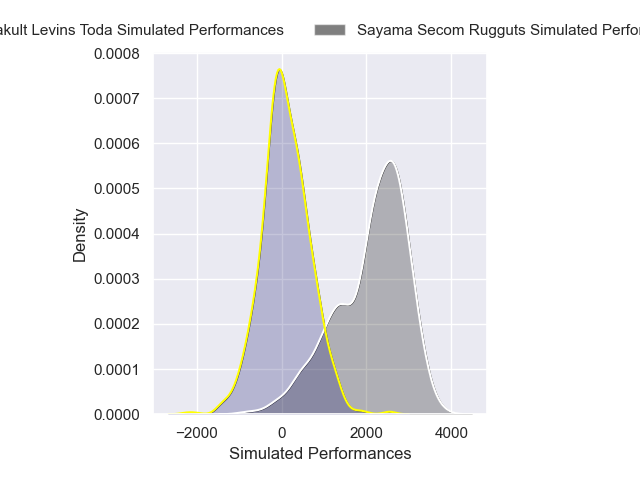
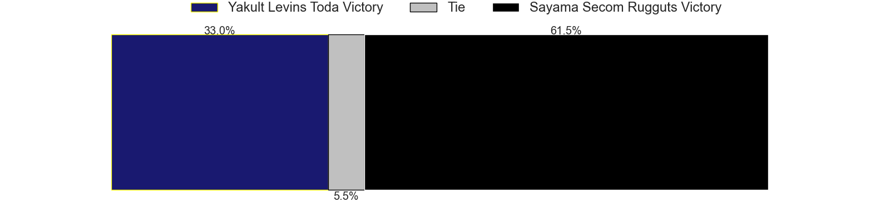
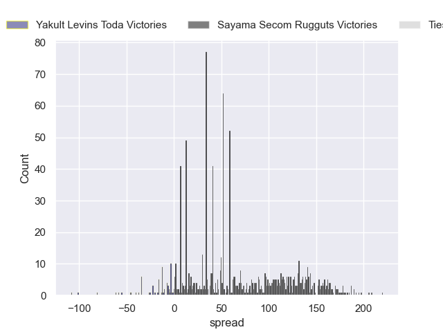

## Week 17

### Yakult Levins Toda V LeRiro Fukuoka on 2025/05/10

Average Margin: Yakult Levins Toda by 40.9

Average Scoreline: 47-6

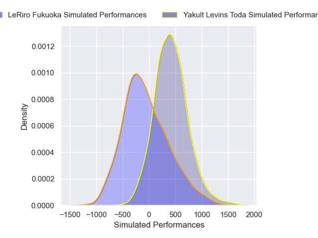
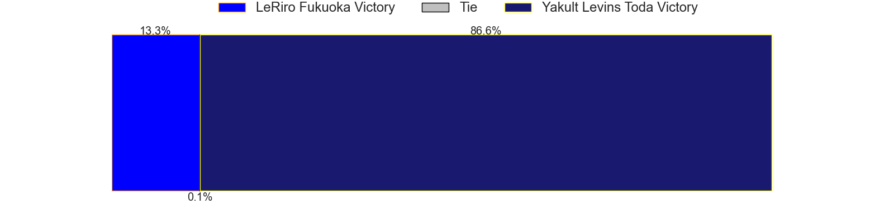
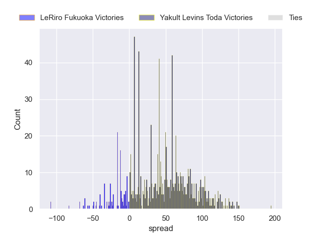

### Skyactivs Hiroshima V Chugoku Red Regulions on 2025/05/10

Average Margin: Skyactivs Hiroshima by 29.6

Average Scoreline: 39-10

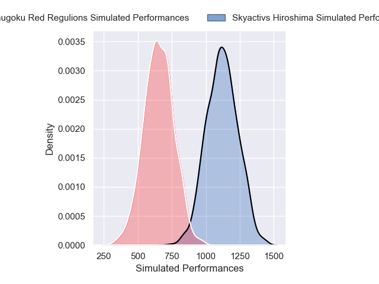
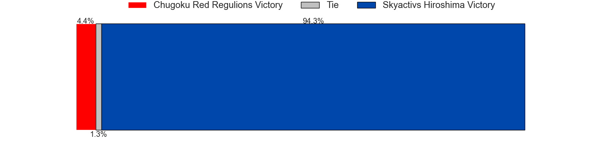
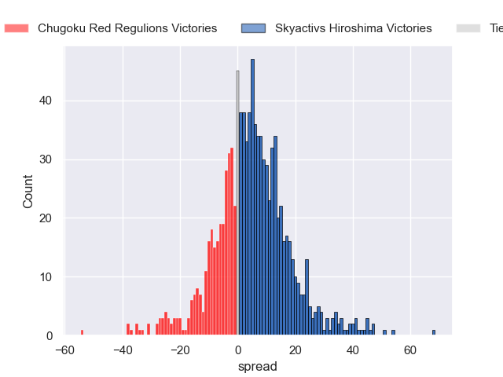

### Kurita Water Gush V Sayama Secom Rugguts on 2025/05/10

Average Margin: Kurita Water Gush by 23.9

Average Scoreline: 37-13

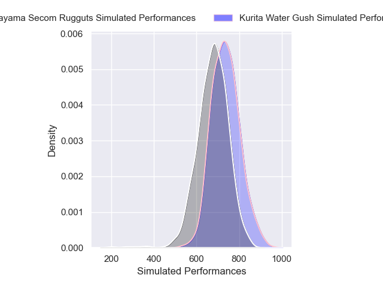

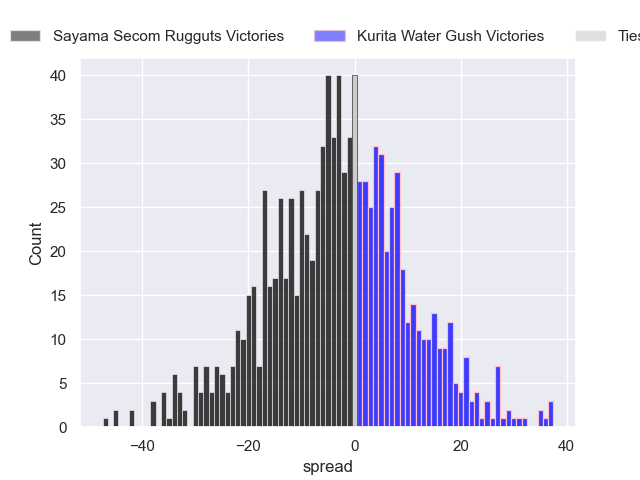

