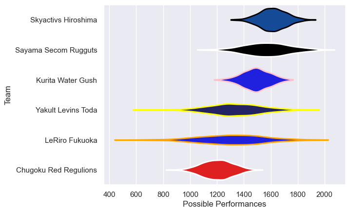

---  
title: "Japan Rugby League One D3 24/25 Status"  
date: 2025-05-09 6:00:00 -0500  
categories: model review projection  
layout: article  
aside:  
    toc: true  
---
# Current Team Rankings

# Standings

## Current Standings

| Club                  |   Played |   Wins |   Point Differential |   Losing Bonus Points |   Try Bonus Points |   Competition Points |
|:----------------------|---------:|-------:|---------------------:|----------------------:|-------------------:|---------------------:|
| Skyactivs Hiroshima   |       18 |     14 |                  448 |                     4 |                nan |                   70 |
| Kurita Water Gush     |       17 |     12 |                  188 |                     1 |                nan |                   57 |
| Sayama Secom Rugguts  |       14 |     10 |                  271 |                     3 |                nan |                   53 |
| Chugoku Red Regulions |       16 |      6 |                 -163 |                     1 |                nan |                   29 |
| Yakult Levins Toda    |       17 |      5 |                 -324 |                     2 |                nan |                   26 |
| LeRiro Fukuoka        |       16 |      2 |                 -421 |                     1 |                nan |                   14 |
| Sayama Rugguts        |        5 |      3 |                   62 |                     1 |                nan |                   13 |
| LeRIRO Fukuoka        |        1 |      0 |                  -61 |                     0 |                nan |                    0 |

## Projected Remaining Table

| Club                  |   Matches Remaining |   Wins |   Point Differential |   Losing Bonus Points |   Try Bonus Points |   Competition Points |
|:----------------------|--------------------:|-------:|---------------------:|----------------------:|-------------------:|---------------------:|
| Skyactivs Hiroshima   |                   1 |    0.9 |             31.5885  |                   0   |                0.9 |                  4.7 |
| Yakult Levins Toda    |                   1 |    0.8 |             12.7413  |                   0.1 |                0.7 |                  4   |
| Sayama Secom Rugguts  |                   1 |    0.6 |              3.43033 |                   0.2 |                0.6 |                  3.2 |
| Kurita Water Gush     |                   1 |    0.4 |             -3.43033 |                   0.2 |                0.5 |                  2.3 |
| LeRiro Fukuoka        |                   1 |    0.2 |            -12.7413  |                   0.2 |                0.4 |                  1.4 |
| Chugoku Red Regulions |                   1 |    0.1 |            -31.5885  |                   0   |                0.2 |                  0.5 |

## Projected Total Table

| Club                  |   Total Matches |   Wins |   Point Differential |   Losing Bonus Points |   Try Bonus Points |   Competition Points |
|:----------------------|----------------:|-------:|---------------------:|----------------------:|-------------------:|---------------------:|
| Skyactivs Hiroshima   |              19 |   14.9 |              479.588 |                   4   |                0.9 |                 74.7 |
| Kurita Water Gush     |              18 |   12.4 |              184.57  |                   1.2 |                0.5 |                 59.3 |
| Sayama Secom Rugguts  |              15 |   10.6 |              274.43  |                   3.2 |                0.6 |                 56.2 |
| Yakult Levins Toda    |              18 |    5.8 |             -311.259 |                   2.1 |                0.7 |                 30   |
| Chugoku Red Regulions |              17 |    6.1 |             -194.588 |                   1   |                0.2 |                 29.5 |
| LeRiro Fukuoka        |              17 |    2.2 |             -433.741 |                   1.2 |                0.4 |                 15.4 |
| Sayama Rugguts        |               5 |    3   |               62     |                   1   |                0   |                 13   |
| LeRIRO Fukuoka        |               1 |    0   |              -61     |                   0   |                0   |                  0   |

# Completed Match Review

| Model | Percent Correct Predictions | Spread Error |
| ------ | ------ | ------ |
| Club Level | 50.0% | 48.8 |
| Player Level: Lineup | 56.0% | 23.0 |
| Player Level: Minutes | 64.0% | 22.5 |

# Future Predictions

## Week 19

### Skyactivs Hiroshima V Chugoku Red Regulions on 2025/05/10

Average Margin: Skyactivs Hiroshima by 31.6

Average Scoreline: 50-18

### Yakult Levins Toda V LeRiro Fukuoka on 2025/05/10

Average Margin: Yakult Levins Toda by 12.7

Average Scoreline: 41-28

### Kurita Water Gush V Sayama Secom Rugguts on 2025/05/10

Average Margin: Sayama Secom Rugguts by 3.4

Average Scoreline: 41-38

