# Team Rankings

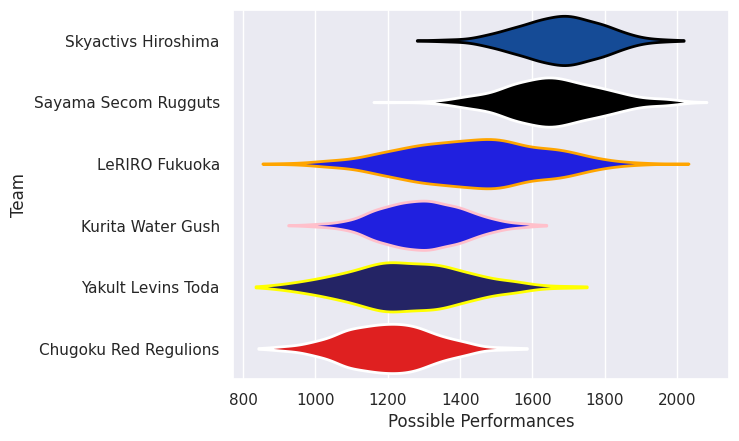
# Standings

## Current Standings

| Club                  |   Played |   Wins |   Point Differential |   Losing Bonus Points |   Try Bonus Points |   Competition Points |
|:----------------------|---------:|-------:|---------------------:|----------------------:|-------------------:|---------------------:|
| Skyactivs Hiroshima   |        6 |      6 |                  189 |                     0 |                  1 |                   25 |
| Sayama Secom Rugguts  |        5 |      4 |                  141 |                     0 |                  1 |                   17 |
| LeRIRO Fukuoka        |        5 |      2 |                  -29 |                     0 |                    |                   10 |
| Yakult Levins Toda    |        6 |      2 |                 -127 |                     1 |                    |                    9 |
| Kurita Water Gush     |        5 |      1 |                  -88 |                     2 |                    |                    6 |
| Chugoku Red Regulions |        5 |      0 |                  -86 |                     1 |                  1 |                    4 |

## Projected Remaining Table

| Club                  |   To Play |   Projected Wins |   Projected Differential |   Projected Losing Bonus Points | Projected Try Bonus Points   |   Projected Competition Points |
|:----------------------|----------:|-----------------:|-------------------------:|--------------------------------:|:-----------------------------|-------------------------------:|
| Sayama Secom Rugguts  |         2 |            1.43  |                   18.904 |                           0.245 |                              |                          6.093 |
| Chugoku Red Regulions |         2 |            0.863 |                   -3.594 |                           0.418 |                              |                          4.024 |
| LeRIRO Fukuoka        |         2 |            0.814 |                   -5.956 |                           0.399 |                              |                          3.787 |
| Skyactivs Hiroshima   |         1 |            0.703 |                    7.542 |                           0.152 |                              |                          3.014 |
| Yakult Levins Toda    |         1 |            0.54  |                    2.331 |                           0.206 |                              |                          2.462 |
| Kurita Water Gush     |         2 |            0.484 |                  -19.227 |                           0.419 |                              |                          2.459 |

## Projected Total Table

| Club                  |   Played |   Wins |   Point Differential |   Losing Bonus Points |   Try Bonus Points |   Competition Points |
|:----------------------|---------:|-------:|---------------------:|----------------------:|-------------------:|---------------------:|
| Skyactivs Hiroshima   |        7 |  6.703 |              196.542 |                 0.152 |                  1 |               28.014 |
| Sayama Secom Rugguts  |        7 |  5.43  |              159.904 |                 0.245 |                  1 |               23.093 |
| LeRIRO Fukuoka        |        7 |  2.814 |              -34.956 |                 0.399 |                    |               13.787 |
| Yakult Levins Toda    |        7 |  2.54  |             -124.669 |                 1.206 |                    |               11.462 |
| Kurita Water Gush     |        7 |  1.484 |             -107.227 |                 2.419 |                    |                8.459 |
| Chugoku Red Regulions |        7 |  0.863 |              -89.594 |                 1.418 |                  1 |                8.024 |

# Completed Match Review

| Model | Percent Correct Predictions | Spread Error |
| ------ | ------ | ------ |
| Club Level | 71.4% | 15.7 |
| Player Level: Lineup | nan% | nan |
| Player Level: Minutes | nan% | nan |

# Future Predictions

## Week 7

### LeRIRO Fukuoka V Chugoku Red Regulions on 2026/02/08

Average Margin: LeRIRO Fukuoka by 1.3

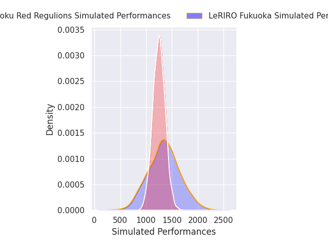
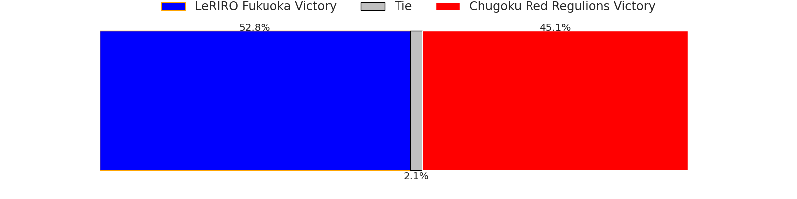
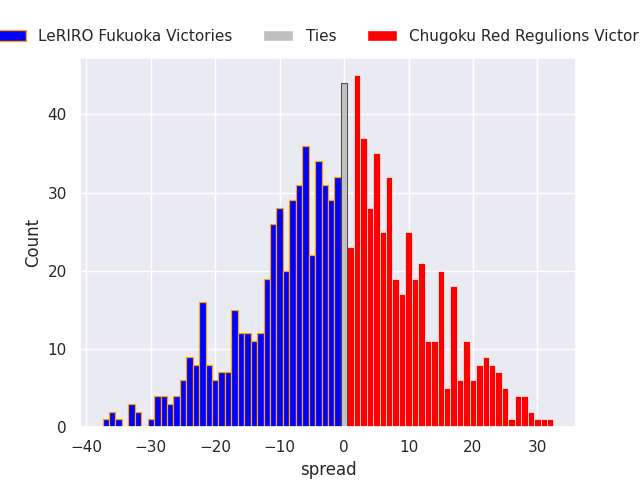

## Week 8

### Sayama Secom Rugguts V Kurita Water Gush on 2026/02/15

Average Margin: Sayama Secom Rugguts by 11.7

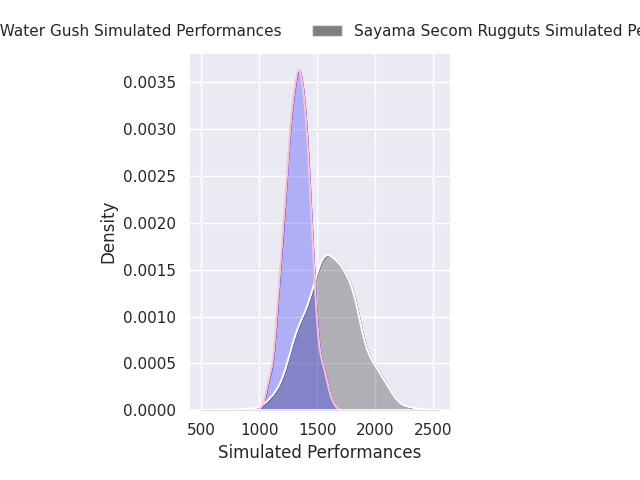
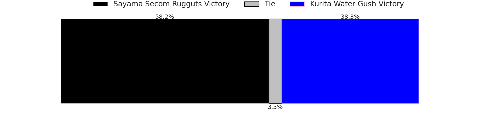
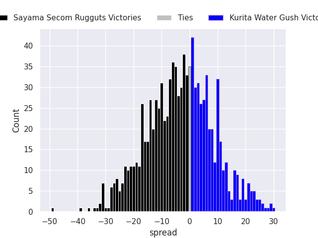

## Week 9

### Kurita Water Gush V Skyactivs Hiroshima on 2026/02/21

Average Margin: Skyactivs Hiroshima by 7.5

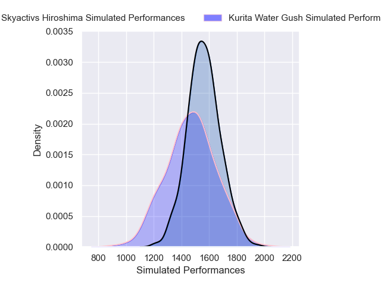
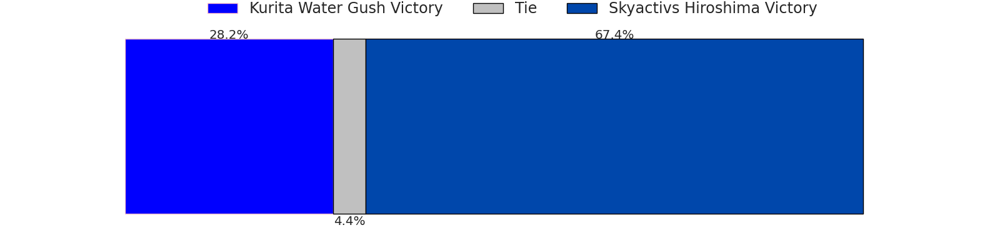
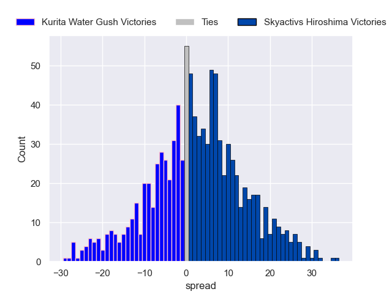

### Sayama Secom Rugguts V LeRIRO Fukuoka on 2026/02/21

Average Margin: Sayama Secom Rugguts by 7.2

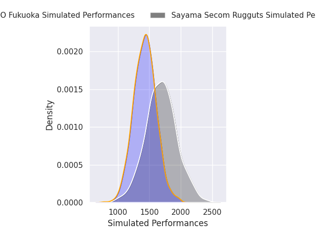
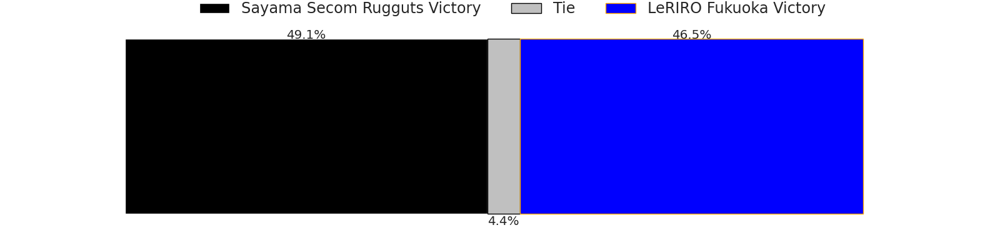
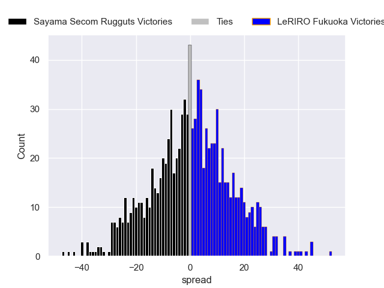

### Yakult Levins Toda V Chugoku Red Regulions on 2026/02/22

Average Margin: Yakult Levins Toda by 2.3

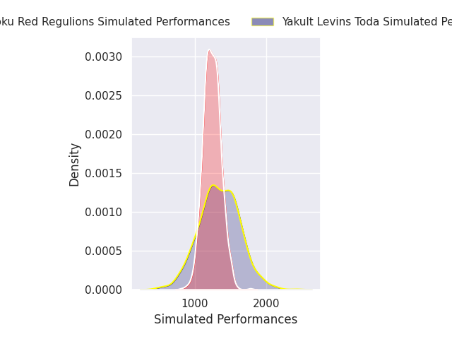

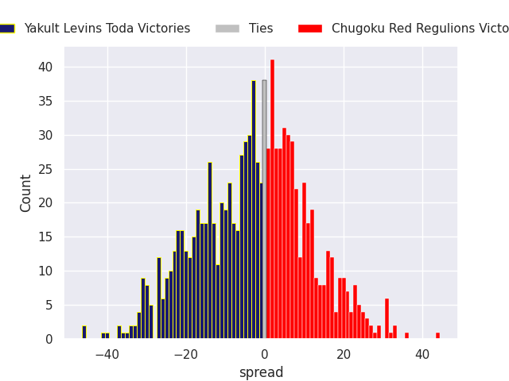

