---  
title: "Japan Rugby League One Division 2 2023 Status"  
date: 2023-12-11 6:00:00 -0500  
categories: model review projection  
layout: article  
aside:  
    toc: true  
---
# Current Team Rankings

# Standings

## Current Standings

| Club                             |   Played |   Wins |   Point Differential |   Losing Bonus Points |   Try Bonus Points |   Competition Points |
|:---------------------------------|---------:|-------:|---------------------:|----------------------:|-------------------:|---------------------:|
| Toyota Industries Shuttles Aichi |        1 |      1 |                   45 |                     0 |                nan |                    4 |
| NTT Docomo Red Hurricanes Osaka  |        1 |      1 |                    4 |                     0 |                nan |                    4 |
| Green Rockets Tokatsu            |        1 |      1 |                    3 |                     0 |                nan |                    4 |
| Urayasu D-Rocks                  |        1 |      0 |                   -3 |                     1 |                nan |                    1 |
| Kyuden Voltex                    |        1 |      0 |                   -4 |                     1 |                nan |                    1 |
| Kamaishi Seawaves                |        1 |      0 |                  -45 |                     0 |                nan |                    0 |

## Projected Remaining Table

| Club                             |   Matches Remaining |   Wins |   Point Differential |   Losing Bonus Points |   Try Bonus Points |   Competition Points |
|:---------------------------------|--------------------:|-------:|---------------------:|----------------------:|-------------------:|---------------------:|
| Green Rockets Tokatsu            |                   9 |    7.7 |            105.708   |                   1   |                7.6 |                 39.5 |
| Urayasu D-Rocks                  |                   9 |    7.6 |             98.2713  |                   1.1 |                7.5 |                 39.2 |
| NTT Docomo Red Hurricanes Osaka  |                   9 |    4.6 |             12.1058  |                   2   |                4.5 |                 24.8 |
| Toyota Industries Shuttles Aichi |                   9 |    4   |             -5.94326 |                   2.2 |                3.9 |                 22   |
| Kyuden Voltex                    |                   9 |    2.8 |            -46.9378  |                   1.9 |                2.7 |                 15.6 |
| Kamaishi Seawaves                |                   9 |    0.3 |           -163.204   |                   0.8 |                1.2 |                  3.4 |

## Projected Total Table

| Club                             |   Total Matches |   Wins |   Point Differential |   Losing Bonus Points |   Try Bonus Points |   Competition Points |
|:---------------------------------|----------------:|-------:|---------------------:|----------------------:|-------------------:|---------------------:|
| Green Rockets Tokatsu            |              10 |    8.7 |             108.708  |                   1   |                7.6 |                 43.5 |
| Urayasu D-Rocks                  |              10 |    7.6 |              95.2713 |                   2.1 |                7.5 |                 40.2 |
| NTT Docomo Red Hurricanes Osaka  |              10 |    5.6 |              16.1058 |                   2   |                4.5 |                 28.8 |
| Toyota Industries Shuttles Aichi |              10 |    5   |              39.0567 |                   2.2 |                3.9 |                 26   |
| Kyuden Voltex                    |              10 |    2.8 |             -50.9378 |                   2.9 |                2.7 |                 16.6 |
| Kamaishi Seawaves                |              10 |    0.3 |            -208.204  |                   0.8 |                1.2 |                  3.4 |

# Completed Match Review

| Model | Percent Correct Predictions | Spread Error |
| ------ | ------ | ------ |
| Club Level | 66.7% | 15.9 |
| Player Level: Lineup | nan% | nan |
| Player Level: Minutes | nan% | nan |

# Future Predictions

## Week 2

### NTT Docomo Red Hurricanes Osaka V Kamaishi Seawaves on 2023/12/16

Average Margin: NTT Docomo Red Hurricanes Osaka by 19.2

### Toyota Industries Shuttles Aichi V Green Rockets Tokatsu on 2023/12/16

Average Margin: Green Rockets Tokatsu by 5.5

### Urayasu D-Rocks V Kyuden Voltex on 2023/12/16

Average Margin: Urayasu D-Rocks by 15.3

## Week 3

### Green Rockets Tokatsu V Kyuden Voltex on 2023/12/23

Average Margin: Green Rockets Tokatsu by 17.3

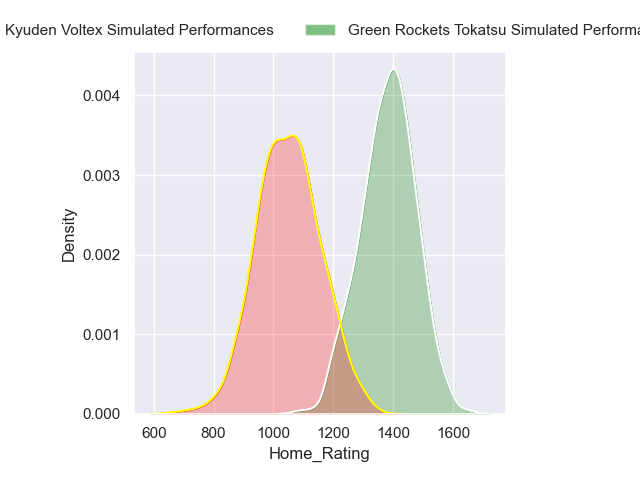
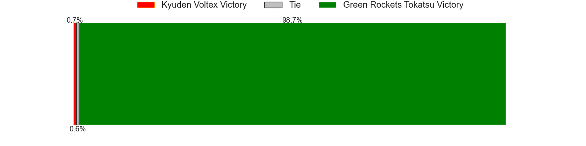
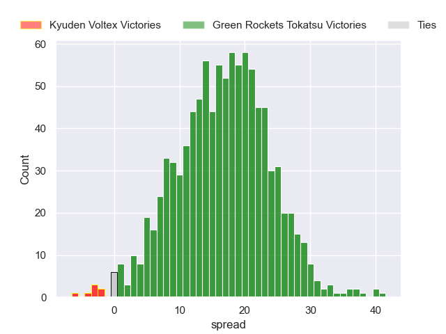

### Kamaishi Seawaves V Urayasu D-Rocks on 2023/12/24

Average Margin: Urayasu D-Rocks by 19.6

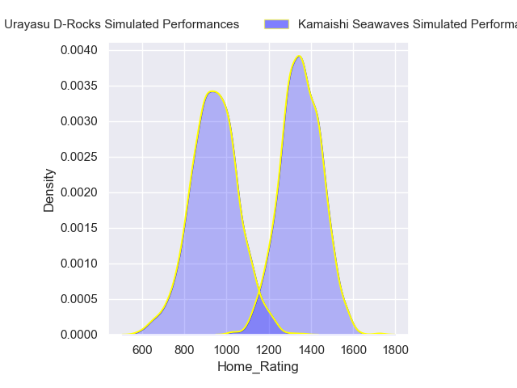
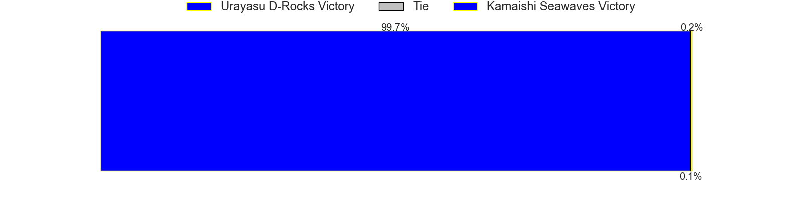
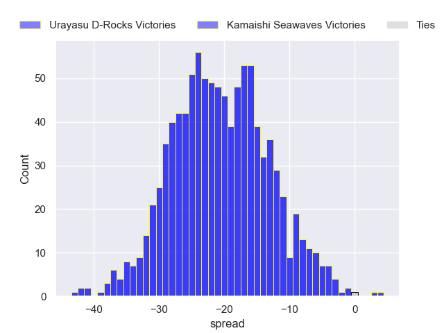

### Toyota Industries Shuttles Aichi V NTT Docomo Red Hurricanes Osaka on 2023/12/24

Average Margin: Toyota Industries Shuttles Aichi by 2.8

## Week 4

### Kyuden Voltex V Kamaishi Seawaves on 2024/01/06

Average Margin: Kyuden Voltex by 14.0

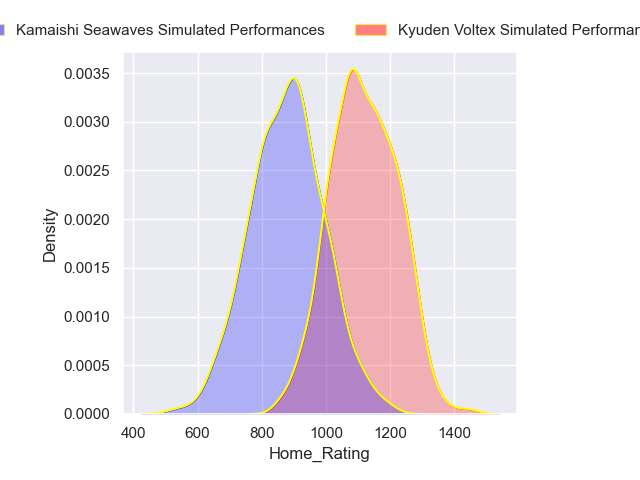
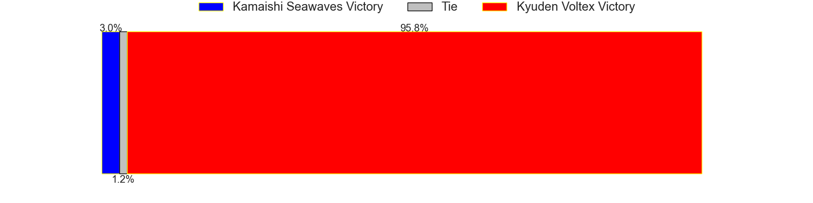
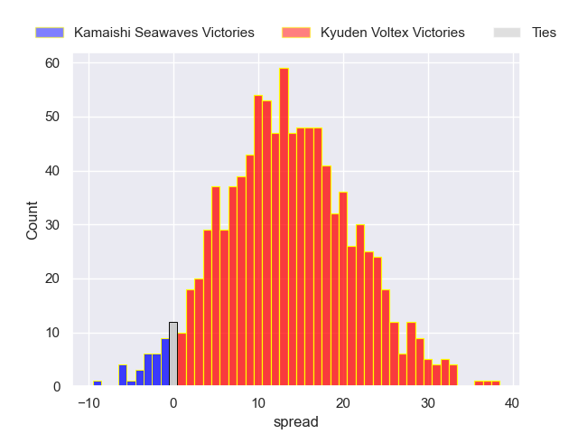

## Week 5

### Urayasu D-Rocks V Toyota Industries Shuttles Aichi on 2024/01/13

Average Margin: Urayasu D-Rocks by 10.3

### NTT Docomo Red Hurricanes Osaka V Green Rockets Tokatsu on 2024/01/13

Average Margin: Green Rockets Tokatsu by 4.9

## Week 6

### Toyota Industries Shuttles Aichi V Kyuden Voltex on 2024/01/28

Average Margin: Toyota Industries Shuttles Aichi by 7.6

## Week 7

### Urayasu D-Rocks V NTT Docomo Red Hurricanes Osaka on 2024/02/03

Average Margin: Urayasu D-Rocks by 10.0

### Green Rockets Tokatsu V Kamaishi Seawaves on 2024/02/04

Average Margin: Green Rockets Tokatsu by 27.0

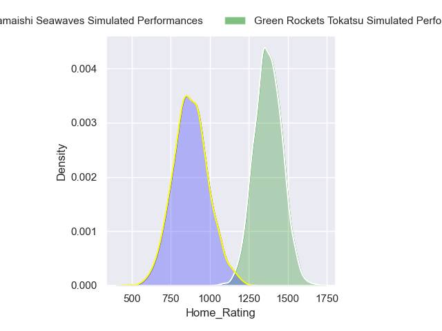

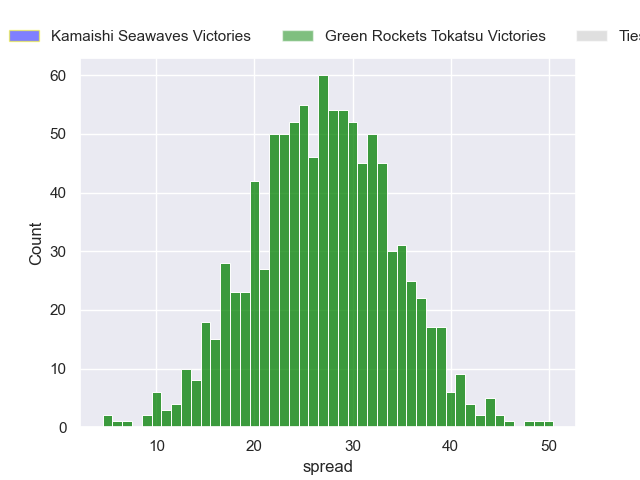

## Week 8

### NTT Docomo Red Hurricanes Osaka V Toyota Industries Shuttles Aichi on 2024/02/10

Average Margin: NTT Docomo Red Hurricanes Osaka by 4.1

## Week 9

### Urayasu D-Rocks V Kamaishi Seawaves on 2024/02/17

Average Margin: Urayasu D-Rocks by 25.8

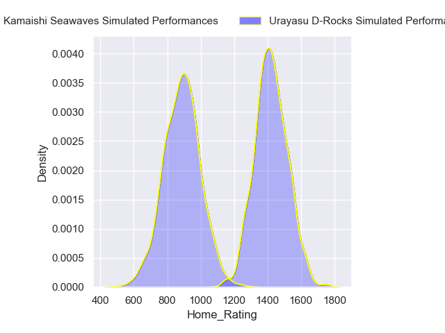

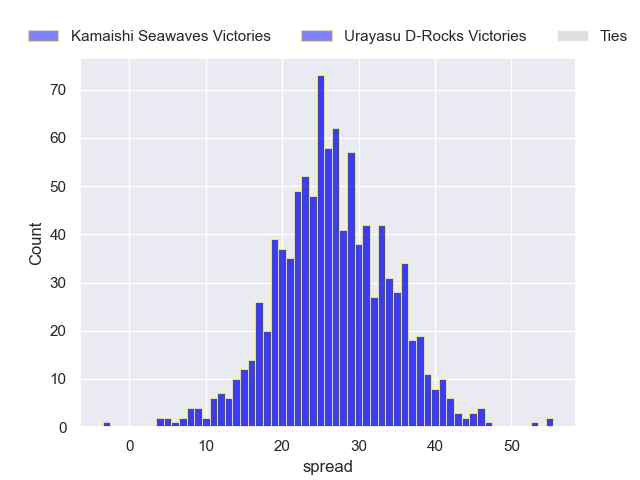

## Week 10

### Kyuden Voltex V Green Rockets Tokatsu on 2024/02/24

Average Margin: Green Rockets Tokatsu by 9.7

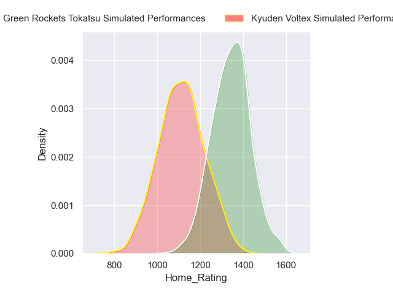
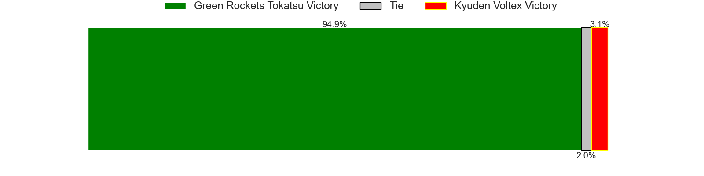
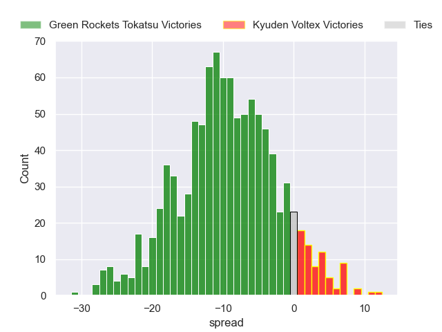

## Week 11

### Kyuden Voltex V Toyota Industries Shuttles Aichi on 2024/03/03

Average Margin: Toyota Industries Shuttles Aichi by 0.9

### Kamaishi Seawaves V Green Rockets Tokatsu on 2024/03/03

Average Margin: Green Rockets Tokatsu by 20.2

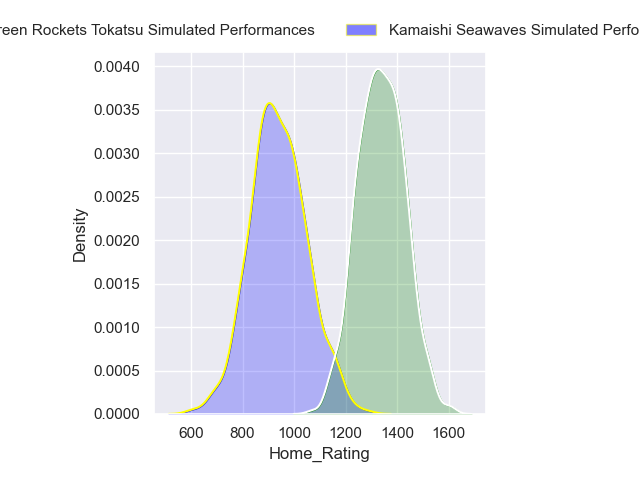

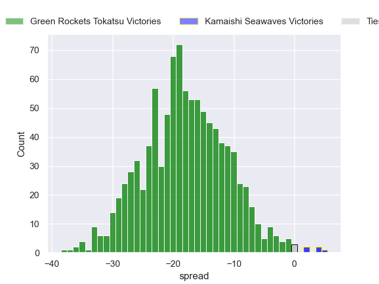

### NTT Docomo Red Hurricanes Osaka V Urayasu D-Rocks on 2024/03/03

Average Margin: Urayasu D-Rocks by 3.2

## Week 12

### Green Rockets Tokatsu V NTT Docomo Red Hurricanes Osaka on 2024/03/10

Average Margin: Green Rockets Tokatsu by 11.2

### Kamaishi Seawaves V Kyuden Voltex on 2024/03/10

Average Margin: Kyuden Voltex by 6.8

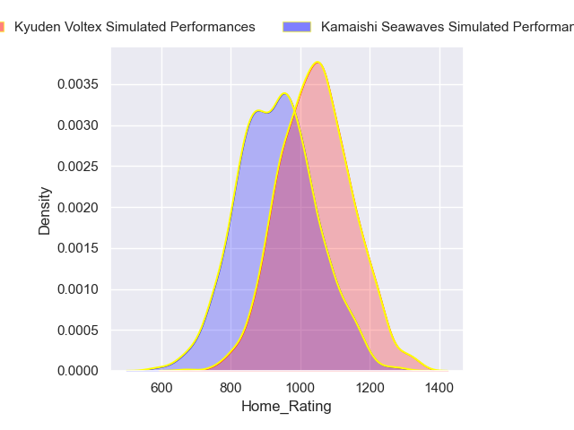
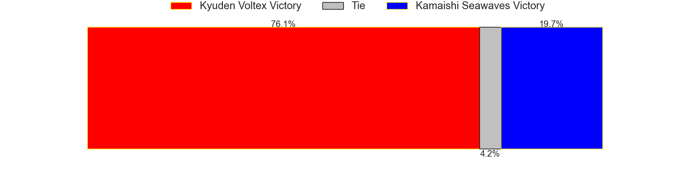
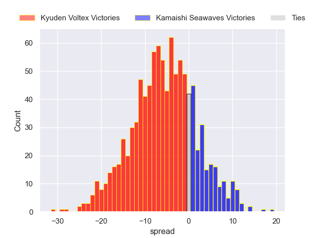

## Week 13

### Toyota Industries Shuttles Aichi V Urayasu D-Rocks on 2024/03/17

Average Margin: Urayasu D-Rocks by 3.8

## Week 14

### Green Rockets Tokatsu V Toyota Industries Shuttles Aichi on 2024/03/24

Average Margin: Green Rockets Tokatsu by 11.7

### Kamaishi Seawaves V NTT Docomo Red Hurricanes Osaka on 2024/03/24

Average Margin: NTT Docomo Red Hurricanes Osaka by 12.3

### Kyuden Voltex V Urayasu D-Rocks on 2024/03/24

Average Margin: Urayasu D-Rocks by 8.5

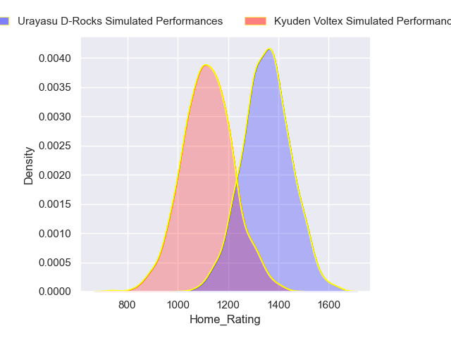
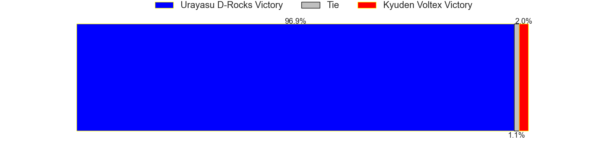
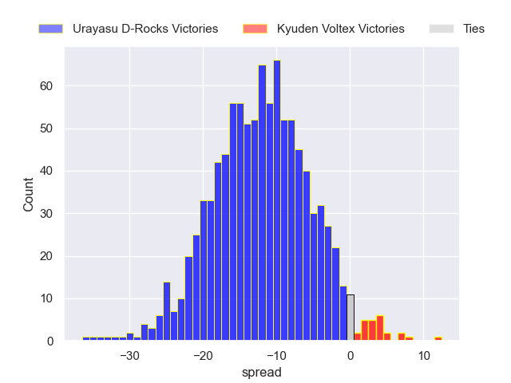

## Week 15

### Toyota Industries Shuttles Aichi V Kamaishi Seawaves on 2024/03/30

Average Margin: Toyota Industries Shuttles Aichi by 18.3

### Urayasu D-Rocks V Green Rockets Tokatsu on 2024/03/30

Average Margin: Urayasu D-Rocks by 1.9

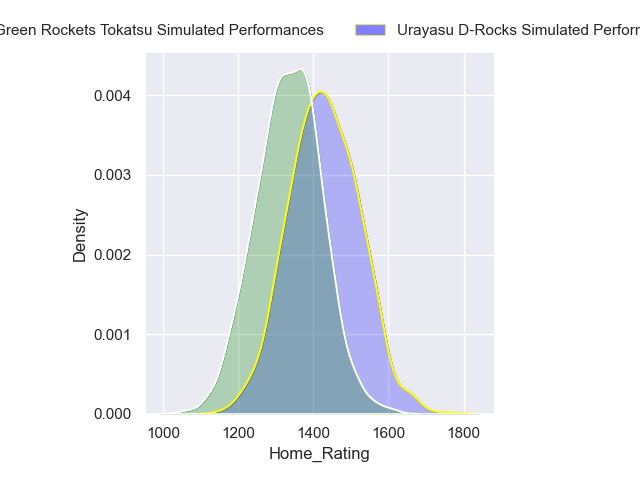

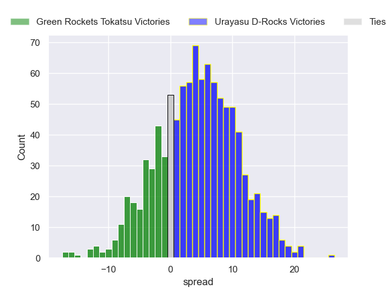

### NTT Docomo Red Hurricanes Osaka V Kyuden Voltex on 2024/03/31

Average Margin: NTT Docomo Red Hurricanes Osaka by 8.6

