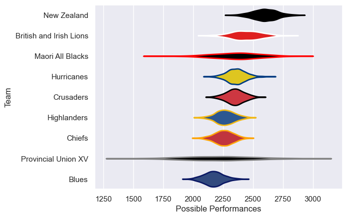

---  
title: "Lions Tour 2017"  
date: 2025-07-29 6:00:00 -0500  
categories: model review projection  
layout: article  
aside:  
    toc: true  
---
# Current Team Rankings

# Standings

## Current Standings

| Club                    |   Played |   Wins |   Point Differential |   Losing Bonus Points |   Try Bonus Points |   Competition Points |
|:------------------------|---------:|-------:|---------------------:|----------------------:|-------------------:|---------------------:|
| British and Irish Lions |       10 |      5 |                   46 |                     2 |                    |                   26 |
| New Zealand             |        3 |      1 |                   12 |                     1 |                    |                    7 |
| Blues                   |        1 |      1 |                    6 |                     0 |                    |                    4 |
| Highlanders             |        1 |      1 |                    1 |                     0 |                    |                    4 |
| Hurricanes              |        1 |      0 |                    0 |                     0 |                  1 |                    3 |
| Provincial Union XV     |        1 |      0 |                   -6 |                     1 |                    |                    1 |
| Crusaders               |        1 |      0 |                   -9 |                     0 |                    |                    0 |
| Maori All Blacks        |        1 |      0 |                  -22 |                     0 |                    |                    0 |
| Chiefs                  |        1 |      0 |                  -28 |                     0 |                    |                    0 |

# Completed Match Review

| Model | Percent Correct Predictions | Spread Error |
| ------ | ------ | ------ |
| Club Level | 50.0% | 12.2 |
| Player Level: Lineup | nan% | nan |
| Player Level: Minutes | nan% | nan |

