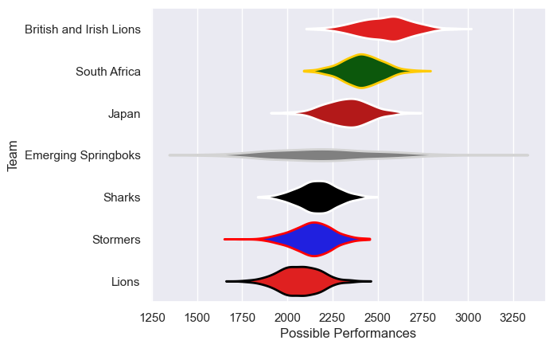

---  
title: "Lions Tour 2021"  
date: 2025-07-29 6:00:00 -0500  
categories: model review projection  
layout: article  
aside:  
    toc: true  
---
# Current Team Rankings

# Standings

## Current Standings

| Club                    |   Played |   Wins |   Point Differential |   Losing Bonus Points | Try Bonus Points   |   Competition Points |
|:------------------------|---------:|-------:|---------------------:|----------------------:|:-------------------|---------------------:|
| British and Irish Lions |        7 |      4 |                  128 |                     2 |                    |                   18 |
| South Africa            |        2 |      2 |                   21 |                     0 |                    |                    8 |
| Emerging Springboks     |        1 |      1 |                    4 |                     0 |                    |                    4 |
| Japan                   |        1 |      0 |                  -18 |                     0 |                    |                    0 |
| Lions                   |        1 |      0 |                  -42 |                     0 |                    |                    0 |
| Stormers                |        1 |      0 |                  -46 |                     0 |                    |                    0 |
| Sharks                  |        1 |      0 |                  -47 |                     0 |                    |                    0 |

# Completed Match Review

| Model | Percent Correct Predictions | Spread Error |
| ------ | ------ | ------ |
| Club Level | 57.1% | 17.5 |
| Player Level: Lineup | nan% | nan |
| Player Level: Minutes | nan% | nan |

