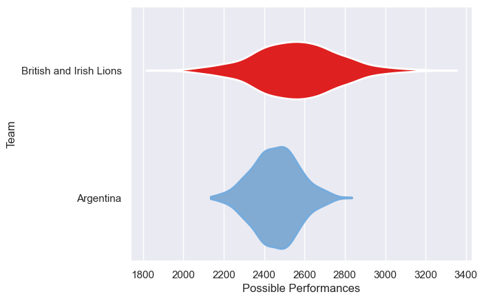

---  
title: "Lions Tour 2025 Status"  
date: 2025-07-28 6:00:00 -0500  
categories: model review projection  
layout: article  
aside:  
    toc: true  
---
# Current Team Rankings

# Standings

## Current Standings

| Club                        |   Played |   Wins |   Point Differential |   Losing Bonus Points |   Try Bonus Points |   Competition Points |
|:----------------------------|---------:|-------:|---------------------:|----------------------:|-------------------:|---------------------:|
| British and Irish Lions     |        9 |      8 |                  170 |                     1 |                  6 |                   39 |
| Argentina                   |        1 |      1 |                    4 |                     0 |                    |                    4 |
| First Nations & Pasifika XV |        1 |      0 |                   -5 |                     1 |                    |                    1 |
| Australia                   |        2 |      0 |                  -11 |                     1 |                    |                    1 |
| Brumbies                    |        1 |      0 |                  -12 |                     0 |                  1 |                    1 |
| New South Wales Waratahs    |        1 |      0 |                  -11 |                     0 |                    |                    0 |
| Queensland Reds             |        1 |      0 |                  -40 |                     0 |                    |                    0 |
| Western Force               |        1 |      0 |                  -47 |                     0 |                    |                    0 |
| AUNZ XV                     |        1 |      0 |                  -48 |                     0 |                    |                    0 |

## Projected Remaining Table

| Club                    |   To Play |   Projected Wins |   Projected Differential |   Projected Losing Bonus Points | Projected Try Bonus Points   |   Projected Competition Points |
|:------------------------|----------:|-----------------:|-------------------------:|--------------------------------:|:-----------------------------|-------------------------------:|
| British and Irish Lions |         1 |            0.62  |                    4.213 |                            0.18 |                              |                           2.75 |
| Australia               |         1 |            0.335 |                   -4.213 |                            0.23 |                              |                           1.66 |

## Projected Total Table

| Club                        |   Played |   Wins |   Point Differential |   Losing Bonus Points |   Try Bonus Points |   Competition Points |
|:----------------------------|---------:|-------:|---------------------:|----------------------:|-------------------:|---------------------:|
| British and Irish Lions     |       10 |  8.62  |              174.213 |                  1.18 |                  6 |                41.75 |
| Argentina                   |        1 |  1     |                4     |                  0    |                    |                 4    |
| Australia                   |        3 |  0.335 |              -15.213 |                  1.23 |                    |                 2.66 |
| First Nations & Pasifika XV |        1 |  0     |               -5     |                  1    |                    |                 1    |
| Brumbies                    |        1 |  0     |              -12     |                  0    |                  1 |                 1    |
| New South Wales Waratahs    |        1 |  0     |              -11     |                  0    |                    |                 0    |
| Queensland Reds             |        1 |  0     |              -40     |                  0    |                    |                 0    |
| Western Force               |        1 |  0     |              -47     |                  0    |                    |                 0    |
| AUNZ XV                     |        1 |  0     |              -48     |                  0    |                    |                 0    |

# Completed Match Review

| Model | Percent Correct Predictions | Spread Error |
| ------ | ------ | ------ |
| Club Level | 70.0% | 14.6 |
| Player Level: Lineup | nan% | nan |
| Player Level: Minutes | nan% | nan |

# Future Predictions

## Week 10

### Australia V British and Irish Lions on 2025/08/02

Average Margin: British and Irish Lions by 4.2

