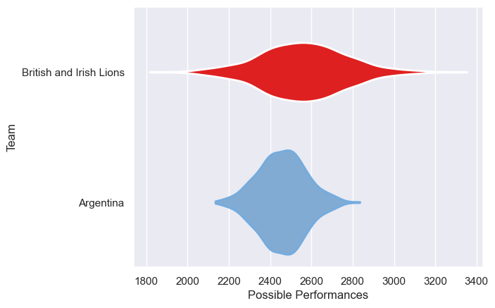

---  
title: "Lions Tour 2025 Status"  
date: 2025-06-17 6:00:00 -0500  
categories: model review projection  
layout: article  
aside:  
    toc: true  
---
# Current Team Rankings

# Standings

## Projected Remaining Table

| Club                    |   To Play |   Projected Wins |   Projected Differential |   Projected Losing Bonus Points | Projected Try Bonus Points   |   Projected Competition Points |
|:------------------------|----------:|-----------------:|-------------------------:|--------------------------------:|:-----------------------------|-------------------------------:|
| British and Irish Lions |         1 |            0.59  |                     5.85 |                           0.146 |                              |                          2.562 |
| Argentina               |         1 |            0.382 |                    -5.85 |                           0.175 |                              |                          1.759 |

## Projected Total Table

| Club                    |   Played |   Wins |   Point Differential |   Losing Bonus Points | Try Bonus Points   |   Competition Points |
|:------------------------|---------:|-------:|---------------------:|----------------------:|:-------------------|---------------------:|
| British and Irish Lions |        1 |  0.59  |                 5.85 |                 0.146 |                    |                2.562 |
| Argentina               |        1 |  0.382 |                -5.85 |                 0.175 |                    |                1.759 |

# Future Predictions

## Week 1

### British and Irish Lions V Argentina on 2025/06/20

Average Margin: British and Irish Lions by 5.8

