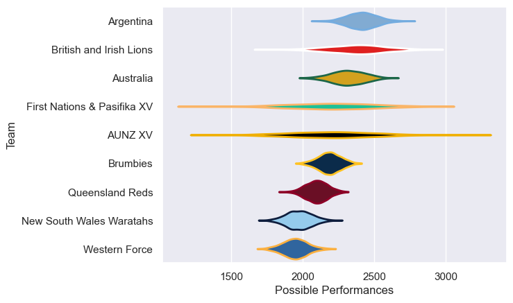

---  
title: "Lions Tour 2025 Status"  
date: 2025-07-14 6:00:00 -0500  
categories: model review projection  
layout: article  
aside:  
    toc: true  
---
# Current Team Rankings

# Standings

## Current Standings

| Club                     |   Played |   Wins |   Point Differential |   Losing Bonus Points |   Try Bonus Points |   Competition Points |
|:-------------------------|---------:|-------:|---------------------:|----------------------:|-------------------:|---------------------:|
| British and Irish Lions  |        6 |      5 |                  154 |                     1 |                  4 |                   25 |
| Argentina                |        1 |      1 |                    4 |                     0 |                    |                    4 |
| Brumbies                 |        1 |      0 |                  -12 |                     0 |                  1 |                    1 |
| New South Wales Waratahs |        1 |      0 |                  -11 |                     0 |                    |                    0 |
| Queensland Reds          |        1 |      0 |                  -40 |                     0 |                    |                    0 |
| Western Force            |        1 |      0 |                  -47 |                     0 |                    |                    0 |
| AUNZ XV                  |        1 |      0 |                  -48 |                     0 |                    |                    0 |

## Projected Remaining Table

| Club                    |   To Play |   Projected Wins |   Projected Differential |   Projected Losing Bonus Points | Projected Try Bonus Points   |   Projected Competition Points |
|:------------------------|----------:|-----------------:|-------------------------:|--------------------------------:|:-----------------------------|-------------------------------:|
| British and Irish Lions |         1 |            0.563 |                    2.231 |                           0.21  |                              |                          2.53  |
| Australia               |         1 |            0.403 |                   -2.231 |                           0.253 |                              |                          1.933 |

## Projected Total Table

| Club                     |   Played |   Wins |   Point Differential |   Losing Bonus Points |   Try Bonus Points |   Competition Points |
|:-------------------------|---------:|-------:|---------------------:|----------------------:|-------------------:|---------------------:|
| British and Irish Lions  |        7 |  5.563 |              156.231 |                 1.21  |                  4 |               27.53  |
| Argentina                |        1 |  1     |                4     |                 0     |                    |                4     |
| Australia                |        1 |  0.403 |               -2.231 |                 0.253 |                    |                1.933 |
| Brumbies                 |        1 |  0     |              -12     |                 0     |                  1 |                1     |
| New South Wales Waratahs |        1 |  0     |              -11     |                 0     |                    |                0     |
| Queensland Reds          |        1 |  0     |              -40     |                 0     |                    |                0     |
| Western Force            |        1 |  0     |              -47     |                 0     |                    |                0     |
| AUNZ XV                  |        1 |  0     |              -48     |                 0     |                    |                0     |

# Completed Match Review

| Model | Percent Correct Predictions | Spread Error |
| ------ | ------ | ------ |
| Club Level | 71.4% | 20.3 |
| Player Level: Lineup | nan% | nan |
| Player Level: Minutes | nan% | nan |

# Future Predictions

## Week 7

### Australia V British and Irish Lions on 2025/07/19

Average Margin: British and Irish Lions by 2.2

