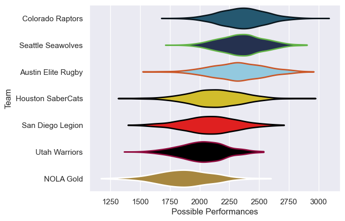

---  
title: "Major League Rugby 2018"  
date: 2025-07-29 6:00:00 -0500  
categories: model review projection  
layout: article  
aside:  
    toc: true  
---
# Current Team Rankings

# Standings

## Current Standings

| Club               |   Played |   Wins |   Point Differential |   Losing Bonus Points | Try Bonus Points   |   Competition Points |
|:-------------------|---------:|-------:|---------------------:|----------------------:|:-------------------|---------------------:|
| Colorado Raptors   |       10 |      8 |                   93 |                     1 |                    |                   33 |
| Seattle Seawolves  |       10 |      8 |                   62 |                     1 |                    |                   33 |
| San Diego Legion   |        9 |      5 |                   -1 |                     1 |                    |                   21 |
| Utah Warriors      |        9 |      3 |                  -18 |                     3 |                    |                   15 |
| Austin Elite Rugby |        8 |      3 |                  -14 |                     1 |                    |                   13 |
| NOLA Gold          |        8 |      3 |                  -82 |                     1 |                    |                   13 |
| Houston SaberCats  |        8 |      1 |                  -40 |                     4 |                    |                    8 |

# Completed Match Review

| Model | Percent Correct Predictions | Spread Error |
| ------ | ------ | ------ |
| Club Level | 61.3% | 12.2 |
| Player Level: Lineup | nan% | nan |
| Player Level: Minutes | nan% | nan |

