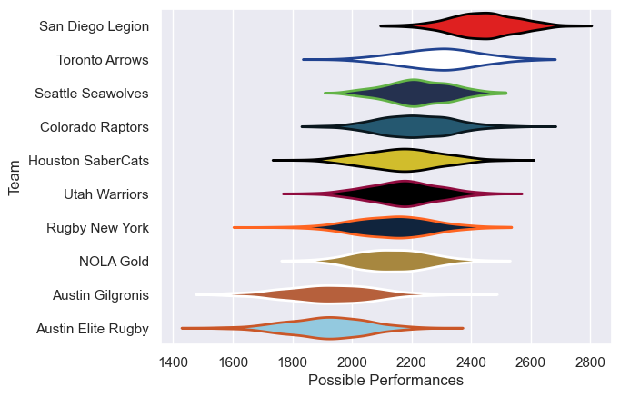

---  
title: "Major League Rugby 2019"  
date: 2025-07-29 6:00:00 -0500  
categories: model review projection  
layout: article  
aside:  
    toc: true  
---
# Current Team Rankings

# Standings

## Current Standings

| Club               |   Played |   Wins |   Point Differential |   Losing Bonus Points |   Try Bonus Points |   Competition Points |
|:-------------------|---------:|-------:|---------------------:|----------------------:|-------------------:|---------------------:|
| Seattle Seawolves  |       28 |     21 |                  173 |                     3 |                  1 |                   92 |
| San Diego Legion   |       22 |     16 |                  217 |                     5 |                    |                   71 |
| Toronto Arrows     |       22 |     14 |                  101 |                     5 |                    |                   61 |
| Rugby New York     |       20 |     13 |                  105 |                     4 |                    |                   56 |
| NOLA Gold          |       19 |     11 |                   75 |                     7 |                    |                   51 |
| Colorado Raptors   |       19 |      9 |                   21 |                     2 |                    |                   42 |
| Houston SaberCats  |       19 |      8 |                 -146 |                     1 |                    |                   33 |
| Utah Warriors      |       19 |      4 |                 -112 |                     5 |                    |                   27 |
| Austin Elite Rugby |       16 |      0 |                 -217 |                     3 |                    |                    3 |
| Austin Gilgronis   |       16 |      0 |                 -217 |                     3 |                    |                    3 |

# Completed Match Review

| Model | Percent Correct Predictions | Spread Error |
| ------ | ------ | ------ |
| Club Level | 65.0% | 13.3 |
| Player Level: Lineup | nan% | nan |
| Player Level: Minutes | nan% | nan |

