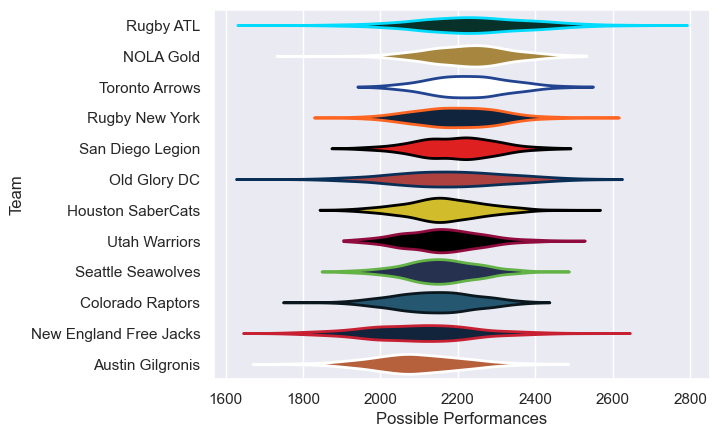

---  
title: "Major League Rugby 2020 Status"  
date: 2025-07-28 6:00:00 -0500  
categories: model review projection  
layout: article  
aside:  
    toc: true  
---
# Current Team Rankings

# Standings

## Current Standings

| Club                   |   Played |   Wins |   Point Differential |   Losing Bonus Points | Try Bonus Points   |   Competition Points |
|:-----------------------|---------:|-------:|---------------------:|----------------------:|:-------------------|---------------------:|
| San Diego Legion       |       17 |      6 |                   62 |                     0 |                    |                   46 |
| Toronto Arrows         |       17 |      5 |                   90 |                     1 |                    |                   43 |
| Old Glory DC           |       16 |      4 |                   -7 |                     0 |                    |                   38 |
| NOLA Gold              |       16 |      3 |                   33 |                     1 |                    |                   35 |
| Rugby New York         |       16 |      3 |                    5 |                     1 |                    |                   35 |
| Rugby ATL              |       16 |      2 |                    6 |                     2 |                    |                   32 |
| Utah Warriors          |       16 |      2 |                   -9 |                     0 |                    |                   32 |
| Colorado Raptors       |       16 |      2 |                  -32 |                     1 |                    |                   31 |
| Houston SaberCats      |       16 |      1 |                  -17 |                     2 |                    |                   28 |
| Seattle Seawolves      |       16 |      1 |                  -24 |                     2 |                    |                   28 |
| Austin Gilgronis       |       17 |      1 |                  -79 |                     0 |                    |                   28 |
| New England Free Jacks |       17 |      1 |                  -28 |                     1 |                    |                   27 |

# Completed Match Review

| Model | Percent Correct Predictions | Spread Error |
| ------ | ------ | ------ |
| Club Level | 22.4% | 7.9 |
| Player Level: Lineup | nan% | nan |
| Player Level: Minutes | nan% | nan |

