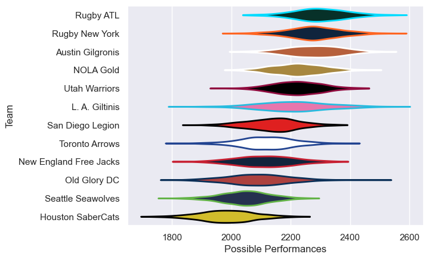

---  
title: "Major League Rugby 2021"  
date: 2025-07-29 6:00:00 -0500  
categories: model review projection  
layout: article  
aside:  
    toc: true  
---
# Current Team Rankings

# Standings

## Current Standings

| Club                   |   Played |   Wins |   Point Differential |   Losing Bonus Points | Try Bonus Points   |   Competition Points |
|:-----------------------|---------:|-------:|---------------------:|----------------------:|:-------------------|---------------------:|
| L. A. Giltinis         |       23 |     18 |                  356 |                     5 |                    |                   77 |
| Rugby ATL              |       20 |     13 |                  102 |                     5 |                    |                   57 |
| Austin Gilgronis       |       19 |     11 |                  101 |                     5 |                    |                   49 |
| Utah Warriors          |       18 |     11 |                   39 |                     5 |                    |                   49 |
| Rugby New York         |       18 |     11 |                   30 |                     4 |                    |                   48 |
| NOLA Gold              |       18 |     11 |                  -26 |                     2 |                    |                   48 |
| New England Free Jacks |       17 |     11 |                   34 |                     1 |                    |                   45 |
| San Diego Legion       |       19 |      7 |                  -43 |                     7 |                    |                   35 |
| Seattle Seawolves      |       25 |      6 |                 -188 |                     9 |                    |                   33 |
| Old Glory DC           |       17 |      6 |                  -87 |                     6 |                    |                   32 |
| Toronto Arrows         |       17 |      6 |                    5 |                     5 |                    |                   29 |
| Houston SaberCats      |       17 |      2 |                 -323 |                     2 |                    |                   10 |

# Completed Match Review

| Model | Percent Correct Predictions | Spread Error |
| ------ | ------ | ------ |
| Club Level | 64.0% | 11.4 |
| Player Level: Lineup | nan% | nan |
| Player Level: Minutes | nan% | nan |

