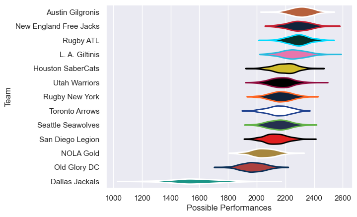

---  
title: "Major League Rugby 2022"  
date: 2025-07-29 6:00:00 -0500  
categories: model review projection  
layout: article  
aside:  
    toc: true  
---
# Current Team Rankings

# Standings

## Current Standings

| Club                   |   Played |   Wins |   Point Differential |   Losing Bonus Points |   Try Bonus Points |   Competition Points |
|:-----------------------|---------:|-------:|---------------------:|----------------------:|-------------------:|---------------------:|
| Seattle Seawolves      |       24 |     15 |                  210 |                     4 |                  6 |                   70 |
| Austin Gilgronis       |       19 |     14 |                  293 |                     2 |                  8 |                   66 |
| L. A. Giltinis         |       22 |     14 |                  188 |                     2 |                  7 |                   65 |
| Rugby New York         |       20 |     14 |                   12 |                     2 |                  2 |                   60 |
| New England Free Jacks |       19 |     14 |                  166 |                     3 |                    |                   59 |
| Rugby ATL              |       19 |     13 |                  148 |                     3 |                  2 |                   57 |
| Houston SaberCats      |       19 |     10 |                  -32 |                     4 |                  7 |                   51 |
| San Diego Legion       |       22 |     10 |                   -8 |                     3 |                  7 |                   50 |
| Utah Warriors          |       17 |      6 |                   38 |                     7 |                  6 |                   37 |
| Toronto Arrows         |       17 |      8 |                   11 |                     2 |                  1 |                   35 |
| NOLA Gold              |       17 |      4 |                 -211 |                     3 |                  1 |                   20 |
| Old Glory DC           |       18 |      3 |                 -194 |                     3 |                    |                   15 |
| Dallas Jackals         |       17 |      0 |                 -621 |                     2 |                  2 |                    4 |

# Completed Match Review

| Model | Percent Correct Predictions | Spread Error |
| ------ | ------ | ------ |
| Club Level | 65.6% | 13.9 |
| Player Level: Lineup | nan% | nan |
| Player Level: Minutes | nan% | nan |

