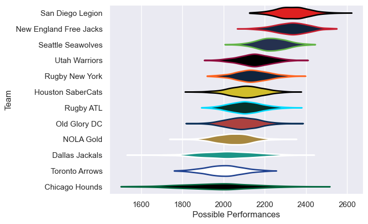

---  
title: "Major League Rugby 2023 Status"  
date: 2025-07-28 6:00:00 -0500  
categories: model review projection  
layout: article  
aside:  
    toc: true  
---
# Current Team Rankings

# Standings

## Current Standings

| Club                   |   Played |   Wins |   Point Differential |   Losing Bonus Points |   Try Bonus Points |   Competition Points |
|:-----------------------|---------:|-------:|---------------------:|----------------------:|-------------------:|---------------------:|
| San Diego Legion       |       18 |     16 |                  290 |                     2 |                 14 |                   80 |
| New England Free Jacks |       18 |     16 |                  302 |                     1 |                 11 |                   76 |
| Seattle Seawolves      |       18 |     13 |                  150 |                     2 |                 10 |                   64 |
| Houston SaberCats      |       17 |     10 |                   60 |                     2 |                 12 |                   54 |
| Utah Warriors          |       16 |     10 |                   24 |                     2 |                  8 |                   50 |
| Old Glory DC           |       18 |      8 |                  -49 |                     2 |                 12 |                   48 |
| Rugby New York         |       17 |      8 |                   37 |                     2 |                 11 |                   45 |
| NOLA Gold              |       16 |      7 |                  -96 |                     1 |                  7 |                   36 |
| Rugby ATL              |       16 |      5 |                  -73 |                     1 |                  6 |                   29 |
| Chicago Hounds         |       16 |      3 |                 -170 |                     4 |                  4 |                   20 |
| Dallas Jackals         |       16 |      2 |                 -180 |                     5 |                  6 |                   19 |
| Toronto Arrows         |       16 |      1 |                 -295 |                     4 |                  4 |                   16 |

# Completed Match Review

| Model | Percent Correct Predictions | Spread Error |
| ------ | ------ | ------ |
| Club Level | 71.3% | 12.5 |
| Player Level: Lineup | nan% | nan |
| Player Level: Minutes | nan% | nan |

