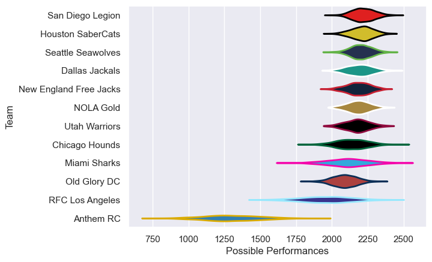

---  
title: "Major League Rugby 2024"  
date: 2025-07-29 6:00:00 -0500  
categories: model review projection  
layout: article  
aside:  
    toc: true  
---
# Current Team Rankings

# Standings

## Current Standings

| Club                   |   Played |   Wins |   Point Differential |   Losing Bonus Points |   Try Bonus Points |   Competition Points |
|:-----------------------|---------:|-------:|---------------------:|----------------------:|-------------------:|---------------------:|
| Seattle Seawolves      |       24 |     16 |                  186 |                     5 |                  7 |                   78 |
| New England Free Jacks |       22 |     16 |                  193 |                     3 |                  5 |                   74 |
| San Diego Legion       |       23 |     15 |                   70 |                     7 |                  5 |                   72 |
| Houston SaberCats      |       18 |     14 |                  106 |                     0 |                  8 |                   64 |
| Dallas Jackals         |       22 |     10 |                   47 |                    11 |                  8 |                   59 |
| Chicago Hounds         |       21 |     11 |                  130 |                     6 |                  6 |                   58 |
| NOLA Gold              |       20 |     12 |                   37 |                     2 |                  5 |                   55 |
| Old Glory DC           |       17 |      7 |                  -26 |                     5 |                  5 |                   42 |
| Utah Warriors          |       20 |      6 |                  -85 |                     8 |                  4 |                   40 |
| RFC Los Angeles        |       23 |      6 |                 -180 |                     3 |                  7 |                   36 |
| Miami Sharks           |       19 |      6 |                  -92 |                     6 |                  2 |                   32 |
| Anthem RC              |       17 |      0 |                 -386 |                     1 |                  5 |                    6 |

# Completed Match Review

| Model | Percent Correct Predictions | Spread Error |
| ------ | ------ | ------ |
| Club Level | 60.2% | 13.8 |
| Player Level: Lineup | nan% | nan |
| Player Level: Minutes | nan% | nan |

