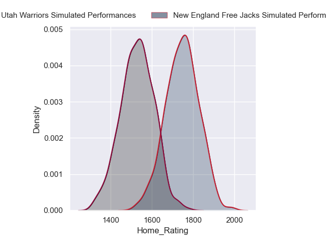
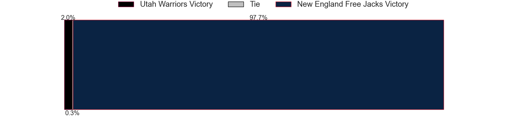
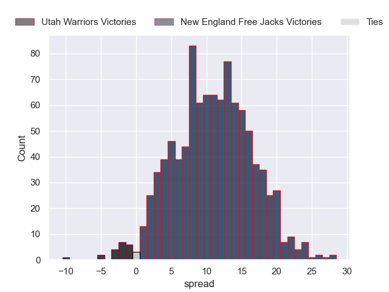

---  
title: "Major League Rugby 2024 Status"  
date: 2024-04-29 6:00:00 -0500  
categories: model review projection  
layout: article  
aside:  
    toc: true  
---
# Current Team Rankings

# Standings

## Current Standings

| Club                   |   Played |   Wins |   Point Differential |   Losing Bonus Points |   Try Bonus Points |   Competition Points |
|:-----------------------|---------:|-------:|---------------------:|----------------------:|-------------------:|---------------------:|
| Seattle Seawolves      |        9 |      7 |                   74 |                     1 |                nan |                   31 |
| Houston SaberCats      |        8 |      7 |                   80 |                     0 |                nan |                   28 |
| New England Free Jacks |        8 |      6 |                   91 |                     1 |                nan |                   25 |
| San Diego Legion       |        8 |      5 |                   -2 |                     2 |                nan |                   22 |
| Chicago Hounds         |        7 |      4 |                   64 |                     1 |                nan |                   19 |
| Dallas Jackals         |        8 |      4 |                   41 |                     3 |                nan |                   19 |
| NOLA Gold              |        8 |      4 |                   24 |                     1 |                nan |                   17 |
| Utah Warriors          |        8 |      3 |                   10 |                     3 |                nan |                   17 |
| Old Glory DC           |        8 |      3 |                  -41 |                     1 |                nan |                   13 |
| Miami Sharks           |        8 |      2 |                  -26 |                     2 |                nan |                   10 |
| RFC Los Angeles        |        8 |      1 |                  -91 |                     2 |                nan |                    8 |
| Anthem RC              |        8 |      0 |                 -224 |                     0 |                nan |                    0 |

## Projected Remaining Table

| Club                   |   Matches Remaining |   Wins |   Point Differential |   Losing Bonus Points |   Try Bonus Points |   Competition Points |
|:-----------------------|--------------------:|-------:|---------------------:|----------------------:|-------------------:|---------------------:|
| New England Free Jacks |                   9 |    8.2 |            116.556   |                   0.7 |                5.1 |                 38.5 |
| Houston SaberCats      |                   8 |    6.2 |             79.5131  |                   1.4 |                5.4 |                 31.7 |
| Seattle Seawolves      |                   8 |    6.3 |             92.4114  |                   1.3 |                4.3 |                 30.8 |
| San Diego Legion       |                   8 |    5.7 |             66.7564  |                   1.9 |                3.3 |                 27.8 |
| Chicago Hounds         |                   8 |    5.2 |             51.6492  |                   1.5 |                3.1 |                 25.4 |
| Miami Sharks           |                   8 |    4   |             15.7908  |                   2.1 |                2.7 |                 20.8 |
| Utah Warriors          |                   9 |    4   |            -10.6794  |                   2.4 |                2.4 |                 20.7 |
| Old Glory DC           |                   8 |    2.9 |             -3.63104 |                   2   |                2.7 |                 16.3 |
| Dallas Jackals         |                   8 |    2.7 |            -27.4097  |                   2   |                1.9 |                 14.9 |
| NOLA Gold              |                   8 |    1.8 |            -41.402   |                   3   |                2   |                 12.3 |
| RFC Los Angeles        |                   8 |    2   |            -47.4594  |                   1.5 |                2.2 |                 11.8 |
| Anthem RC              |                   8 |    0   |           -292.095   |                   0   |                0.9 |                  0.9 |

## Projected Total Table

| Club                   |   Total Matches |   Wins |   Point Differential |   Losing Bonus Points |   Try Bonus Points |   Competition Points |
|:-----------------------|----------------:|-------:|---------------------:|----------------------:|-------------------:|---------------------:|
| New England Free Jacks |              17 |   14.2 |           207.556    |                   1.7 |                5.1 |                 63.5 |
| Seattle Seawolves      |              17 |   13.3 |           166.411    |                   2.3 |                4.3 |                 61.8 |
| Houston SaberCats      |              16 |   13.2 |           159.513    |                   1.4 |                5.4 |                 59.7 |
| San Diego Legion       |              16 |   10.7 |            64.7564   |                   3.9 |                3.3 |                 49.8 |
| Chicago Hounds         |              15 |    9.2 |           115.649    |                   2.5 |                3.1 |                 44.4 |
| Utah Warriors          |              17 |    7   |            -0.679448 |                   5.4 |                2.4 |                 37.7 |
| Dallas Jackals         |              16 |    6.7 |            13.5903   |                   5   |                1.9 |                 33.9 |
| Miami Sharks           |              16 |    6   |           -10.2092   |                   4.1 |                2.7 |                 30.8 |
| NOLA Gold              |              16 |    5.8 |           -17.402    |                   4   |                2   |                 29.3 |
| Old Glory DC           |              16 |    5.9 |           -44.631    |                   3   |                2.7 |                 29.3 |
| RFC Los Angeles        |              16 |    3   |          -138.459    |                   3.5 |                2.2 |                 19.8 |
| Anthem RC              |              16 |    0   |          -516.095    |                   0   |                0.9 |                  0.9 |

# Completed Match Review

| Model | Percent Correct Predictions | Spread Error |
| ------ | ------ | ------ |
| Club Level | 60.4% | 13.1 |
| Player Level: Lineup | nan% | nan |
| Player Level: Minutes | nan% | nan |

# Future Predictions

## Week 10

### Seattle Seawolves V Anthem RC on 2024/05/03

Average Margin: Seattle Seawolves by 45.0

Average Scoreline: 59-14

### Old Glory DC V Miami Sharks on 2024/05/04

Average Margin: Old Glory DC by 2.7

Average Scoreline: 25-23

### Utah Warriors V Houston SaberCats on 2024/05/04

Average Margin: Houston SaberCats by 1.2

Average Scoreline: 31-30

### New England Free Jacks V Utah Warriors on 2024/05/04

Average Margin: New England Free Jacks by 10.9

Average Scoreline: 31-21

### New England Free Jacks V Chicago Hounds on 2024/05/05

Average Margin: New England Free Jacks by 8.9

Average Scoreline: 28-19

### San Diego Legion V Dallas Jackals on 2024/05/05

Average Margin: San Diego Legion by 9.5

Average Scoreline: 33-24

## Week 11

### Dallas Jackals V RFC Los Angeles on 2024/05/10

Average Margin: Dallas Jackals by 10.4

Average Scoreline: 35-25

### Anthem RC V Houston SaberCats on 2024/05/10

Average Margin: Houston SaberCats by 37.7

Average Scoreline: 42-5

### Chicago Hounds V Old Glory DC on 2024/05/11

Average Margin: Chicago Hounds by 10.2

Average Scoreline: 33-23

### NOLA Gold V Seattle Seawolves on 2024/05/11

Average Margin: Seattle Seawolves by 7.0

Average Scoreline: 34-27

### Miami Sharks V Utah Warriors on 2024/05/11

Average Margin: Utah Warriors by 1.3

Average Scoreline: 31-29

## Week 12

### Houston SaberCats V Chicago Hounds on 2024/05/18

Average Margin: Houston SaberCats by 6.4

Average Scoreline: 32-25

### Anthem RC V RFC Los Angeles on 2024/05/18

Average Margin: RFC Los Angeles by 23.5

Average Scoreline: 39-16

### NOLA Gold V Utah Warriors on 2024/05/18

Average Margin: Utah Warriors by 1.7

Average Scoreline: 29-27

### Dallas Jackals V Seattle Seawolves on 2024/05/19

Average Margin: Seattle Seawolves by 4.7

Average Scoreline: 31-26

### San Diego Legion V New England Free Jacks on 2024/05/19

Average Margin: New England Free Jacks by 0.2

Average Scoreline: 27-26

## Week 13

### Seattle Seawolves V Old Glory DC on 2024/05/24

Average Margin: Seattle Seawolves by 13.9

Average Scoreline: 34-20

### Miami Sharks V New England Free Jacks on 2024/05/25

Average Margin: New England Free Jacks by 8.5

Average Scoreline: 35-26

### Chicago Hounds V NOLA Gold on 2024/05/26

Average Margin: Chicago Hounds by 10.6

Average Scoreline: 30-19

### RFC Los Angeles V San Diego Legion on 2024/05/26

Average Margin: San Diego Legion by 10.1

Average Scoreline: 32-22

## Week 14

### NOLA Gold V Houston SaberCats on 2024/06/01

Average Margin: Houston SaberCats by 6.4

Average Scoreline: 34-27

### Old Glory DC V Anthem RC on 2024/06/01

Average Margin: Old Glory DC by 33.9

Average Scoreline: 48-14

### Utah Warriors V San Diego Legion on 2024/06/01

Average Margin: San Diego Legion by 0.5

Average Scoreline: 29-29

### RFC Los Angeles V Miami Sharks on 2024/06/02

Average Margin: Miami Sharks by 1.6

Average Scoreline: 27-25

### New England Free Jacks V Dallas Jackals on 2024/06/02

Average Margin: New England Free Jacks by 13.0

Average Scoreline: 33-20

## Week 15

### Houston SaberCats V RFC Los Angeles on 2024/06/08

Average Margin: Houston SaberCats by 17.6

Average Scoreline: 40-23

### Old Glory DC V New England Free Jacks on 2024/06/08

Average Margin: New England Free Jacks by 9.0

Average Scoreline: 40-31

### San Diego Legion V Anthem RC on 2024/06/09

Average Margin: San Diego Legion by 43.3

Average Scoreline: 58-15

### Miami Sharks V NOLA Gold on 2024/06/09

Average Margin: Miami Sharks by 3.9

Average Scoreline: 31-27

### Seattle Seawolves V Utah Warriors on 2024/06/09

Average Margin: Seattle Seawolves by 8.5

Average Scoreline: 34-25

### Dallas Jackals V Chicago Hounds on 2024/06/09

Average Margin: Chicago Hounds by 0.8

Average Scoreline: 32-31

## Week 16

### Dallas Jackals V Old Glory DC on 2024/06/14

Average Margin: Dallas Jackals by 6.1

Average Scoreline: 32-26

### Chicago Hounds V San Diego Legion on 2024/06/15

Average Margin: Chicago Hounds by 1.4

Average Scoreline: 30-28

### Houston SaberCats V Seattle Seawolves on 2024/06/15

Average Margin: Houston SaberCats by 2.6

Average Scoreline: 35-32

### New England Free Jacks V Utah Warriors on 2024/06/16

Average Margin: New England Free Jacks by 10.8

Average Scoreline: 31-21

### RFC Los Angeles V NOLA Gold on 2024/06/16

Average Margin: NOLA Gold by 0.6

Average Scoreline: 25-25

### Anthem RC V Miami Sharks on 2024/06/16

Average Margin: Miami Sharks by 28.4

Average Scoreline: 48-19

## Week 17

### Utah Warriors V Dallas Jackals on 2024/06/22

Average Margin: Utah Warriors by 5.7

Average Scoreline: 31-26

### Seattle Seawolves V RFC Los Angeles on 2024/06/22

Average Margin: Seattle Seawolves by 18.1

Average Scoreline: 41-22

### Miami Sharks V Old Glory DC on 2024/06/22

Average Margin: Miami Sharks by 4.2

Average Scoreline: 31-27

### Anthem RC V Chicago Hounds on 2024/06/22

Average Margin: Chicago Hounds by 34.1

Average Scoreline: 54-20

### NOLA Gold V New England Free Jacks on 2024/06/22

Average Margin: New England Free Jacks by 9.1

Average Scoreline: 38-29

### San Diego Legion V Houston SaberCats on 2024/06/23

Average Margin: San Diego Legion by 2.8

Average Scoreline: 32-29

## Week 18

### Utah Warriors V RFC Los Angeles on 2024/06/28

Average Margin: Utah Warriors by 12.6

Average Scoreline: 35-22

### San Diego Legion V Seattle Seawolves on 2024/06/29

Average Margin: San Diego Legion by 2.2

Average Scoreline: 31-29

### Old Glory DC V NOLA Gold on 2024/06/29

Average Margin: Old Glory DC by 3.2

Average Scoreline: 31-28

### New England Free Jacks V Anthem RC on 2024/06/29

Average Margin: New England Free Jacks by 46.2

Average Scoreline: 58-12

### Chicago Hounds V Miami Sharks on 2024/06/29

Average Margin: Chicago Hounds by 9.8

Average Scoreline: 34-24

### Houston SaberCats V Dallas Jackals on 2024/06/29

Average Margin: Houston SaberCats by 10.3

Average Scoreline: 38-28

