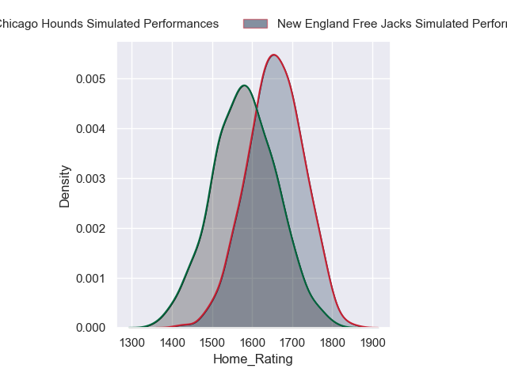
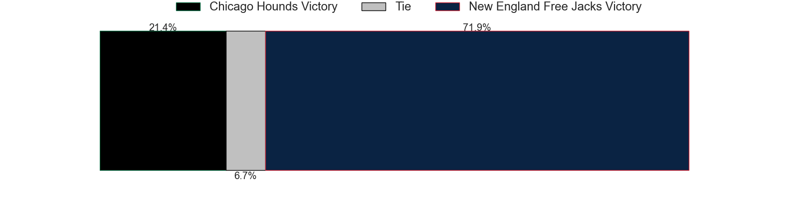
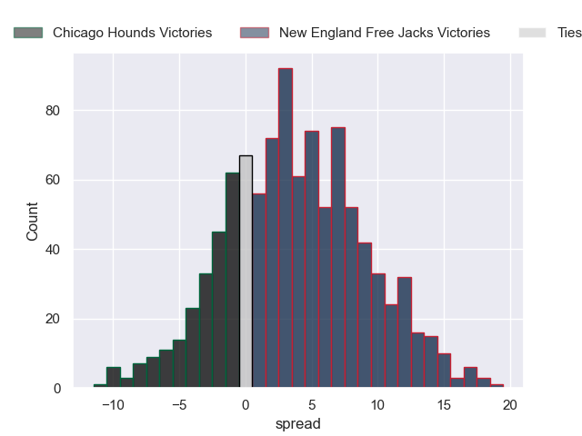
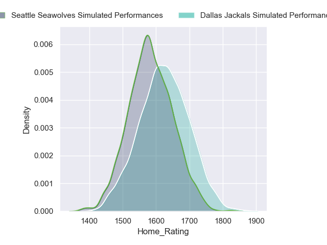
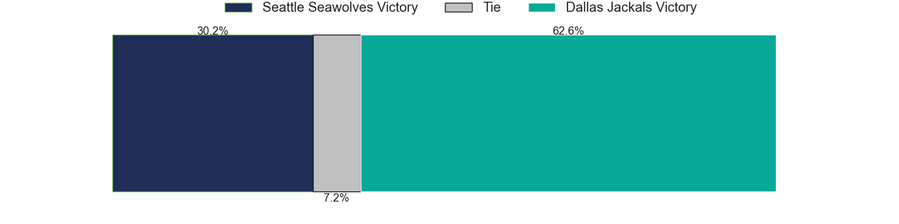
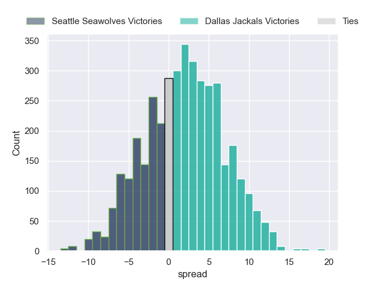
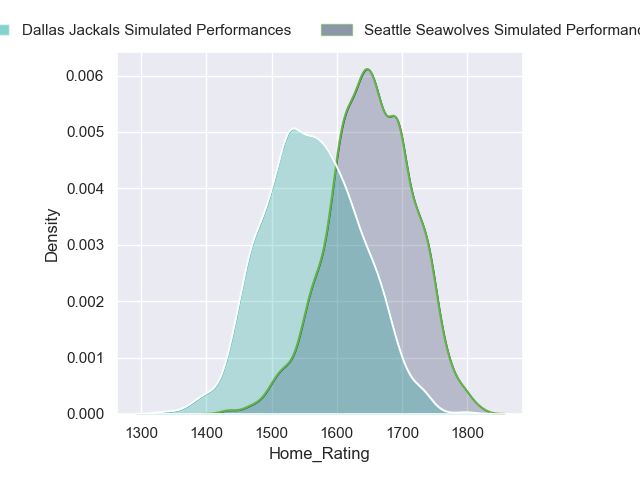
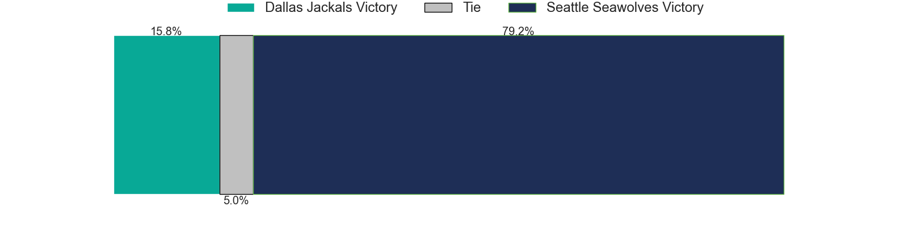
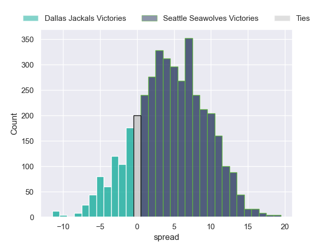

---  
title: "Major League Rugby 2024 Status"  
date: 2024-07-22 6:00:00 -0500  
categories: model review projection  
layout: article  
aside:  
    toc: true  
---
# Current Team Rankings

# Standings

## Current Standings

| Club                   |   Played |   Wins |   Point Differential |   Losing Bonus Points |   Try Bonus Points |   Competition Points |
|:-----------------------|---------:|-------:|---------------------:|----------------------:|-------------------:|---------------------:|
| Houston SaberCats      |       20 |     17 |                  148 |                     0 |                nan |                   76 |
| Seattle Seawolves      |       21 |     14 |                  138 |                     5 |                nan |                   69 |
| New England Free Jacks |       20 |     13 |                  143 |                     4 |                nan |                   63 |
| San Diego Legion       |       17 |     12 |                   57 |                     4 |                nan |                   57 |
| NOLA Gold              |       19 |     12 |                   79 |                     2 |                nan |                   55 |
| Dallas Jackals         |       21 |      9 |                   63 |                    11 |                nan |                   55 |
| Old Glory DC           |       20 |     10 |                  -24 |                     6 |                nan |                   51 |
| Chicago Hounds         |       18 |      8 |                   83 |                     6 |                nan |                   45 |
| Utah Warriors          |       21 |      6 |                  -60 |                    11 |                nan |                   39 |
| Miami Sharks           |       20 |      8 |                  -75 |                     5 |                nan |                   39 |
| RFC Los Angeles        |       19 |      7 |                 -121 |                     2 |                nan |                   39 |
| Anthem RC              |       20 |      0 |                 -431 |                     2 |                nan |                    7 |

## Projected Remaining Table

| Club                   |   Matches Remaining |   Wins |   Point Differential |   Losing Bonus Points |   Try Bonus Points |   Competition Points |
|:-----------------------|--------------------:|-------:|---------------------:|----------------------:|-------------------:|---------------------:|
| Seattle Seawolves      |                   8 |    4.6 |              9.84761 |                   2.7 |                2.3 |                 23.5 |
| Dallas Jackals         |                   8 |    3.4 |             -9.84761 |                   3.2 |                2   |                 18.7 |
| New England Free Jacks |                   1 |    0.8 |              3.79687 |                   0.2 |                0.3 |                  3.5 |
| Chicago Hounds         |                   1 |    0.2 |             -3.79687 |                   0.5 |                0.3 |                  1.7 |

## Projected Total Table

| Club                   |   Total Matches |   Wins |   Point Differential |   Losing Bonus Points |   Try Bonus Points |   Competition Points |
|:-----------------------|----------------:|-------:|---------------------:|----------------------:|-------------------:|---------------------:|
| Seattle Seawolves      |              29 |   18.6 |             147.848  |                   7.7 |                2.3 |                 92.5 |
| Houston SaberCats      |              20 |   17   |             148      |                   0   |                0   |                 76   |
| Dallas Jackals         |              29 |   12.4 |              53.1524 |                  14.2 |                2   |                 73.7 |
| New England Free Jacks |              21 |   13.8 |             146.797  |                   4.2 |                0.3 |                 66.5 |
| San Diego Legion       |              17 |   12   |              57      |                   4   |                0   |                 57   |
| NOLA Gold              |              19 |   12   |              79      |                   2   |                0   |                 55   |
| Old Glory DC           |              20 |   10   |             -24      |                   6   |                0   |                 51   |
| Chicago Hounds         |              19 |    8.2 |              79.2031 |                   6.5 |                0.3 |                 46.7 |
| Utah Warriors          |              21 |    6   |             -60      |                  11   |                0   |                 39   |
| Miami Sharks           |              20 |    8   |             -75      |                   5   |                0   |                 39   |
| RFC Los Angeles        |              19 |    7   |            -121      |                   2   |                0   |                 39   |
| Anthem RC              |              20 |    0   |            -431      |                   2   |                0   |                  7   |

## Projected Playoff Results

|                   | quarterfinal qualifiers   |
|:------------------|:--------------------------|
| Seattle Seawolves | 100.0 %                   |
| San Diego Legion  | 100.0 %                   |

# Completed Match Review

| Model | Percent Correct Predictions | Spread Error |
| ------ | ------ | ------ |
| Club Level | 62.7% | 11.3 |
| Player Level: Lineup | 60.5% | 10.9 |
| Player Level: Minutes | 60.3% | 10.8 |

# Future Predictions

## Week 22

### Seattle Seawolves V San Diego Legion on 2024/07/22

Average Margin: Seattle Seawolves by 1.6

Average Scoreline: 28-27

### New England Free Jacks V Chicago Hounds on 2024/07/27

Average Margin: New England Free Jacks by 3.8

Average Scoreline: 29-25

### Dallas Jackals V Seattle Seawolves on 2024/07/28

Average Margin: Dallas Jackals by 2.0

Average Scoreline: 32-30

### Dallas Jackals V Seattle Seawolves on 2024/07/28

Average Margin: Dallas Jackals by 2.0

Average Scoreline: 32-30

### Dallas Jackals V Seattle Seawolves on 2024/07/28

Average Margin: Dallas Jackals by 2.0

Average Scoreline: 32-30

### Dallas Jackals V Seattle Seawolves on 2024/07/28

Average Margin: Dallas Jackals by 2.0

Average Scoreline: 32-30

### Seattle Seawolves V Dallas Jackals on 2024/07/28

Average Margin: Seattle Seawolves by 4.5

Average Scoreline: 33-29

### Seattle Seawolves V Dallas Jackals on 2024/07/28

Average Margin: Seattle Seawolves by 4.5

Average Scoreline: 33-29

### Seattle Seawolves V Dallas Jackals on 2024/07/28

Average Margin: Seattle Seawolves by 4.5

Average Scoreline: 33-29

### Seattle Seawolves V Dallas Jackals on 2024/07/28

Average Margin: Seattle Seawolves by 4.5

Average Scoreline: 33-29

